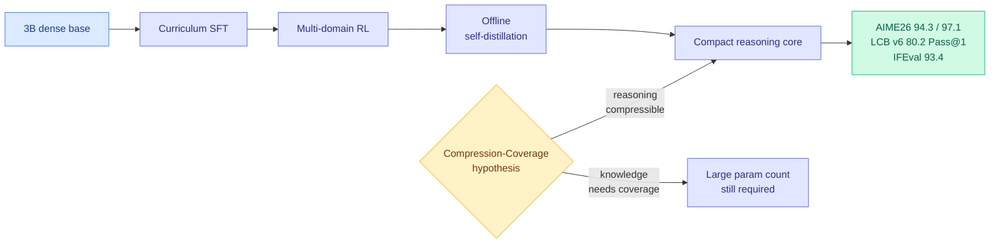

# VibeThinker-3B: Frontier Verifiable Reasoning in a 3B Model

**TL;DR.** VibeThinker-3B (arxiv 2606.16140) is a dense 3B model that scores 94.3 on AIME26 (97.1 with claim-level test-time scaling), 80.2 Pass@1 on LiveCodeBench v6, and 96.1% acceptance on unseen LeetCode contests — matching or beating flagship models orders of magnitude larger (DeepSeek V3.2, GLM-5, Gemini 3 Pro) on *verifiable* reasoning tasks, while keeping 93.4 on IFEval (instruction following). The interpretation matters more than the score: the authors propose the **Parametric Compression-Coverage Hypothesis** — verifiable reasoning compresses into a small "reasoning core," while open-domain knowledge needs broad parameter coverage. Small reasoning models are a *complementary capability path*, not just a cheap substitute.

## What it is

A technical report pushing verifiable reasoning to its limit inside a strict 3B-parameter budget, built on the **Spectrum-to-Signal** post-training paradigm via an optimized pipeline: curriculum-based supervised fine-tuning, multi-domain reinforcement learning, and offline self-distillation. The empirical claim is that a 3B dense model can land in the performance band of first-tier reasoning systems on highly demanding verifiable tasks (competition math, code), with strong out-of-distribution generalization (96.1% on *recent unseen* LeetCode, which rules out simple contamination) and without sacrificing instruction controllability (93.4 IFEval).

The conceptual contribution is the **Parametric Compression-Coverage Hypothesis**: verifiable reasoning is *compressible* into compact reasoning cores, whereas open-domain knowledge and general competence require *broad parameter coverage* over facts, concepts, and long-tail scenarios. This reframes small reasoning models as a complementary path to frontier capability in parameter-dense regimes, not merely a deployment-efficient downgrade. It extends the authors' prior 1.5B work.

## How it relates to prior wiki knowledge

VibeThinker is the strongest single datapoint yet for a thesis the wiki has been assembling from many angles: **reasoning signal is small, locatable, and separable from knowledge.** The [knowledge-distillation page](knowledge-distillation.md) and the OPD line have repeatedly found the useful signal is sparse — [TIP](knowledge-distillation.md) (04-16, under 10% of distillation tokens carry signal), [Dense Supervision, Sparse Updates](2026-06-15-dense-supervision-sparse-updates-opd-geometry.md) (06-15, OPD writes a small FFN-heavy subnetwork). The Compression-Coverage Hypothesis lifts that from "the *update* is sparse" to "the *capability* is compressible," and separates it cleanly from knowledge breadth.

It is the dense-small-model counterpart to the MoE deployment-sizing line on the [routing page](../ai-routing/llm-routing.md) — [MobileMoE](2026-05-27-mobilemoe-on-device-moe-scaling.md) (05-27, on-device MoE scaling law) and [MiniMax-M2](../llms-foundation-models/2026-05-27-minimax-m2-mini-activation-moe.md) (05-27, mini-activation MoE) — but argues something sharper: you do not need the parameters *at all* for verifiable reasoning, only for coverage. That directly informs routing: if reasoning is compressible into a 3B core, a router could send verifiable-reasoning queries to a tiny specialist and reserve large models for knowledge-heavy, long-tail queries.

It also reframes the small-explorer result [S2L-PO](../llms-foundation-models/2026-06-15-s2l-po-small-models-explorers-grpo.md) (06-15, a small model is the cheapest diverse explorer for RL): if small models carry a dense reasoning core, their value as explorers and as deployable reasoners is the same underlying fact.

## Gaps

The benchmarks are all *verifiable* (math, code) by design — that is the hypothesis's home turf, so the result confirms the easy half of the claim and leaves the hard half (that knowledge genuinely needs coverage a 3B cannot have) asserted rather than measured against a knowledge benchmark. "Matches Gemini 3 Pro" is true only on these verifiable slices; broad-knowledge QA would presumably collapse, which is the point but is not shown side by side. Claim-level test-time scaling (94.3 → 97.1) adds inference cost not accounted against the "small model" framing.

## Industrial implication

If verifiable reasoning compresses to 3B, the cost structure of math/code agents changes: route verifiable subtasks to a cheap dense specialist, reserve frontier models for open-domain knowledge. This is the model-economics argument behind the day's routing finding ([Kilo plan-strong/implement-cheap](../ai-routing/2026-06-16-kilo-plan-implement-model-split.md)) made at the architecture level rather than the workflow level. Expect a wave of sub-7B reasoning specialists positioned not as "budget models" but as the *correct* tool for verifiable work.

**Source:** HuggingFace Daily Papers · [Paper](https://arxiv.org/abs/2606.16140) · [Raw](../../raw/huggingface/2026-06-16-vibethinker-3b-exploring-the-frontier-of-verifiable-reasonin.md)
