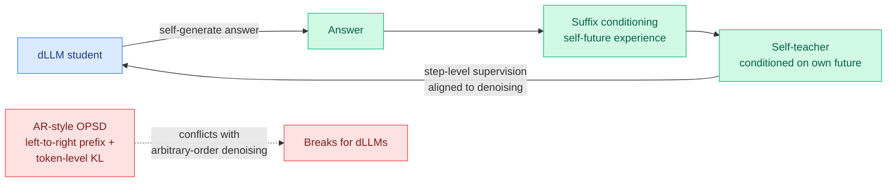

# d-OPSD: on-policy self-distillation for diffusion LLMs, via "self-future" suffixes

**TL;DR.** On-policy self-distillation (OPSD) post-trains autoregressive LLMs well, but it has never worked for diffusion LLMs (dLLMs — models that generate by iterative denoising in arbitrary token order rather than left-to-right). Existing OPSD is autoregressive-centric: it injects privileged information via left-to-right *prefix* conditioning with token-level divergence supervision, which fundamentally conflicts with a dLLM's arbitrary-order generation. d-OPSD is the first OPSD built for dLLMs. Two moves: (1) construct the self-teacher from self-generated answers as *suffix* conditioning ("self-future experience") instead of privileged prefixes; (2) supervise at the *step* level (aligned to denoising iterations) instead of the token level. Across four reasoning benchmarks it beats RLVR and SFT with far better sample efficiency, needing only ~10% of RLVR's optimization steps.

> **Name note:** this paper ("Learning from the Self-future", arXiv 2606.18195, code `xingzhejun/d-OPSD`) reuses the acronym **d-OPSD** that the wiki already assigned to a different 05-07 diffusion self-distillation paper ([D-OPSD, step-distilled diffusion](2026-05-07-d-opsd-self-distillation-step-distilled-diffusion.md)). They share the conditioning-asymmetry idea but are distinct works; this page covers the 06-17 dLLM paper.

## What it is

A post-training method that ports on-policy self-distillation to diffusion LLMs by respecting their generation order. In an autoregressive model, privileged information naturally enters as a *prefix* (the teacher sees more of the left context). A dLLM denoises tokens in arbitrary order, so a left-to-right prefix is the wrong conditioning. d-OPSD instead conditions the self-teacher on the student's *own self-generated answer as a suffix* — letting the student learn from "future experience" it produced — and shifts supervision from per-token divergence to per-denoising-step alignment, matching the iterative structure of dLLM generation.

## Key findings

- First OPSD framework tailored to diffusion LLMs; AR-centric OPSD does not transfer.
- Suffix ("self-future") conditioning replaces prefix privilege; step-level replaces token-level supervision.
- Beats RLVR and SFT on four reasoning benchmarks.
- ~10% of RLVR's optimization steps to reach better results — a large sample-efficiency win.
- Code: github.com/xingzhejun/d-OPSD.

## How it relates to prior wiki knowledge

- It carries the [knowledge-distillation](knowledge-distillation.md) **conditioning-asymmetry** device (a privileged teacher view the student lacks) into a new architecture. That device runs through [D-OPSD 05-07](2026-05-07-d-opsd-self-distillation-step-distilled-diffusion.md), [SDPG](2026-06-04-sdpg-self-distilled-policy-gradient.md), and [PBSD](../llms-foundation-models/2026-06-09-pbsd-bayesian-self-distillation.md). d-OPSD's twist is that the privilege is *temporal-but-not-positional*: the teacher sees the future answer, but "future" is a suffix, not a left prefix, because order is arbitrary.
- It joins the diffusion-LLM efficiency line ([dMoE block-level MoE](2026-06-01-dmoe-block-level-moe-diffusion-llm.md), [TIDE MoE diffusion inference](2026-05-21-tide-moe-diffusion-llm-inference.md), [RT-Lynx activation sparsity](2026-05-27-rt-lynx-activation-sparsity-diffusion.md)) — dLLM post-training was the missing piece, since dLLMs lacked the mature SFT→OPD→RLVR stack AR models have.
- Step-level supervision aligned to denoising is the dLLM analogue of the AR token-selection line ([TIP](2026-04-16-tip-token-importance-on-policy-distillation.md) etc.): match the supervision granularity to where the signal actually lives.

## Gaps

Four reasoning benchmarks only; whether suffix-conditioned self-distillation scales to larger dLLMs or to agentic/long-horizon tasks is open. The "self-future" suffix is the student's own (possibly wrong) answer — on hard questions where the self-generated answer is bad, the suffix could teach the wrong thing, the same failure mode the AR OPD line (TRD prefix-repair, FiRe filtering) spent months addressing; d-OPSD does not yet have that correction layer. The 10%-of-RLVR-steps comparison depends on matched compute-per-step, which the abstract doesn't pin down.

## Research angle

dLLMs are attractive for inference because they can decode in parallel; a working post-training recipe is what they've lacked to compete with AR reasoning models. If d-OPSD's sample efficiency holds, the question is whether the AR OPD corrections (trajectory repair, trust regions, verifier gates) port over as cleanly as the base method did, or whether arbitrary-order generation needs its own failure taxonomy. The deeper bet: if dLLMs can be post-trained as cheaply as this claims, the parallel-decoding speed advantage becomes a real reason to prefer them for verifiable reasoning.

**Source:** [arXiv 2606.18195](https://arxiv.org/abs/2606.18195) · [HuggingFace](https://huggingface.co/papers/2606.18195) · [code](https://github.com/xingzhejun/d-OPSD) · raw: `raw/huggingface/2026-06-17-learning-from-the-self-future-on-policy-self-distillation-fo.md`
