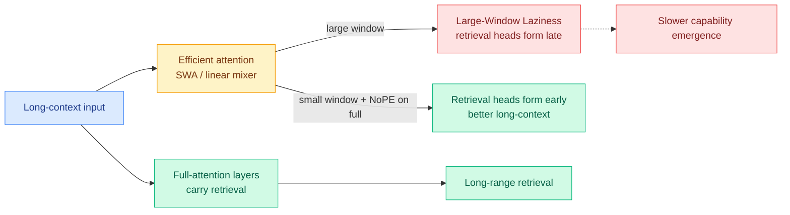

# Rethinking Efficient Attention in Hybrid Architectures: Large-Window Laziness

**TL;DR.** Hybrid models mix a few full-attention layers with cheaper "efficient" attention (sliding-window attention, or linear recurrent mixers). This paper asks what those efficient modules actually do, across scaling, mechanism, and design. Three findings: (1) the efficient-attention choice mostly controls *how fast* long-context ability emerges during training, not the final ceiling — different hybrids converge to similar long-context performance given enough training. (2) Long-range retrieval is carried by the *full-attention* layers; efficient attention shapes the optimization path. This produces a counterintuitive effect they name **Large-Window Laziness**: a *bigger* sliding-window attention (SWA) window *delays* the formation of retrieval heads in the full-attention layers, because the cheap layers cover for them. (3) The fix: apply NoPE (no positional encoding) to only the full-attention layers of a small-window SWA hybrid, which substantially improves long-context performance with negligible short-context cost.

## What it is

A systematic mechanism study of hybrid attention. As frontier open models converge on mostly-linear / mostly-windowed backbones with a minority of full-attention layers (see yesterday's [Nemotron 3 Ultra](../llms-foundation-models/2026-06-16-nemotron-3-ultra-moe-hybrid-mamba.md) Mamba+attention and [Ling/Ring-2.6](../llms-foundation-models/2026-06-16-ling-ring-2.6-hybrid-linear-attention.md) 7:1 Lightning-to-MLA hybrid), the field has been choosing the efficient-module type and window size largely empirically. This paper supplies the mechanism: the full-attention layers are the retrieval substrate, the efficient layers govern the training trajectory, and oversized windows make the full layers lazy.

## Key findings

- **Scaling:** efficient-attention design changes the *rate* of long-context emergence; given enough training, hybrids converge to comparable long-context ceilings.
- **Mechanism:** full attention does long-range retrieval; efficient attention shapes its optimization trajectory.
- **Large-Window Laziness:** larger SWA windows delay retrieval-head formation in full-attention layers.
- **Design fix:** NoPE on only the full-attention layers of a small-window SWA hybrid lifts long-context performance with negligible short-context impact.

## How it relates to prior wiki knowledge

- This is the **mechanistic underpinning** of the hybrid-attention convergence the wiki declared a pattern on 06-16 (two frontier labs shipping mostly-linear backbones the same day). The digest noted the usual caveat — "the 7:1 ratio's effect on long-context retrieval precision is uncharacterized." This paper directly characterizes it: retrieval lives in the full layers, so the ratio is safe as long as the full layers stay un-lazy.
- "Bigger isn't better for the cheap layer" rhymes with today's [LoopCoder-v2](2026-06-17-loopcoder-v2-two-loop-saturation.md) (two loops beat more) and the [kv-cache](kv-cache.md) eviction line's repeated finding that more budget is not monotonically better.
- The NoPE-on-full-only trick connects to the long-context-extension thread ([EndPrompt](2026-05-19-endprompt-terminal-anchoring-long-context-extension.md), [Lighthouse](2026-05-16-lighthouse-attention-long-context-pretraining.md)) and the [attention-mechanisms](../llms-foundation-models/attention-mechanisms.md) concept page.

## Gaps

The convergence claim ("enough training closes the gap") is exactly the expensive part to verify at frontier scale; if compute-matched runs never reach "enough training," the rate difference is the ceiling difference in practice. NoPE-on-full is shown on SWA hybrids; whether it transfers to linear-recurrent hybrids (Mamba, Lightning Attention, Gated DeltaNet) is untested.

## Research angle

If retrieval is provably localized to full-attention layers, then KV-cache budget should be spent almost entirely there — a head-axis and *layer-axis* allocation prior that the non-uniform KV line ([Tangram](2026-06-16-tangram-non-uniform-kv-compression-serving.md), [MISA](2026-05-11-misa-mixture-of-indexer-sparse-attention.md)) could exploit directly: compress the efficient layers aggressively, protect the full layers. Large-Window Laziness also predicts a curriculum: start with a small window to force early retrieval-head formation, then widen. Worth tracking whether a frontier lab adopts NoPE-on-full as a default.

**Source:** [arXiv 2606.15378](https://arxiv.org/abs/2606.15378) · [HuggingFace](https://huggingface.co/papers/2606.15378) · raw: `raw/huggingface/2026-06-17-rethinking-the-role-of-efficient-attention-in-hybrid-archite.md`
