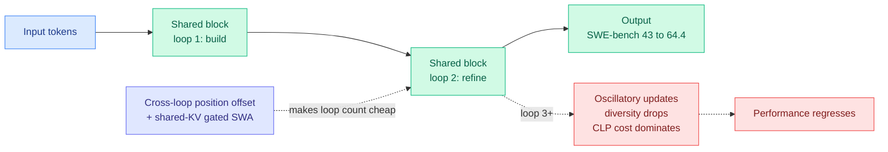

# LoopCoder-v2: Only Loop Once for Efficient Test-Time Computation Scaling

**TL;DR.** Looped transformers add latent compute by applying the same shared block repeatedly, but sequential looping inflates latency and KV cache with every extra loop. Parallel Loop Transformers (PLT) make loop count a cheap design knob via cross-loop position offsets (CLP) and shared-KV gated sliding-window attention. LoopCoder-v2 trains a family of 7B PLT coders from scratch on 18T tokens at different loop counts to settle the question of how many loops to use. The answer is sharply non-monotonic: **two loops is optimal**, lifting SWE-bench Verified from 43.0 to 64.4 and Multi-SWE from 14.0 to 31.0, while three or more loops *regress*. A gain–cost analysis explains why: loop 2 does the productive refinement, later loops add oscillatory, low-diversity updates while the fixed CLP positional-mismatch cost keeps accruing.

**Source:** HuggingFace · [arxiv 2606.18023](https://arxiv.org/abs/2606.18023)

## Key findings

- **Two loops is the sweet spot.** The two-loop 7B PLT beats the non-looped baseline broadly: SWE-bench Verified 43.0→64.4, Multi-SWE 14.0→31.0, plus gains on code reasoning, agentic SWE, and tool use.
- **Three-plus loops regress** — a strongly non-monotonic loop-count curve, not "more compute = more accuracy."
- **Why loop 2 is special:** diagnostics show loop 2 supplies the main productive representational refinement; later loops yield diminishing, oscillatory updates and reduced representational diversity.
- **The cost side is fixed.** CLP introduces a positional mismatch at each loop boundary. That mismatch cost stays roughly constant per loop while the refinement gain shrinks, so the offset cost increasingly dominates past loop 2 — a clean gain–cost account of PLT saturation.
- **Shared-KV gated sliding-window attention** keeps the KV cache from growing linearly with loop count, which is what makes loop count a *practical* design choice rather than a memory blowup.

## Relation to prior wiki

- This is the depth-side counterpart to [Variable-Width Transformers](2026-06-17-variable-width-transformers.md) (06-17, width allocation as an efficiency axis): LoopCoder treats *iterative latent depth* as the axis. Together with [Looped World Models](../llms-foundation-models/2026-06-17-looped-world-models.md) (06-17, looped blocks for world simulation, 100x param efficiency) and the Kurate-rated *Solve the Loop: Attractor Models for Language and Reasoning* (cs.LG #6), this is **three papers in one week** treating loop/iterative depth as a first-class scaling axis. See the new [looped-transformers](../llms-foundation-models/looped-transformers.md) concept page.
- The shared-KV gated SWA echoes the KV-sharing line ([Raschka's MHC/compressed-attention survey](2026-05-17-raschka-llm-architecture-kv-sharing-mhc-compressed-attention.md), 05-17) — sharing KV across loops is the same instinct as sharing it across heads/layers.
- The "more inference compute doesn't monotonically help" result is a test-time-compute cousin of the [Extrapolation Cliff](2026-05-14-extrapolation-cliff-on-policy-distillation.md) (05-14, a closed-form threshold past which on-policy distillation collapses): both find a hard ceiling where adding the obvious scaling knob backfires.

## Gaps

Only the 7B scale and only coding/tool-use benchmarks; whether the two-loop optimum holds at other scales or on non-code reasoning is untested. The CLP positional-mismatch diagnosis is plausible but the paper does not show a CLP variant that removes the mismatch and unlocks loops 3+, which would confirm the mechanism.

Raw: `raw/huggingface/2026-06-17-loopcoder-v2-only-loop-once-for-efficient-test-time-computat.md`
