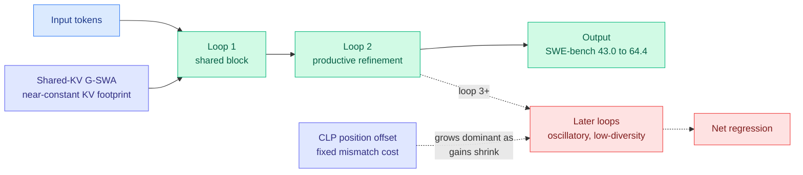

# LoopCoder-v2: looped transformers saturate at exactly two loops

**TL;DR.** Looped transformers reuse the same block several times to add "depth" without adding parameters, scaling test-time compute. LoopCoder-v2 trains a family of 7B code models (from scratch on 18T tokens) at different loop counts and finds a sharp, non-monotonic result: two loops is the sweet spot. The two-loop variant lifts SWE-bench Verified from 43.0 to 64.4 and Multi-SWE from 14.0 to 31.0, but three or more loops *regress*. The paper explains why with a gain–cost account: loop 2 does the productive representational refinement, while later loops yield diminishing, oscillatory updates, and the fixed positional-mismatch cost of the parallelization trick comes to dominate.

## What it is

A looped (or "universal") transformer applies a shared stack of layers repeatedly, so a model with N physical layers behaves like one with N×loops effective depth, paying parameters once and compute per loop. The cost is that naive sequential looping grows latency and KV-cache memory linearly with loop count. The Parallel Loop Transformer (PLT) backbone LoopCoder-v2 builds on fixes both: **Cross-Loop Position Offsets (CLP)** break the sequential dependency between loops so loops run in parallel, and **Shared-KV Gated Sliding-Window Attention (G-SWA)** shares the first loop's KV cache and blends global/local attention, holding the KV footprint roughly constant as loops increase. That makes loop count a free design knob rather than a latency/memory penalty.

## Key findings

- Two-loop 7B coder: SWE-bench Verified 43.0 → 64.4, Multi-SWE 14.0 → 31.0 over the non-looped baseline, with broad gains across code generation, code reasoning, agentic SWE, and tool use.
- The effect is strongly **non-monotonic**: three or more loops regress below the two-loop variant.
- Diagnostics: loop 2 carries the main productive refinement; later loops produce diminishing, oscillatory hidden-state updates and reduced representational diversity.
- Because CLP's positional-mismatch cost stays roughly fixed at each loop boundary while refinement gain shrinks, the offset cost increasingly dominates, explaining the saturation.

## How it relates to prior wiki knowledge

- This is the test-time-compute cousin of the wiki's recurring **"the useful signal is sparse / saturates early"** theme. It mirrors [POLAR / Program-of-Layers](polar-program-of-layers.md) (06-15, layer reuse as a learned program) and the broad finding across the on-policy distillation line ([Geometry of OPD](2026-06-09-geometry-on-policy-distillation.md), subspace locking) that the productive update is confined and additional compute hits diminishing returns.
- The G-SWA "near-constant KV footprint across loops" is a KV-cache lever and slots next to the [kv-cache](kv-cache.md) line; sharing first-loop KV is conceptually adjacent to KV-sharing schemes ([Raschka KV-sharing notes](2026-05-17-raschka-llm-architecture-kv-sharing-mhc-compressed-attention.md)).
- It is a counterpoint to the inference-time-scaling-by-more-loops intuition: more latent compute is not monotonically better, echoing the [Kilo Code audit](../ai-routing/2026-06-16-kilo-plan-implement-model-split.md) ("more reasoning is not monotonically better").

## Gaps

7B only; whether the two-loop optimum holds at frontier scale or shifts with model size is open. The regression diagnosis (CLP mismatch) is specific to the PLT parallelization trick, so a different parallel-loop scheme might saturate elsewhere. All numbers are code/agentic benchmarks; non-code reasoning is untested here.

## Research angle

If the two-loop optimum is an artifact of CLP's fixed positional cost, a position-mismatch-free parallel loop scheme could push the optimum to three or four loops and unlock more test-time depth for free. The open question: is two-loop saturation a property of the *architecture* (CLP) or of the *representations* (refinement genuinely converges by loop 2)? The oscillatory-update diagnostic suggests the latter is partly real, which would cap looped depth regardless of the parallelization trick.

**Source:** [arXiv 2606.18023](https://arxiv.org/abs/2606.18023) · [HuggingFace](https://huggingface.co/papers/2606.18023) · raw: `raw/huggingface/2026-06-17-loopcoder-v2-only-loop-once-for-efficient-test-time-computat.md`
