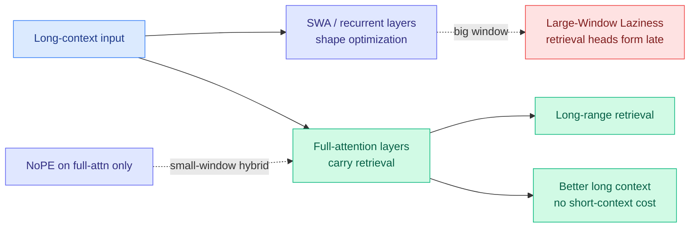

# Rethinking the Role of Efficient Attention in Hybrid Architectures

**TL;DR.** Hybrid models mix full attention with cheap "efficient attention" modules (sliding-window attention, SWA; recurrent sequence mixers), but nobody had a clean account of what the efficient modules actually contribute. This paper studies hybrids along three axes — scaling, mechanism, architecture — and lands three results. First, the efficient-attention choice mostly affects *how fast* long-context ability emerges; given enough training, different hybrids converge to comparable long-context performance. Second, mechanistically, long-range retrieval is carried by the full-attention layers, while efficient attention only shapes the optimization trajectory. That explains a counterintuitive effect they name **Large-Window Laziness**: bigger SWA windows *delay* the formation of retrieval heads in the full-attention layers, because the wide window lets the model lean on local context instead of learning to retrieve. Third, applying NoPE (no positional encoding) to only the full-attention layers of a small-window SWA hybrid substantially improves long context with negligible short-context cost.

**Source:** HuggingFace · [arxiv 2606.15378](https://arxiv.org/abs/2606.15378)

## Key findings

- **Efficient attention sets the *rate*, not the ceiling.** Different hybrids converge to similar long-context quality given enough training; the SWA/recurrent choice mainly changes how quickly long-context capability emerges.
- **Retrieval lives in full attention.** Mechanistic analysis attributes long-range retrieval to the full-attention layers; efficient attention shapes the optimization path that gets there.
- **Large-Window Laziness:** larger SWA windows delay retrieval-head formation. Counterintuitively, a *smaller* window can force the model to learn retrieval faster.
- **NoPE-on-full-attention fix:** removing positional encoding from only the full-attention layers of a small-window hybrid improves long-context performance with negligible short-context impact — a cheap, targeted intervention guided by the mechanism.

## Relation to prior wiki

- This is the **mechanistic "why"** behind the hybrid-attention convergence the wiki declared a pattern on 06-16, when [Nemotron 3 Ultra](../llms-foundation-models/2026-06-16-nemotron-3-ultra-moe-hybrid-mamba.md) (NVIDIA's 550B Mamba+attention hybrid) and Ling-2.6/Ring-2.6 (Ant's 7:1 linear-to-MLA hybrid) shipped the same structural bet on the same day. Those papers showed hybrids *work*; this paper says *which layers do the work* — full attention retrieves, efficient layers optimize — and gives a recipe (small window + NoPE on full attention) that follows from it.
- It sharpens the [attention-mechanisms](../llms-foundation-models/attention-mechanisms.md) concept page's running question of whether linear/SWA layers lose retrieval. Answer: they don't carry it in the first place, so offloading bulk compute to them is safe as long as enough full-attention layers remain.
- Directly relevant to GLM-5.2's 1M-context claim (06-17, MIT open weights) and DeepSeek's interleaved-compressed-attention line ([DeepSeek V4](2026-05-25-deepseek-v4-interleaved-compressed-attention.md)): the "keep a few full-attention layers for retrieval, make the rest cheap" template is exactly these production long-context models.

## Gaps

The retrieval-head attribution rests on mechanistic probing that may not capture all long-range pathways. "Converge given enough training" hides a compute cost that could be large; the practical question is whether a small-window+NoPE hybrid reaches frontier long-context quality within a realistic training budget. No frontier-scale validation.

Raw: `raw/huggingface/2026-06-17-rethinking-the-role-of-efficient-attention-in-hybrid-archite.md`
