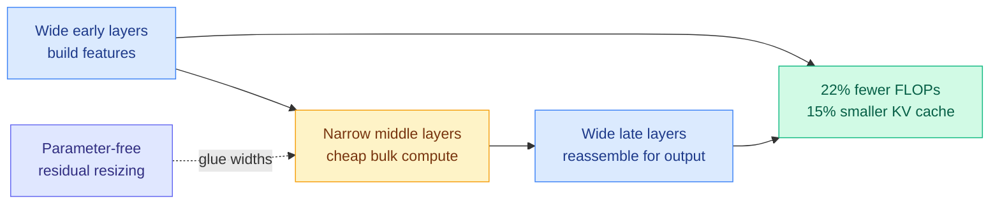

# Variable-Width Transformers

**TL;DR.** Almost every transformer keeps the same width (hidden dimension) at every layer, spending the same parameter and compute budget on each one. Variable-Width Transformers break that assumption with an hourglass ("times-shaped") design: keep the early and late layers wide, narrow the middle layers, and stitch the widths together with a parameter-free residual resizing trick. Across dense models from 200M to 2B and a 3B MoE, the hourglass beats parameter-matched uniform baselines on language-modeling loss while cutting FLOPs 22% and KV cache memory and I/O 15% under loss-matched scaling curves. Nonuniform width allocation is a new, orthogonal efficiency axis.

**Source:** HuggingFace · [arxiv 2606.18246](https://arxiv.org/abs/2606.18246)

## Key findings

- **The hourglass shape wins on loss, not just cost.** A times-shaped width profile (wide ends, narrow middle) consistently beats uniform-width baselines with the same parameter count on language-modeling loss, across 200M–2B dense and 3B MoE.
- **22% FLOPs reduction** under fitted loss-matched scaling curves, because the average layer is narrower.
- **15% smaller KV cache memory and I/O cost** — the narrow middle layers carry smaller per-token key/value tensors, which is the part that matters most for inference at long context and large batch.
- **Residual resizing is parameter-free.** Width transitions between wide and narrow blocks are handled without adding projection parameters, so the saving is real, not bookkept away.
- **Mechanistic signature.** The bottleneck produces qualitatively different residual-stream representations in the middle layers, evidence that the middle layers were over-provisioned in uniform models.

## Relation to prior wiki

- This is a **new, orthogonal efficiency axis** to everything the wiki has tracked on the KV cache. Where [Tangram](2026-06-16-tangram-non-uniform-kv-compression-serving.md) (06-16, per-head non-uniform cache budgets made shippable on vLLM) and the OSCAR/Octopus/VaSE line attack the cache *after* training by compressing or evicting, Variable-Width shrinks the cache *by construction* through architecture. The two compose: a narrower middle layer produces less KV to begin with, then a non-uniform compressor can still trim what remains.
- It rhymes with the non-uniform-allocation theme that runs through [MoE-muP scale-stable parameterization](2026-05-21-moe-mup-scale-stable-parameterization.md) (allocate width/experts by a principled scaling rule) — both argue the field's default of uniform capacity-per-layer is wasteful.
- Complements depth-side efficiency work like [LoopCoder-v2](2026-06-17-loopcoder-v2-parallel-loop-transformer.md): width allocation and looped depth are independent levers on the same FLOPs-vs-loss frontier.

## Gaps

Tested up to 3B (MoE); whether the hourglass profile holds at frontier scale (70B+) is unproven, and the optimal narrowing schedule may shift with depth. No downstream task evals beyond LM loss, and no long-context retrieval audit to confirm the narrowed middle layers don't quietly hurt retrieval heads.

Raw: `raw/huggingface/2026-06-17-variable-width-transformers.md`
