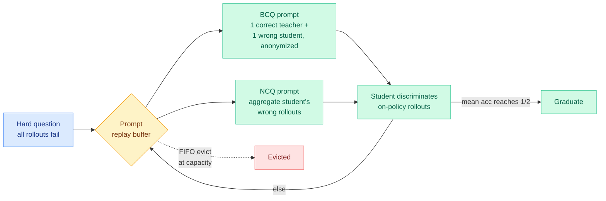

# ZPPO: keep the teacher in the prompt, not the policy gradient

**TL;DR.** Distillation into a small student is brittle: forcing the student to imitate a much larger teacher's logits concentrates it on the teacher's sharpest modes and hurts out-of-distribution generalization. RL on the student's own rollouts avoids logit imitation, but on hard questions where every rollout fails (zero advantage, silently discarded) there is no signal — and injecting a teacher's answer into the policy gradient there breaks the on-policy assumption and causes drift. Zone of Proximal Policy Optimization (ZPPO), named after Vygotsky's zone of proximal development, keeps the teacher *inside the prompt* rather than the gradient. It reformulates hard questions into discrimination tasks and recirculates them through a replay buffer until the student can solve them. On Qwen3.5 VLMs at 0.8B–9B with a 27B teacher, evaluated over 31 benchmarks, ZPPO beats off-policy distillation, on-policy distillation, and GRPO, with the largest gains at the smallest scale.

## What it is

A post-training method that injects teacher knowledge through the *prompt channel* instead of the *gradient channel*. On a hard question, ZPPO builds two reformulated prompts. The **Binary Candidate-included Question (BCQ)** pairs one correct teacher response with one incorrect student response as anonymized candidates the student must discriminate. The **Negative Candidate-included Question (NCQ)** aggregates the student's own wrong rollouts into a single prompt to surface their shared failure modes. A **prompt replay buffer** recirculates each hard question until the student's mean rollout accuracy on it reaches one half ("graduates"), or it is FIFO-evicted under finite capacity. This concentrates teacher signal inside the student's current zone of proximal development — questions just beyond its reach.

## Key findings

- On Qwen3.5 at four student scales (0.8B–9B) with a 27B teacher, post-trained as vision-language models, evaluated on 31 benchmarks (16 VLM, 10 LLM, 5 video).
- Beats off-policy distillation, on-policy distillation, and GRPO.
- Largest gains at the smallest (0.8B) scale — exactly where logit-imitation distillation is most brittle.
- Teacher influence never enters the policy gradient, so the on-policy assumption is preserved.

## How it relates to prior wiki knowledge

- This is a **genuinely new axis** on the [knowledge-distillation](knowledge-distillation.md) page. The whole spring OPD line argued about *which tokens* to supervise and *how to bound the update* in the gradient — TIP (token selection), TrOPD (trust region), FiRe-OPD (filter-then-reweight), SG-OPD (verifier-gated direction), OPRD (distill representations not logits). ZPPO sidesteps all of it by refusing to put the teacher in the gradient at all. It directly attacks the failure the line keeps naming: off-distribution teacher signal on hard questions (the [Many Faces](2026-05-13-many-faces-on-policy-distillation.md) "distribution mismatch" and [TA-OPD](2026-06-01-ta-opd-token-teachability.md) "unreachable disagreement").
- It is the mirror image of the **MOPD** recipe Interconnects flagged (06-16 podcast: multi-teacher on-policy distillation, minimize reverse-KL to a teacher token-by-token, now the 2026 frontier default in DeepSeek V4, MiMo Flash, Nemotron 3 Ultra). MOPD puts the teacher maximally in the gradient; ZPPO removes it from the gradient entirely. Two opposite bets on the same small-student brittleness problem, the same week.
- The "discriminate correct-from-incorrect candidate" framing rhymes with the verifier-as-gate move in [SG-OPD](2026-06-12-sg-opd-sign-gated-on-policy-distillation.md).

## Gaps

The replay-buffer "graduation at 50% accuracy" threshold and FIFO eviction are heuristics; how sensitive results are to them is not characterized. All gains shown on VLM-heavy suites with one teacher/student family (Qwen3.5, 27B→{0.8–9}B); whether prompt-channel teaching beats gradient distillation on text-only frontier-scale students is open. BCQ/NCQ add prompt length and extra rollouts — a compute cost the headline comparison should net out.

## Research angle

If teacher-in-prompt genuinely avoids the on-policy drift that teacher-in-gradient causes, the open question is whether it *composes* with gradient distillation: use MOPD for the easy-medium questions where the teacher distribution is reachable, and ZPPO's discrimination prompts only for the hard tail where every rollout fails. That would unify the two opposite bets. The deeper claim — that distillation brittleness is fundamentally a distribution-mismatch problem best solved in input space, not output space — would, if it holds, reframe the entire token-selection literature as solving a self-inflicted problem (the same reframing [OPRD](2026-06-05-oprd-on-policy-representation-distillation.md) made for representation space).

**Source:** [arXiv 2606.18216](https://arxiv.org/abs/2606.18216) · [HuggingFace](https://huggingface.co/papers/2606.18216) · raw: `raw/huggingface/2026-06-17-zone-of-proximal-policy-optimization-teacher-in-prompts-not.md`
