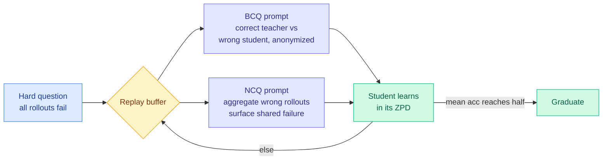

# Zone of Proximal Policy Optimization (ZPPO): Teacher in Prompts, Not Gradients

**TL;DR.** Distillation into a small student is brittle: forcing the student to imitate a much larger teacher's logits concentrates it on the teacher's sharpest modes and hurts out-of-distribution generalization. RL on the student's own rollouts avoids logit imitation, but on hard questions where every rollout fails (zero advantage, silently discarded), injecting a teacher response into the policy gradient breaks the on-policy assumption and causes drift. ZPPO, named after Vygotsky's zone of proximal development, keeps the teacher *inside the prompt* rather than the gradient. On hard questions it builds two reformulated prompts: a **Binary Candidate-included Question (BCQ)** that pairs one correct teacher answer with one wrong student answer as anonymized candidates to discriminate, and a **Negative Candidate-included Question (NCQ)** that aggregates the student's wrong rollouts to surface their shared failure mode. A replay buffer recirculates each hard question until the student's mean accuracy on it reaches half (it "graduates") or it is FIFO-evicted. On Qwen3.5 students from 0.8B to 9B with a 27B teacher, across a 31-benchmark VLM/LLM/video suite, ZPPO beats off-policy distillation, on-policy distillation, and GRPO — with the largest gains at the smallest scale.

**Source:** HuggingFace · [arxiv 2606.18216](https://arxiv.org/abs/2606.18216)

## Key findings

- **Teacher in the prompt, not the gradient** — sidesteps both the OOD-collapse of logit imitation and the on-policy drift of injecting teacher rollouts into the policy gradient.
- **Two prompt reformulations for hard (zero-advantage) questions:** BCQ turns it into a discrimination task between an anonymized correct teacher answer and a wrong student answer; NCQ pools the student's own wrong rollouts to expose their shared mistake.
- **Replay buffer with graduation:** each hard question recirculates until the student hits half mean accuracy, then graduates; finite capacity FIFO-evicts the rest, concentrating effort inside the student's zone of proximal development.
- **Largest gains at the smallest scale (0.8B):** beats off/on-policy distillation and GRPO across a 31-benchmark suite (16 VLM, 10 LLM, 5 video) on Qwen3.5 students with a 27B teacher.

## Relation to prior wiki

- ZPPO is the clearest answer yet to the question the [Extrapolation Cliff](2026-05-14-extrapolation-cliff-on-policy-distillation.md) (05-14, a closed-form capability gap past which on-policy distillation collapses) and the [distillation-panic](2026-05-04-distillation-panic-lambert.md) thread raised: how to distill into a *much* smaller student without collapse. Its answer — never imitate logits, never inject teacher rollouts, instead reshape the *prompt* — is a genuinely new third path beside off-policy and on-policy distillation.
- The "recirculate hard questions until they graduate" is a curriculum cousin of [SCRL: subproblem-curriculum RLVR](../llms-foundation-models/2026-05-23-scrl-subproblem-curriculum-rlvr.md) (05-23) and shares the zero-advantage problem that [WAPO](../llms-foundation-models/2026-06-17-wapo-winner-advantage-rlvr.md) (06-17) attacks from the gradient side — both papers, same day, both targeting the "every rollout fails, no signal" regime, with opposite fixes (WAPO drops it, ZPPO reformulates it).
- Updated in [knowledge-distillation](knowledge-distillation.md).

## Gaps

The 27B→0.8B gap is large but not frontier-scale; whether prompt-side teaching beats gradient-side distillation when the teacher is itself frontier-scale is open. BCQ/NCQ add prompt-construction overhead and depend on the student being able to *discriminate* even when it cannot *generate* — untested whether that holds on tasks without a clean correct/incorrect split.

Raw: `raw/huggingface/2026-06-17-zone-of-proximal-policy-optimization-teacher-in-prompts-not.md`
