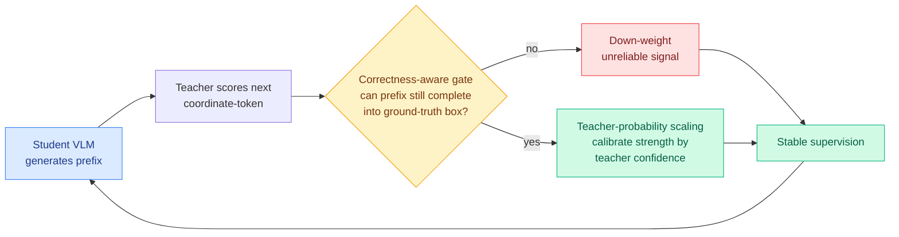

# Quality-Aware OPSD: gate the teacher per coordinate-token by whether it can still reach the right box

**TL;DR.** GUI grounding asks a vision-language model (VLM, a model that reads images and text together) to look at a high-resolution screenshot and predict the exact screen coordinates of the element an instruction wants clicked. On-policy self-distillation (OPSD, where the model is post-trained on its own generated outputs while a privileged version of itself supplies dense token-level teacher signals) is attractive here because hard coordinate labels are sparse, and the teacher's per-token signal carries far more information than the single ground-truth point. But naive OPSD breaks on this task: OPSD scores the teacher on the *student's* generated prefix, and once that prefix has already drifted off the target coordinate, the teacher's next coordinate-token prediction is being asked to continue a path that can no longer reach the right answer. The signal there is unreliable, and copying it hurts. Quality-Aware OPSD fixes this with two coupled mechanisms. A **soft correctness-aware gate** checks, given the student's prefix so far, whether the teacher's current coordinate-token prediction can still be completed into the ground-truth box; if not, that teacher signal is down-weighted. **Teacher-probability scaling** then uses the teacher's own confidence as a lightweight factor to calibrate how strongly the surviving, gated supervision is applied. The empirical headline: neither component helps alone, but combined they consistently beat the base model and strong baselines across six GUI grounding benchmarks.

## What it is

A post-training method for VLM-based GUI grounding that filters the OPSD teacher signal token by token instead of trusting it everywhere. Coordinate prediction is sequential: the model emits the coordinate as a sequence of tokens. On the student's own rollout, the prefix can wander off the target early. When that happens, the teacher's prediction for the next coordinate-token is still produced, but it is now conditioned on a doomed prefix, so it is noise dressed up as supervision. Quality-Aware OPSD asks a sharper question at every coordinate-token: under the student's current prefix, is there still a completion that lands inside the ground-truth box? The soft correctness-aware gate answers that and down-weights the signal when the answer is no. Teacher-probability scaling is the second, complementary knob: among the signals the gate keeps, it modulates strength by the teacher's confidence, so a hesitant teacher does not get the same weight as a sharp one.

## Key findings

- Two mechanisms, and the central empirical result is that they are complementary: correctness-aware gating alone does not improve overall performance, and teacher-probability scaling alone does not either; only the combination consistently improves.
- The two roles are distinct. Gating *suppresses* unreliable coordinate-token supervision (a yes/no reliability filter). Scaling *calibrates the strength* of the supervision that survives (a graded confidence weight). Filtering without calibration, or calibration without filtering, each falls short.
- Consistent improvement over both the base model and strong baselines across six GUI grounding benchmarks.
- The gate is grounded in the ground-truth box: it asks whether the student prefix can still complete into the known target region, which is what makes per-token reliability checkable for a coordinate task.

## How it relates to prior wiki knowledge

This is the **fourth on-policy-distillation paper in two days**, and it shares one core idea with the other three: the teacher signal is unreliable on hard or off-track cases, so it must be **gated or re-weighted, not copied blindly**. Name the cluster:

- [ZPPO](2026-06-17-zppo-teacher-in-prompts-not-gradients.md) (Zone of Proximal Policy Optimization, 06-17): on hard questions where every student rollout fails, pull the teacher *out* of the policy gradient entirely and inject it through the prompt instead, as discrimination tasks recirculated until the student graduates.
- [d-OPSD](2026-06-17-d-opsd-dllm-self-future-distillation.md) (Learning from the Self-future, 06-17): adapt OPSD to diffusion LLMs (models that generate by iterative denoising in arbitrary order) by conditioning the self-teacher on the student's own self-generated future answer as a suffix, and supervising at the denoising-step level.
- [OPD-Evolver](../agentic-systems/2026-06-17-opd-evolver-agent-evolver-on-policy-distillation.md) (06-17): distill the *ability to manage memory* into agent weights via on-policy self-distillation, with outcome-calibrated attribution crediting only the memory operations that actually helped.

Quality-Aware OPSD's specific move within that cluster is the most fine-grained reliability filter yet: gate the teacher *per coordinate-token* by whether the student's current prefix can still reach the right answer, then calibrate the survivors by teacher confidence. **State the pattern plainly: in roughly one week the field has converged on a single principle, that the OPSD teacher signal must be filtered or gated by reliability rather than applied uniformly.** This is not new in spirit. It is the precise continuation of the whole spring selection-and-gating line that the [knowledge-distillation](knowledge-distillation.md) concept page tracks: [SG-OPD](2026-06-12-sg-opd-sign-gated-on-policy-distillation.md) (06-12) made a verifier a gate that extrapolates the update where teacher and verifier agree and damps it where they disagree; [TrOPD](2026-06-03-tropd-trust-region-on-policy-distillation.md) (06-03) applied OPD only inside a reliable-supervision trust region; [TA-OPD](2026-06-01-ta-opd-token-teachability.md) (06-01) supervised only at tokens whose teacher correction the student could actually reach; [TIP](2026-04-16-tip-token-importance-on-policy-distillation.md) (04-16) found under 10% of teacher tokens carry signal. The diagnosis is also exactly the [Many Faces](2026-05-13-many-faces-on-policy-distillation.md) (05-13) "distribution mismatch" failure: teacher labels computed on student-generated prefixes go bad when the prefix has drifted. Quality-Aware OPSD ports that whole line out of math and code reasoning and into a coordinate-prediction VLM task for the first time, and adds the wrinkle that for a coordinate task, "can the prefix still reach the answer?" has a clean, ground-truth-box-checkable definition.

## Research angle

The correctness-aware gate works here because GUI grounding has a crisp completion test: the ground-truth box is known, so "can this prefix still land inside it?" is decidable per token. The open question is whether that gate generalizes past coordinate tasks to general OPSD, where "still reachable" is not a box-membership check but something fuzzier over a 150k-token vocabulary. Is this gate a special case of a general teacher-reliability estimator, the thing the [knowledge-distillation](knowledge-distillation.md) page's "joint formulation across all OPD facets" gap keeps asking for? TA-OPD's "teachability" and TrOPD's "trust region" and SG-OPD's "sign-consistency" and this paper's "can-still-complete" gate are four task-specific instances of the same latent quantity: per-token teacher reliability. A unified estimator that subsumes all four, with the coordinate-box case as the cleanest instance, would be the durable contribution. Second angle: the paper's finding that gating and confidence-scaling only work *together* is itself a claim about reliability estimation, namely that a binary keep/drop decision and a graded strength weight are not redundant. Whether that two-part structure (filter then calibrate) is fundamental or an artifact of this task is worth testing on the math-and-code OPD suites the rest of the line uses.

## Gaps

GUI grounding only; no evidence yet that the gate transfers to general reasoning OPSD. No scale study, so it is unknown whether the effect holds as student or teacher size grows, or with stronger base VLMs. The gate is fundamentally train-time only: it requires the ground-truth box to decide whether a prefix can still complete correctly, so it cannot be applied at inference and cannot help in settings where the target region is unknown. The abstract reports "consistent improvement" across six benchmarks but the magnitude is not pinned down here, and the compute overhead of running the per-token gate check is not netted out against the headline gains.

## Links

**Source:** [arXiv 2606.18101](https://arxiv.org/abs/2606.18101) · [HuggingFace](https://huggingface.co/papers/2606.18101) · raw: [`raw/huggingface/2026-06-18-trust-the-right-teacher-quality-aware-self-distillation-for.md`](../../../raw/huggingface/2026-06-18-trust-the-right-teacher-quality-aware-self-distillation-for.md)

**Related:** [knowledge-distillation.md](knowledge-distillation.md) · [ZPPO](2026-06-17-zppo-teacher-in-prompts-not-gradients.md) · [d-OPSD](2026-06-17-d-opsd-dllm-self-future-distillation.md) · [OPD-Evolver](../agentic-systems/2026-06-17-opd-evolver-agent-evolver-on-policy-distillation.md) · [SG-OPD](2026-06-12-sg-opd-sign-gated-on-policy-distillation.md) · [TrOPD](2026-06-03-tropd-trust-region-on-policy-distillation.md) · [TA-OPD](2026-06-01-ta-opd-token-teachability.md) · [TIP](2026-04-16-tip-token-importance-on-policy-distillation.md) · [Many Faces](2026-05-13-many-faces-on-policy-distillation.md)
