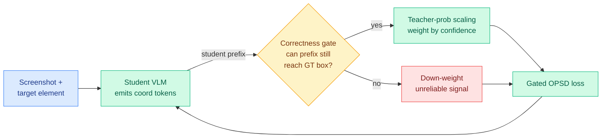

# Trust the Right Teacher: Quality-Aware Self-Distillation for GUI Grounding

**TL;DR.** GUI grounding is the task of looking at a high-resolution screenshot and predicting the exact pixel coordinates of a small target element (a button, a field). On-policy self-distillation (OPSD) is attractive here because it gives the student dense token-level teacher signal beyond the single hard coordinate label. But naive OPSD breaks in a way specific to coordinate prediction: OPSD evaluates the teacher on the student's own generated prefix, and once the student has already started emitting a wrong coordinate, the teacher's next coordinate-token prediction is being asked to continue a doomed prefix, so its signal is unreliable. This paper fixes that with two cooperating mechanisms. A **soft correctness-aware gate** checks whether the teacher's current coordinate-token prediction could still be completed into the ground-truth box given the student's prefix so far; if not, that teacher signal is down-weighted. **Teacher-probability scaling** then uses the teacher's own confidence as a lightweight multiplier to calibrate how strongly the surviving signal is applied. The key empirical result: neither piece helps alone, only the combination does. Across six GUI grounding benchmarks it beats the base model and strong baselines.

**Source:** HuggingFace · [arxiv 2606.18101](https://arxiv.org/abs/2606.18101) · arxiv-dated 2026-06-18

## What it is

A post-training method for vision-language models (VLMs) doing GUI grounding. The student generates coordinate tokens for a target element; on-policy self-distillation supervises those tokens with a teacher's per-token distribution computed over the student's own rollout. The contribution is making that teacher signal *quality-aware* in the one place it most often goes bad: coordinate tokens emitted after the student has already drifted off the target.

Two mechanisms:

- **Soft correctness-aware gate.** For each coordinate token, it asks whether, under the student-generated prefix, the teacher's predicted token can still be completed into the ground-truth bounding box. If the prefix has already wandered outside reach, the teacher's continuation is supervising the student toward a coordinate it cannot validly produce, so the gate down-weights it. "Soft" because it is a continuous down-weighting, not a hard mask.
- **Teacher-probability scaling.** A separate lightweight factor that scales the gated supervision by the teacher's own confidence, so a confident-and-reachable teacher token counts more than a hesitant one.

The headline empirical finding is the **complementarity**: gating alone or scaling alone does not reliably improve overall performance, but together they consistently do. The gate suppresses unreliable coordinate-token supervision; the scaling calibrates the strength of what survives.

## Key findings

- Naive OPSD's failure for GUI grounding is prefix-dependent: teacher coordinate-token quality degrades precisely when the student's prefix has already deviated from the target box.
- The soft gate plus teacher-probability scaling consistently improves the base model and outperforms strong baselines across six GUI grounding benchmarks.
- The two components are individually insufficient and jointly effective, which the authors read as evidence they play distinct roles (suppression vs calibration).

## Relation to prior wiki

This is the GUI-grounding instance of the wiki's deepest 2026 thread: **on-policy distillation fails when the teacher is evaluated on student-induced off-distribution states, so don't trust the teacher uniformly.** See [knowledge-distillation](knowledge-distillation.md).

- The "down-weight teacher signal where the student prefix has already gone wrong" move is the coordinate-token version of the prefix-failure diagnosis that [TRD](2026-06-09-trd-trajectory-refined-distillation.md) (06-09, a wrong early step makes the teacher's per-token distribution bimodal and fragments the gradient) named at the trajectory level, and of the reliability trust region in [TrOPD](2026-06-03-tropd-trust-region-on-policy-distillation.md) (06-03, apply OPD only where the teacher's supervision is reliable). Where TRD *repairs* the bad prefix and TrOPD *clips* the unreliable region, this paper *gates and rescales* per coordinate token using a domain-specific reachability check (can this prefix still land in the box).
- It sharpens the selection line ([TIP](2026-04-16-tip-token-importance-on-policy-distillation.md) → [TA-OPD](2026-06-01-ta-opd-token-teachability.md) "reachable corrections" → [FiRe-OPD](2026-06-04-fire-opd-filter-then-reweight-distillation.md) "soft-reweight retained tokens") by giving "reachability" a literal geometric meaning in coordinate space: a token is teachable if its prefix can still complete into the ground-truth box. The abstract "teachability" of TA-OPD becomes a concrete bounding-box containment test.
- The complementarity finding (gate alone and scale alone both fail) echoes [SG-OPD](2026-06-12-sg-opd-sign-gated-on-policy-distillation.md) (06-12), which also pairs a gate with a strength modulator and argued neither granularity suffices alone.
- On the application side it joins the GUI-agent line ([gui-agents](../agentic-systems/gui-agents.md)): UI-Zoomer (04-16) used uncertainty to *zoom* before grounding; this uses correctness-reachability to *weight the training signal* for grounding. Both target the small-target high-resolution coordinate problem, one at inference, one at post-training.

## Research angle

The gate needs a "can this prefix still reach the ground-truth box" oracle, which is cheap when you have the label at training time but is exactly the kind of privileged signal the broader OPD line keeps trying to internalize. The open question for the distillation program: is the reachability gate a coordinate-specific trick, or an instance of a general "teacher-reliability = student-prefix-feasibility" rule that could be defined for any structured output with a checkable partial-completion test (code with a parser, JSON with a schema, math with a verifier)? If the latter, this is the structured-output generalization of TA-OPD's teachability, and the natural experiment is to port the soft-gate-plus-confidence-scaling pair to a non-coordinate structured task and see if the complementarity holds.

## Gaps

Six GUI benchmarks but no scale ablation (the brittleness of coordinate OPSD should be worst at small scale, as in [ZPPO](2026-06-17-zppo-teacher-in-prompts-not-gradients.md), but that is not characterized). The reachability gate depends on having the ground-truth box, so it is a training-time-only signal; whether a learned reachability estimate works is untested. No report on inference latency or memory, the usual OPD efficiency ledger.

Raw: `raw/huggingface/2026-06-18-trust-the-right-teacher-quality-aware-self-distillation-for.md`
