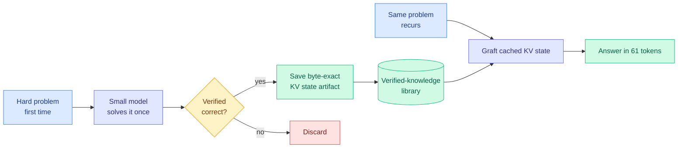

# Byte-Exact KV-Cache Grafting: Verified Knowledge as a Reusable Cache Artifact

**Source:** HuggingFace Daily Papers (10 upvotes, 2026-07-17) | **arXiv:** [2607.14431](https://arxiv.org/abs/2607.14431) | **Author:** Sietse Schelpe (Corbenic AI)

## TL;DR

Deposit the exact KV cache (key-value cache, a transformer's attention memory store) state that solved a hard problem once, then graft it byte-for-byte into a fresh inference context later. The frozen small model resumes from having already worked out the answer. Gemma-4-12B goes from 80.0% to 93.3% on AIME 2025, answers recurring problems in 61 tokens (6,574x fewer, ~8,700x less energy), and extends usable context from 32,768 to 2,854,766 tokens with no extra GPU memory. No weight changes.

## Diagram

## Key points

- **Byte-exact, hash-committed reuse.** Unlike prefix/prompt caching (reuse within a serving window for identical prefixes), a verified KV state is a durable, portable artifact deposited in a library and restored into a different context bit-for-bit identically. All metrics backed by committed input/output hashes.
- **Solve once, replay cheap.** Retrieval re-reads documents every call; fine-tuning needs a training run and inexact weight edits. Grafting pays the derivation cost once, reuses at near-zero marginal cost.
- **Numbers.** AIME 2025: 80.0% → 93.3% (Gemma-4-12B). Eight recurring unsolvable problems answered in 61 total decode tokens. Context 32,768 → 2,854,766 with no extra accelerator memory. Byte-exact across 12B and 31B.

## Relation to prior wiki knowledge

- **Mirror of KVpop (2026-07-08, learned KV eviction).** KVpop learns which cache entries to *drop*; this learns which to *keep and reuse*. Two halves of treating the KV cache as the optimization target. See [inference-efficiency/kv-cache.md].
- **KV-cache analogue of memory poisoning (J-space digest, 2026-07-07).** A stale byte-exact graft is a hard commitment: if the new query differs from the cached one, the graft can inject a confident wrong answer the model will not correct, because it believes the work is done.
- **Capability-extraction-from-fixed-models thread.** Sits with the Mirage of Optimizing Training Policies (07-07) and The Harness Effect (07-11 weekly): the model is increasingly fixed, engineering moves to what wraps it.

## Gaps

Proprietary grafting engine (not reproducible despite committed hashes). Evaluated on AIME (clean verifiable answers, the friendliest case). Behavior under distribution shift (similar-but-not-identical queries) untested and is the key risk. Single author, single affiliation.

## Research angle

Graft safety under distribution shift is the open problem. The natural fix is a verifier gate on graft eligibility (compose with the continuous verifier from Verification as a Scaling Axis, 07-11 weekly): only graft when a cheap check confirms the cached state applies. Falsifiable: measure wrong-answer rate on near-miss grafts, with and without a verifier gate.

## Raw source

[arXiv 2607.14431](https://arxiv.org/abs/2607.14431) · farmed to `raw/huggingface/2026-07-17.md`
