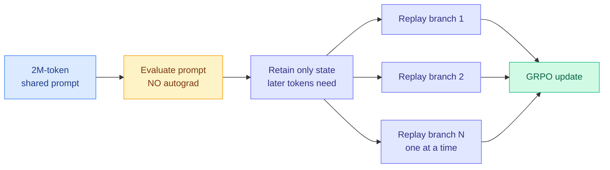

# LongStraw: Long-Context RL Beyond 2M Tokens under a Fixed GPU Budget

**Source:** HuggingFace Daily Papers (175 upvotes, 2026-07-17) | **arXiv:** [2607.14952](https://arxiv.org/abs/2607.14952) | **Affiliations:** MindLab, Fudan University

## TL;DR

Reinforcement-learning post-training past 2 million tokens on a fixed (8-to-32) GPU budget. LongStraw evaluates the shared prompt without building the autograd graph, retains only the model-specific state later tokens need, and replays short response branches one at a time. This shrinks the live training graph, trading extra replay time for a large memory saving. Closes the gap between million-token inference and 256K-token RL post-training. Honestly scoped: demonstrates execution *capacity*, not yet full training *correctness*.

## Diagram

## Key points

- **Decouples prompt evaluation from response gradients.** Standard GRPO RL holds prompt graph + all response graphs + cached state simultaneously; that is what makes long context explode. LongStraw evaluates the prompt with no autograd, detaches the needed state, then processes response branches sequentially so only one short branch's graph is live at a time.
- **Numbers.** 8 H20 GPUs: grouped scoring + response backward at 2.1M positions for groups of 2 and 8; stress test to 4.46M. Group size 2→8 adds only 0.21 GB peak memory (groups share the detached prompt state). 32 H20 GPUs: end-to-end path validated for a 2.1M-token prompt across all 78 layers of GLM-5.2.
- **Two real architectures:** hybrid recurrent + full-attention Qwen3.6-27B; compressed-attention MoE GLM-5.2.
- **Fixed-budget framing.** Ring Attention / DeepSpeed-Ulysses / ByteScale scale *out* to hundreds-to-thousands of GPUs; LongStraw's contribution is doing million-token RL under a small, static budget.

## Relation to prior wiki knowledge

- **Answers the training-length side of the agent long-horizon problem.** Long-Horizon-Terminal-Bench (07-13) measures where agents drift on long tasks; if agents are trained at 256K but deployed at 1M+, drift is expected. LongStraw lets you train at deployment length.
- **Tier 1 GPU-efficiency.** Sits on the same memory-management axis as FlashAttention and the KV-cache thread.
- **Composes with selective distillation.** If trajectories are now 2M tokens, TIP's "only ~10% of tokens carry signal" (04-16) becomes a memory-management question too. Composing LongStraw's selective state retention with selective OPD signal is unexplored.

## Gaps

Authors explicitly state the experiments "establish execution capacity rather than complete training correctness": prompt state is detached and some distributed forward/gradient-composition paths remain incomplete. Load-bearing follow-up: an end-to-end run proving a 2M-token-trained agent beats a 256K-trained one at long-context deployment. Replay-time vs memory trade at 2M+ tokens not fully priced in wall-clock.

## Research angle

The replay-time-vs-memory trade decides whether this is practical or merely possible. Open composition: does the detached-prompt-state approach interact with the on-policy distillation thread when trajectories are 2M tokens long?

## Raw source

[arXiv 2607.14952](https://arxiv.org/abs/2607.14952) · farmed to `raw/huggingface/2026-07-17.md`
