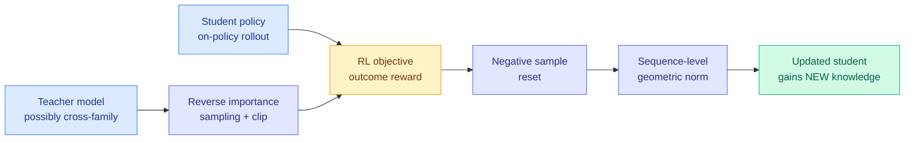

# Distilled RL: Teacher-Guided Reinforcement Learning for LLM Post-training

**TL;DR.** LLM post-training splits into two camps, each with a flaw. Reinforcement learning (RL) trains on outcome rewards, which are too coarse for credit assignment and cannot inject genuinely new knowledge. On-policy distillation (OPD) matches teacher logits via KL divergence, but this only works within a model family: a similar teacher adds nothing, and a very different teacher gives guidance the student cannot follow. Distilled RL folds teacher supervision *into* the RL objective, so the teacher gives fine-grained guidance while the RL machinery selectively transfers only the knowledge the student actually lacks, instead of unconditionally imitating everything.

## What it is

A post-training method that unifies RL and distillation. Instead of choosing between coarse outcome reward (RL) or unconditional logit matching (OPD), Distilled RL integrates the teacher signal into the RL update through three components: **reverse importance sampling with clipping** (weight teacher guidance by how relevant it is to the student's current distribution, clipped for stability), **negative sample reset**, and **sequence-level geometric normalization**. The effect is fine-grained, selective knowledge transfer: the teacher steers the student toward knowledge it does not have, without forcing it to copy knowledge it already possesses or guidance it cannot use.

## Core novelty

Resolving the OPD dilemma — similar teacher = no new knowledge, different teacher = unusable guidance — by making the transfer *conditional* through the RL objective rather than an unconditional KL term. A case study shows Distilled RL transferring knowledge a student could not previously acquire, and it works in **cross-family** distillation, which vanilla OPD largely cannot.

## Key results

- Outperforms both standard RL and OPD on **pass@1 and pass@k**, across within-family *and* cross-family teacher/student pairs.
- Demonstrates transfer of previously unavailable knowledge in an interpretable case study.
- Code released.

## How it relates to prior wiki knowledge

- **Directly advances the on-policy-distillation thread** the wiki has tracked densely since spring: [TIP (2026-04-16)](2026-04-16-tip-token-importance-on-policy-distillation.md) (only ~10% of teacher tokens carry signal), [Many Faces of On-Policy Distillation (2026-05-13)](2026-05-13-many-faces-on-policy-distillation.md), [OPRD (2026-06-05)](2026-06-05-oprd-on-policy-representation-distillation.md), [Sign-Gated OPD (2026-06-12)](2026-06-12-sg-opd-sign-gated-on-policy-distillation.md), [TA-OPD token teachability (2026-06-01)](2026-06-01-ta-opd-token-teachability.md). All of these ask *which* teacher signal to keep; Distilled RL asks *whether* to keep any, by conditioning transfer on the student's need. See [knowledge-distillation.md](knowledge-distillation.md).
- **Bridges to the RL thread** ([rl-for-llms.md](../llms-foundation-models/rl-for-llms.md)): it is a member of the growing "distillation and RL are the same objective" family alongside [GFT: SFT as degenerate RL (2026-04-21)](../llms-foundation-models/2026-04-21-gft-sft-as-degenerate-rl.md) and [SDPG self-distilled policy gradient (2026-06-04)](2026-06-04-sdpg-self-distilled-policy-gradient.md).
- **Cross-family transfer is the notable unlock**: prior OPD was stuck within-family. If this holds, it reopens distillation from strong models into architecturally different students.

## Gaps

Benchmarks are reasoning/coding pass@k; open-ended non-verifiable tasks are not the focus (contrast with today's [Experiential Learning](../llms-foundation-models/2026-07-21-experiential-learning-llm-as-coach.md), which targets exactly those). "Selectively transfer new knowledge" is validated by a case study, not a large-scale mechanistic analysis of what gets transferred and what gets skipped. Compute cost versus plain RL (running a teacher every rollout) is not the headline.

**Raw source:** [HuggingFace Daily Papers 2026-07-21](../../../raw/huggingface/2026-07-21.md) · [arXiv 2607.17247](https://arxiv.org/abs/2607.17247) · [code](https://github.com/597358816/Distilled-RL)
