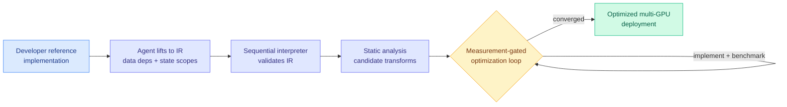

# FlashRT: Agent Harness for Deploying Real-Time Multimodal Applications

> **Note on the name:** this is unrelated to the May 2026 [FlashRT efficient red-teaming paper](2026-05-02-flashrt-efficient-red-teaming.md). Same acronym, different work. This FlashRT (arXiv 2607.18171) is a coding-agent harness for optimizing GPU deployments.

**TL;DR.** Real-time multimodal pipelines (voice agents, interactive video generation) stitch together heterogeneous models, and squeezing latency out of them normally requires an expert hand-tuning placement, streaming, and parallelism for each new app. FlashRT is an agent harness that guides a generic coding agent to turn a simple reference implementation into an optimized multi-GPU deployment. It reports up to ~70x latency reduction and 2.8x throughput on NVIDIA B200, and — the most interesting result — it does *better* on the less-mature AMD MI355X (3.6x throughput), because agent-driven optimization scales where hand-built expert kernels do not yet exist.

## What it is

An agent harness for GPU deployment optimization. Existing serving systems and auto-parallelism compilers commit to a fixed set of transformations and workload assumptions, so a new real-time multimodal app still needs hand-crafting. FlashRT instead directs a generic coding agent through a **chain-of-program** process: (1) lift the reference into an intermediate representation (IR) capturing data dependencies and persistent-state scopes; (2) validate the IR with a sequential interpreter; (3) run static analyses to surface candidate transformations (placement, streaming, intra-model parallelism); (4) iteratively implement, verify, and benchmark each candidate in a **measurement-gated loop** so only transforms that actually improve the target metric survive.

## Core novelty

The chain-of-program paradigm plus the measurement-gated loop: the agent is not asked to "optimize the code" in one shot, it is forced through a verify-then-benchmark cycle grounded in a validated IR, so speedups are empirically confirmed rather than hallucinated. It flexibly weights latency vs throughput against a hardware budget, producing different deployments for different GPUs from the same reference.

## Key results

- Up to **~70x latency reduction** and **2.8x throughput** on NVIDIA B200 across video world models and multimodal LLMs.
- On **AMD MI355X**: matched peak latency reduction and pushed peak throughput to **3.6x** — agent-driven optimization is *more* valuable on platforms with less mature expert tooling.
- For Qwen3-Omni text-to-audio, **65% lower response latency** than the expert-tuned vLLM-Omni implementation on MI355X.

## How it relates to prior wiki knowledge

- **Slots into the "agents optimize GPU code" thread**: [AccelOpt (2026-04-20)](2026-04-20-accelopt-gpu-kernel-optimization.md), [AgentKernelArena (2026-05-19)](../hardware/2026-05-19-agentkernelarena-gpu-kernel-optimization-agents-benchmark.md), and [KernelBench-X (2026-05-09)](../hardware/2026-05-09-kernelbench-x-llm-gpu-kernel-benchmark.md). FlashRT moves up a level from single-kernel generation to full deployment topology.
- **Confirms the "instrumentation, not raw capability" meta-pattern** the digest has tracked all July: value now comes from measuring and extracting from systems, not bigger models.
- **The AMD result is the industrially loaded one**: it directly intersects the [NVIDIA-grip-weakening / Microsoft-and-Anthropic-to-AMD](../ai-industry/) hardware story of the same week — agent-driven optimization is precisely what makes a less-mature accelerator viable without waiting years for expert kernels.

## Gaps

Reported speedups are relative to the developer's naive reference, so the ~70x headline is against an unoptimized baseline, not against a strong hand-tuned system (the vLLM-Omni comparison, 65%, is the fairer number). The measurement-gated loop needs a benchmarkable target and representative workload; apps without a clean latency/throughput metric are out of scope. Cost of the optimization search itself (agent tokens, GPU-hours to benchmark candidates) is not front-and-center.

**Raw source:** [HuggingFace Daily Papers 2026-07-21](../../../raw/huggingface/2026-07-21.md) · [arXiv 2607.18171](https://arxiv.org/abs/2607.18171)
