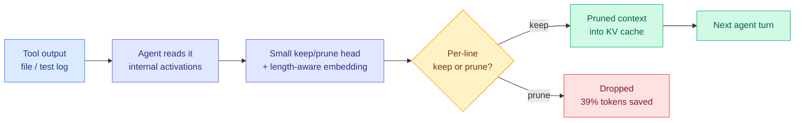

# SWE-Pruner Pro: The Coder LLM Already Knows What to Prune

**TL;DR.** Coding agents drown in long tool outputs (file dumps, test logs, grep results) that bloat the context window and the KV cache. Prior context-pruning work (SWE-Pruner) bolted on a *separate* classifier to decide which lines to keep. SWE-Pruner Pro shows that is unnecessary: the agent's own internal activations, computed while it reads a tool output, already encode which lines are relevant. A tiny keep-or-prune head reading those activations saves up to 39% of prompt and completion tokens while preserving task quality, and on one backbone it even *raises* SWE-Bench Verified resolve rate by +3.8%.

## What it is

Context pruning for long-horizon coding agents. When an agent calls a tool (open a file, run tests, grep), the raw output is often hundreds of lines, most irrelevant to the task. Keeping it all inflates the prompt, the KV cache, and per-turn cost. SWE-Pruner Pro prunes tool outputs *inside* the agent: a small head turns the agent's own per-line internal representations into a keep-or-prune label, with a length-aware embedding keyed to each tool output's line count.

## Core novelty

The finding that the relevance signal is *already present* in the base agent's activations while it reads the output, so no separate code classifier is needed. This removes the extra model call and the train/serve mismatch that a bolt-on classifier introduces. It is the coding-agent analogue of the "the model already knows" line the wiki has tracked in other settings: [TIP (2026-04-16)](2026-04-16-tip-token-importance-on-policy-distillation.md) found most teacher tokens carry no distillation signal and only ~10% matter; [Make Each Token Count (2026-05-12)](2026-05-12-make-each-token-count-kv-eviction.md) used the model's own attention to drive KV eviction. SWE-Pruner Pro extends the pattern to agent tool-output context.

## Key results

- Up to **39% of prompt + completion tokens saved** across two open-weight backbones and four multi-turn benchmarks, with bounded inference overhead.
- On MiMo-V2-Flash, **+3.8% SWE-Bench Verified** resolve rate and **+2.2 points** on the long-context Oolong benchmark — pruning noise *improved* accuracy, not just cost.
- No separate classifier model to train, serve, or keep in sync with the agent.

## How it relates to prior wiki knowledge

- **Extends the context-compression thread**: [TokenPilot (2026-06-16)](2026-06-16-tokenpilot-cache-efficient-agent-context.md) cache-efficient agent context, [LongAttnComp (2026-06-02)](2026-06-02-longattncomp-context-compression.md), [LCLM end-to-end context compression (2026-06-09)](2026-06-09-lclm-end-to-end-context-compression.md). SWE-Pruner Pro is the first to do it with zero added model by reusing the agent's own activations.
- **Confirms the "internal representations are a free signal" pattern** ([kv-cache.md](kv-cache.md) concept page), joining attention-driven eviction work.
- **Industrial angle**: this is directly deployable on top of any open-weight coding agent (SWE-Bench-style harness) with a small trained head, no architecture change.

## Gaps

Tested on two open-weight backbones only; whether the internal-relevance signal transfers to frontier proprietary agents (which may encode relevance differently) is untested. The +3.8% resolve-rate gain is on one backbone (MiMo-V2-Flash); the effect on other models is preservation, not improvement. Length-aware embedding is keyed to line count, so it may misbehave on tool outputs with very long single lines (minified files, base64 blobs).

**Raw source:** [HuggingFace Daily Papers 2026-07-21](../../../raw/huggingface/2026-07-21.md) · [arXiv 2607.18213](https://arxiv.org/abs/2607.18213)
