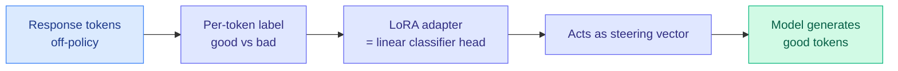

# TOPL: Token-Level Off-Policy Labeling for Faithful Generation

**TL;DR.** TOPL (Token-Level Off-Policy Labeling) reframes post-training as a **token-level correctness-prediction** task: instead of training the model to directly generate off-policy tokens (which is unstable), train it to distinguish good tokens from bad ones in a response. Guiding the model to recognize good tokens naturally steers it toward generating them, while avoiding the pitfalls of directly imitating off-policy data. It gives strong out-of-distribution generalization on faithful-generation tasks like summarization and machine translation.

## What it is

An off-policy post-training paradigm for faithful generation under distribution shift. Rather than sequence-level objectives or direct off-policy token imitation, TOPL trains the model to predict, per token, whether it is "good" or "bad." That discrimination signal doubles as generation guidance. Ablations confirm the token-level signal is essential — sequence-level analogues do not confer the same benefit.

## Core novelty

Turning post-training into **token-level correctness classification**, and the interpretability payoff: the LoRA adapters learned by TOPL function as **linear classification heads and steering vectors**, so the learned update is mechanistically legible rather than an opaque weight change.

## Key results

- Strong OOD generalization across **11 summarization datasets** against sequence-level and token-level baselines.
- Transfers to **machine translation**, suggesting the benefit generalizes across faithful-generation tasks.
- Token-level signal is critical (sequence-level does not work); LoRA adapters are interpretable as linear heads / steering vectors.

## How it relates to prior wiki knowledge

- **Third data point in the "token-level signal beats sequence-level" pattern** the wiki has tracked: [TIP (2026-04-16)](2026-04-16-tip-token-importance-on-policy-distillation.md) (~10% of teacher tokens carry the distillation signal) and [TIDE: every layer knows the token (2026-05-09)](../llms-foundation-models/2026-05-09-tide-every-layer-knows-token.md). TOPL says the same for off-policy faithfulness. Pairs with today's [Distilled RL](2026-07-21-distilled-rl-post-training.md) (selective, not unconditional, transfer).
- **The interpretable-LoRA-as-steering-vector** result connects to the responsible-ai steering-vector thread and to [knowledge-distillation.md](knowledge-distillation.md).

## Gaps

Faithful-generation tasks (summarization, translation) have relatively local token-correctness structure; whether token-level labeling helps on reasoning tasks where correctness is non-local is untested. Requires a source of per-token good/bad labels. Not compared against today's Distilled RL directly despite the shared token-level premise.

**Raw source:** [HuggingFace Daily Papers 2026-07-21](../../../raw/huggingface/2026-07-21.md) · [arXiv 2607.17524](https://arxiv.org/abs/2607.17524)
