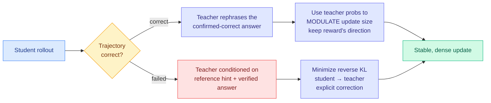

# H²SD: Hybrid Hindsight Self-Distillation

**Source:** HuggingFace Daily Papers (2026-07-22) · [arXiv 2607.18955](https://arxiv.org/abs/2607.18955) · [raw](../../raw/huggingface/2026-07-22-h-2sd-hybrid-hindsight-self-distillation.md)

## TL;DR

RLVR (reinforcement learning with verifiable rewards) gives one scalar reward for a whole reasoning trajectory, which is sparse and offers no per-token credit. On-policy distillation (OPD) fixes the density problem by copying a stronger teacher's token distributions, but needs a separate teacher and a shared vocabulary. On-policy self-distillation (OPSD) removes the extra teacher by letting the same model act as its own teacher when given privileged information, but directly matching that teacher distribution leaks the privileged info and destabilizes training. H²SD's move is to use the self-teacher **differently depending on whether the trajectory was right or wrong**. For correct rollouts it only modulates step size; for failed rollouts it supplies an explicit correction direction from a hinted teacher.

## Key points

- **Correct trajectories → magnitude only.** The teacher is shown the student's own confirmed-correct response plus a rephrasing instruction; its probabilities on the original tokens scale the update size but do not override the direction that the reward already established. This avoids overwriting a good answer with the teacher's stylistic preferences.
- **Failed trajectories → direction.** The teacher is conditioned on a reference hint (key reasoning steps and the verified answer), and the student minimizes reverse KL toward this hinted teacher. This is the piece prior methods lacked: when a rollout fails, RLSD (a predecessor) could only shrink or grow the step, never point the student the right way. H²SD gives an explicit correction vector.
- Positions itself against three baselines it names directly: vanilla RLVR (sparse), OPSD (leaks privileged info, unstable), and RLSD (modulates magnitude but gives no correction direction on failures).
- Reports consistent wins over representative RLVR / OPSD / RLSD baselines on multiple hard reasoning benchmarks, with stable optimization and favorable generation efficiency.

## How this relates to prior wiki knowledge

H²SD is the clearest **continuation** of yesterday's convergence. On 07-21 four papers (Distilled RL, TOPL, GEPO, LLM-as-a-Coach) all attacked the same weakness: a scalar reward throws away everything except a number, so the fix is denser supervision ([2026-07-21 digest](../daily-digest/2026-07/2026-07-21.md)). H²SD is a fifth instance, and it sharpens the "which teacher signal to keep" line the [knowledge-distillation](knowledge-distillation.md) page tracks (TIP 04-16, TA-OPD 06-01, Sign-Gated OPD 06-12) by conditioning the *form* of the teacher signal on outcome: correctness gates whether the teacher moves magnitude or direction.

It sits in the self-distillation lineage the [rl-for-llms](../llms-foundation-models/rl-for-llms.md) page records: SDPG (06-04, exact full-vocabulary self-distillation as a dense per-token signal) and RLRT (05-12, reinforce the tokens where the student out-reasoned the teacher). H²SD's hindsight-on-failure mechanism is the natural pairing with Distilled RL's conditional transfer (07-21): both decide *whether and how* to apply teacher signal per trajectory rather than matching unconditionally. The open thread from yesterday, a **bandwidth-versus-trustworthiness frontier** for RL feedback, applies here too: H²SD's failure-direction signal is anchored to a *verified* answer, which places it on the trustworthy-and-dense side of that frontier rather than the gameable-rubric side.

## Gaps

The failure branch depends on a reference hint containing the verified answer, so H²SD needs ground-truth solutions available at training time, which limits it to verifiable domains and does not obviously extend to open-ended tasks. Whether conditioning the teacher on the answer risks the same information-leakage it was designed to avoid (the answer now flows in through the hint) is not fully dissected. Benchmarks are reasoning-only; no coding or agentic results reported.

## Research angle

The outcome-conditioned teacher is a small, general idea: use rich teacher signal for *what to fix* and cheap scalar signal for *what to keep*. If that split generalizes, it argues the "dense feedback" papers are over-applying the teacher on trajectories that are already correct, where a magnitude nudge suffices. A study measuring how much of OPD's cost is spent re-teaching correct rollouts would test whether H²SD's asymmetry is a free lunch or a domain-specific trick.
