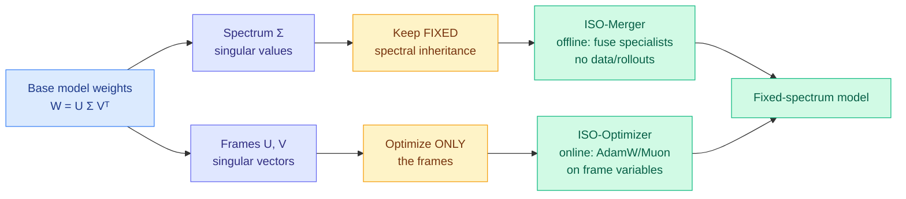

# ISO: An RLVR-Native Optimization Stack

**Source:** HuggingFace Daily Papers (2026-07-22) · [arXiv 2607.19331](https://arxiv.org/abs/2607.19331) · [raw](../../raw/huggingface/2026-07-22-iso-an-rlvr-native-optimization-stack.md)

## TL;DR

RLVR (reinforcement learning with verifiable rewards, where a model earns a reward only when its answer checks out) has a well-studied reward layer and a poorly-understood optimization layer: nobody had asked what the *right optimizer* is for turning reward feedback into weight updates. ISO answers with an empirical claim about weight structure. When you decompose a weight matrix by its singular value decomposition into singular values (the "spectrum," the magnitudes) and singular vectors (the "frames," the directions), RLVR barely touches the spectrum. It reuses the base model's singular values and acquires new behavior almost entirely by rotating the input and output frames. ISO calls this **spectral inheritance** and builds an optimizer around it: freeze the spectrum, optimize only the frames.

## Key points

- **Spectral inheritance** is the empirical finding: RLVR reuses the base model's weight spectra and expresses new behavior through changes in the associated input/output singular frames. The magnitudes are inherited; the directions are learned.
- **ISO-Merger (offline)** fuses several shared-base specialists into one fixed-spectrum model by combining their frame changes. It needs no post-merge data, no rollouts, no gradient steps, and no on-policy distillation, yet recovers complementary specialist capabilities and posts the strongest aggregate score among data-free merging methods.
- **ISO-Optimizer (online)** runs a standard base optimizer (AdamW or Muon) on the frame variables while holding the spectrum fixed. On Qwen3-8B-Base, plain AdamW reaches 0.495 aggregate accuracy after 270 steps; ISO-AdamW reaches the same at **100 steps** and climbs to 0.509 by 210 steps. Same target, far fewer steps.
- Tested across reasoning and coding from 1.5B to 8B parameters.
- The thesis in one line: do not inherit pre-training optimization wholesale for post-training. Design the optimizer around the *structure of reward-driven adaptation*, which is frame rotation, not spectral rescaling.

## How this relates to prior wiki knowledge

This **extends** the wiki's longest-running post-training thread, "the learning signal is sparse and locatable, spend effort only there" ([rl-for-llms](../llms-foundation-models/rl-for-llms.md)), but relocates the locus. Where TIP (04-16, only ~10% of teacher tokens carry signal) and LongAct (04-18, gradient signal concentrated in high-magnitude activations) located the signal in *tokens* and *activations*, ISO locates it in *weight geometry*: the frames, not the spectrum. It is the optimizer-layer sibling of WAPO (06-17, RLVR collapse as token-level gradient dynamics) and the trust-region stabilizers MAI-Thinking-1 / TrOPD (06-03), except ISO reshapes *which parameters move* rather than *how far each step goes*.

It also **complements** the same-day H²SD ([2026-07-22-h2sd-hybrid-hindsight-self-distillation](2026-07-22-h2sd-hybrid-hindsight-self-distillation.md)) and Stale-but-Stable/SAT ([2026-07-22-sat-staleness-adaptive-trust-regions](2026-07-22-sat-staleness-adaptive-trust-regions.md)): all three are RLVR-optimization papers landing the day after yesterday's four-paper RL-distillation convergence (Distilled RL, TOPL, GEPO, LLM-as-a-Coach on 07-21). H²SD works on the *reward/supervision* layer, SAT on the *asynchronous-training-stability* layer, and ISO on the *weight-update geometry* layer. Same week, three different layers of the RLVR stack getting first-class treatment.

## Gaps

The spectral-inheritance claim rests on empirical observation up to 8B; whether the spectrum stays genuinely fixed-worthy at frontier scale, or whether some capabilities require spectral change, is unshown. ISO-Merger only combines *shared-base* specialists, so cross-family merging is out of scope. And "improves accuracy in the reported runs" is careful phrasing that leaves the variance across seeds uncharacterized.

## Research angle

If reward-driven adaptation really lives in the frames, the frozen spectrum is a compression and interpretability handle at once: a fixed-spectrum family of specialists differs only by orthogonal rotations, which is a far smaller and more mergeable object than a set of full weight deltas. The open question is whether frame-only adaptation composes with token-level selection (TIP) and staleness-aware clipping (SAT), i.e. whether the sparse-signal thread's four loci (tokens, activations, timing, weight-frames) are independent knobs or the same underlying structure seen four ways.
