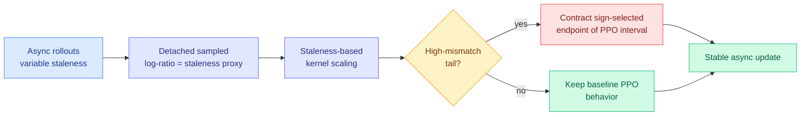

# Stale but Stable: Staleness-Adaptive Trust Regions for Asynchronous RL (SAT)

**Source:** HuggingFace Daily Papers (2026-07-22) · [arXiv 2607.18722](https://arxiv.org/abs/2607.18722) · [raw](../../raw/huggingface/2026-07-22-stale-but-stable-staleness-adaptive-trust-regions-for-stabil.md)

## TL;DR

Asynchronous RL boosts training throughput by letting rollout generation run separately from the optimizer, so GPUs never idle waiting for each other. The cost is **staleness**: by the time a rollout is used for an update, the policy has already moved on, and the gap is worsened by policy lag, engine delays, and mixture-of-experts routing drift. From a trust-region view this is the real danger, because training-inference divergence controls the approximation error, while PPO's clipping only gates the sampled outward updates and acts as a partial surrogate rather than a true full-policy constraint. So the highest-staleness updates, exactly where stale rollouts matter most, stay weakly controlled. SAT adds a staleness-aware clip that tightens only the risky tail.

## Key points

- **Staleness proxy.** SAT uses the detached sampled log-ratio (how far the sampling policy has drifted from the current one) as a cheap, per-token staleness measure, with no extra bookkeeping.
- **Targeted contraction.** It identifies the high-mismatch tail within each batch via staleness-based kernel scaling, then contracts only the sign-selected endpoint of the nominal PPO clip interval. Ordinary tokens keep their baseline behavior; only the newly-caught outward bands get a more conservative update.
- **Theory.** The paper proves local interval containment and pointwise pessimism relative to PPO, i.e. SAT is provably never looser than PPO and strictly tighter on the stale tail.
- **Setup and numbers.** Decoupled asynchronous RL on Qwen3-30B-A3B-Base, SGLang for inference and Megatron for training. SAT-GSPO w/ R3 posts the best observed AIME24 avg@8: 35.83 at lag 1 and 34.79 at lag 8; SAT-GSPO reaches 34.17 at lag 1. Adaptive clipping and routing replay ("R3") are complementary stabilizers, one for mismatch tails and one for MoE routing inconsistency.

## How this relates to prior wiki knowledge

SAT is the **asynchronous-training-stability** layer of the RLVR stack, landing the same day as ISO ([spectral inheritance / frame optimization](2026-07-22-iso-rlvr-native-optimization.md)) and H²SD ([outcome-conditioned self-distillation](2026-07-22-h2sd-hybrid-hindsight-self-distillation.md)). Together the three continue the RL-optimization surge that yesterday's four-paper convergence (07-21) opened, each attacking a different layer.

It is a direct **descendant** of the trust-region thread on [rl-for-llms](../llms-foundation-models/rl-for-llms.md): MAI-Thinking-1 and TrOPD (06-03) reached for a "breathing" trust region against reverse-KL gradient outliers, and WAPO (06-17) gave GRPO collapse a token-level gradient taxonomy and proposed dropping the destabilizing branch entirely. SAT refines that instinct: instead of a global clip or a blunt drop-all-negatives rule, it clips *only where staleness predicts danger*, which is the "adaptive clip on predicted-destabilizing tokens" that WAPO's own analysis invited as a more surgical successor. The MoE-routing-drift term also ties to the wiki's standing note that mixture-of-experts routing is an under-appreciated source of training-inference mismatch.

## Gaps

Results are on a single 30B MoE base and AIME24-only; whether the staleness-tail contraction helps or over-dampens on non-math RLVR (code, agentic, open-ended) is untested. The staleness proxy is the sampled log-ratio, which conflates genuine policy drift with ordinary sampling variance, so on very high-entropy tasks the "tail" it flags may not be stale at all. The lag range studied (1 to 8) is modest for the largest asynchronous fleets.

## Research angle

If the sampled log-ratio is a reliable staleness signal, it is also a scheduling signal: a controller could route the freshest rollouts to the least-clipped updates and dump stale ones into the contracted tail, turning SAT from a passive clip into an active staleness-aware curriculum. The composition question mirrors the day's other papers, whether staleness-tail clipping (SAT), frame-only geometry (ISO), and outcome-conditioned teachers (H²SD) are orthogonal knobs that stack, or three views of one underlying "spend the update where it is trustworthy" principle.
