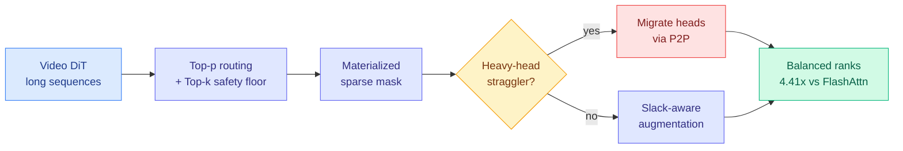

# FVAttn: Adaptive Sparse Attention with Runtime Load Balancing

**TL;DR.** In multi-GPU video generation, adaptive sparse attention (only compute the attention blocks that matter) creates a hidden problem: different attention heads get different amounts of work, so under sequence parallelism the whole batch waits on the slowest GPU rank. FVAttn (Tencent WeChat HPC + Sun Yat-sen) is a training-free system that measures this imbalance and repairs it at runtime by migrating a few heavy heads across GPUs over P2P links. It cuts average load imbalance from 1.34 to 1.08 and delivers a 4.41x attention speedup over FlashAttention, for a 2.02-2.11x end-to-end video-model speedup.

## What it is

Video Diffusion Transformers process very long spatio-temporal sequences, so self-attention is the dominant cost. Training-free sparse attention (choosing which blocks to compute per head via Top-p routing) cuts that cost, but the routing gives each head a different, data-dependent workload. Under multi-GPU sequence parallelism, that heterogeneity turns into a rank-level straggler problem: the batch is only as fast as the busiest GPU. FVAttn keeps the sparse-routing frontend (Top-p routing, a Top-k safety floor so no head starves, video-aware block organization) but adds a runtime repair layer.

## Key findings

- **Runtime Load Balancing** migrates a small number of heavy heads via P2P communication to shorten the critical path.
- **Slack-Aware Sparse Augmentation** fills the idle time on non-critical ranks with additional high-value attention blocks, so quality improves for free while the stragglers finish.
- Overlap hides scheduling and migration overhead behind existing computation.
- On step-distilled Wan2.2 I2V: average load imbalance 1.34 to 1.08, **4.41x attention speedup vs FlashAttention**, 2.02-2.11x DiT inference speedup, competitive video quality.

## Why it matters (relation to prior wiki)

FVAttn is a GPU-optimization paper wearing a video-generation coat: the real contribution is treating sparse attention as a distributed-scheduling problem, not just a FLOP-reduction trick. It sits directly on the wiki's [attention-mechanisms](../llms-foundation-models/attention-mechanisms.md) thread. It pairs with [SANA-Video 2.0](2026-07-24-sana-video-hybrid-linear-attention.md) from the next day: FVAttn makes softmax attention *cheaper to run* at inference by load-balancing the sparse mask; SANA avoids most softmax entirely by training a hybrid linear architecture from scratch. Two attacks on the same bottleneck (attention is the video cost), one at the systems layer and one at the architecture layer.

**Gaps.** Validated on one distilled model (Wan2.2 I2V); whether the load-balancer holds on much longer sequences or non-video DiTs is untested. Gains depend on the specific sparsity pattern that video attention produces, which may not transfer to text.

- Source: [arXiv 2607.16190](https://arxiv.org/abs/2607.16190) · [HuggingFace](https://huggingface.co/papers/2607.16190)
- Raw: `raw/huggingface/2026-07-23-fvattn-adaptive-sparse-attention-with-runtime-load-balancing.md`
- Related: [SANA-Video 2.0 hybrid linear attention](2026-07-24-sana-video-hybrid-linear-attention.md) · [attention mechanisms](../llms-foundation-models/attention-mechanisms.md)
