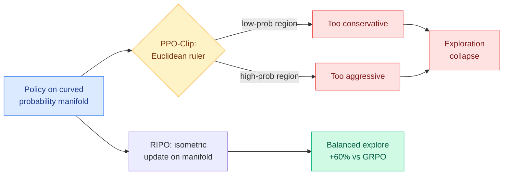

# RIPO: Beyond Euclidean Clipping (Riemannian Isometric Policy Optimization)

**TL;DR.** RIPO diagnoses why PPO-Clip (the standard trust-region trick in RL for LLMs) collapses exploration: its clip implicitly measures how far the policy moved using a Euclidean ruler, but a probability distribution lives on a curved (Riemannian) manifold where Euclidean distance is the wrong metric. The mismatch makes updates too timid in low-probability regions and too aggressive in high-probability ones, so the model stops exploring. RIPO replaces the clip with an isometric update that respects the manifold's geometry, and beats GRPO by up to 60% on AIME24.

## What it is

RL with PPO-Clip is the dominant recipe for improving LLM reasoning, but it suffers exploration collapse (the policy narrows onto a few high-probability answers and stops trying alternatives). Prior fixes were heuristic and never named the root cause. RIPO's claim: PPO-Clip implicitly measures policy discrepancy with a Euclidean metric, which is theoretically inconsistent with the intrinsic geometry of the policy on its Riemannian manifold. That geometric mismatch means the same clip threshold is overly conservative where probabilities are small and overly aggressive where they are large, systematically starving exploration. Riemannian Isometric Policy Optimization guarantees isometric (distance-preserving on the manifold) policy updates, balancing exploration and exploitation, with a favorable bias-variance trade-off that also stabilizes optimization.

## Key findings

- Identifies the *geometric* cause of PPO-Clip exploration collapse, not just another symptom.
- Guarantees isometric updates on the policy manifold; proves a favorable bias-variance trade-off.
- Up to **60% improvement over GRPO on AIME24**, across seven competition-level benchmarks.

## Why it matters (relation to prior wiki)

RIPO is part of a July cluster of papers that all reopen the *optimizer* layer of RLVR (reinforcement learning with verifiable rewards) rather than the reward layer. [ISO (07-22)](2026-07-22-iso-rlvr-native-optimization.md) found RLVR barely changes weight magnitudes and only rotates their directions, so it froze the magnitudes. [SAT (07-22)](2026-07-22-sat-staleness-adaptive-trust-regions.md) tightened the PPO clip only on stale rollouts. [Predictive Divergence Masks (07-24)](2026-07-24-predictive-divergence-masks.md) fixes the *direction* criterion of the same clip. RIPO attacks the *metric* underneath the clip. Four papers in three days converging on "PPO-Clip's trust region is built on the wrong assumptions" is a genuine pattern, tracked on [rl-for-llms](../llms-foundation-models/rl-for-llms.md).

**Gaps.** The 60% headline is one benchmark (AIME24); "up to" leaves the average lift unstated. Isometric updates add per-step geometric computation whose overhead versus GRPO is not quantified here. Manifold theory is derived for softmax policies; extension to other output structures is unaddressed.

- Source: [arXiv 2607.10169](https://arxiv.org/abs/2607.10169) · [HuggingFace](https://huggingface.co/papers/2607.10169)
- Raw: `raw/huggingface/2026-07-23-beyond-euclidean-clipping-overcoming-exploration-collapse-in.md`
- Related: [ISO](2026-07-22-iso-rlvr-native-optimization.md) · [SAT](2026-07-22-sat-staleness-adaptive-trust-regions.md) · [Predictive Divergence Masks](2026-07-24-predictive-divergence-masks.md) · [rl-for-llms](../llms-foundation-models/rl-for-llms.md)
