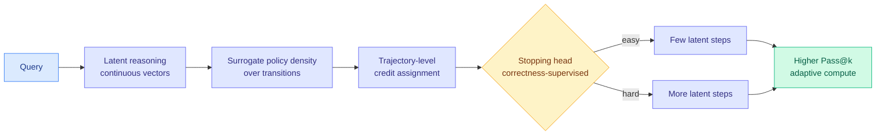

# SLPO: Scaling Latent Reasoning via a Surrogate Policy

**TL;DR.** Chain-of-Thought reasoning scales at test time by decoding every intermediate step as text tokens, which is expensive. Latent reasoning carries the intermediate computation as continuous vectors and matches CoT at far shorter horizons, but it was stuck at imitation learning because latent trajectories have no tractable per-step likelihood and no way to decide when to stop. SLPO brings outcome-reward RL to latent reasoners with two pieces: an empirical surrogate density over latent transitions for credit assignment, and a correctness-supervised stopping head that RL refines into a variable-length policy.

## What it is

RL with verifiable rewards is the standard recipe for eliciting test-time scaling in explicit Chain-of-Thought reasoners, but every intermediate step must be decoded as a language token, which is costly. Latent reasoning keeps intermediate computation as continuous vectors and already matches or surpasses explicit CoT at much shorter horizons. The problem: latent reasoners stayed imitation-bound because latent trajectories lack a tractable per-step likelihood (so you cannot do policy-gradient credit assignment) and lack an adaptive stopping interface under a fixed thinking budget (so outcome rewards cannot elicit latent test-time scaling). Surrogate Latent Policy Optimization (SLPO) supplies both: an empirical surrogate policy density over latent transitions for trajectory-level credit assignment, and a correctness-supervised stopping head that outcome-reward optimization refines into a variable-horizon policy.

## Key findings

- Brings outcome-reward RL to autoregressive latent reasoners for the first time (past pure imitation).
- Improves Pass@k under parallel sampling across continuous and soft thinking settings.
- Allocates longer latent computation to harder instances, with higher deterministic accuracy, an adaptive test-time-compute allocation.

## Why it matters (relation to prior wiki)

SLPO is a test-time-compute efficiency paper: it moves the reasoning trace out of the token stream and into latent space, then makes that space RL-trainable. That is directly Tier-1-relevant because latent reasoning cuts decode cost, the dominant inference expense for long CoT. It complements the July RLVR-optimizer cluster ([ISO](2026-07-22-iso-rlvr-native-optimization.md), [RIPO](2026-07-23-ripo-riemannian-policy-optimization.md), [Predictive Divergence Masks](2026-07-24-predictive-divergence-masks.md)): those improve the optimizer for token-space policies, SLPO changes the representation the policy operates on. The variable-horizon stopping head is a learned version of the "spend compute where it is needed" principle the wiki has tracked since adaptive test-time-scaling work. See [rl-for-llms](../llms-foundation-models/rl-for-llms.md).

**Gaps.** The surrogate density is empirical, so its bias versus a true latent likelihood is a risk; results are Pass@k on reasoning tasks without wall-clock or memory numbers, so the actual efficiency win over token CoT is asserted, not measured here.

- Source: [arXiv 2607.19691](https://arxiv.org/abs/2607.19691) · [HuggingFace](https://huggingface.co/papers/2607.19691)
- Raw: `raw/huggingface/2026-07-23-slpo-scaling-latent-reasoning-via-a-surrogate-policy.md`
- Related: [RIPO](2026-07-23-ripo-riemannian-policy-optimization.md) · [rl-for-llms](../llms-foundation-models/rl-for-llms.md)
