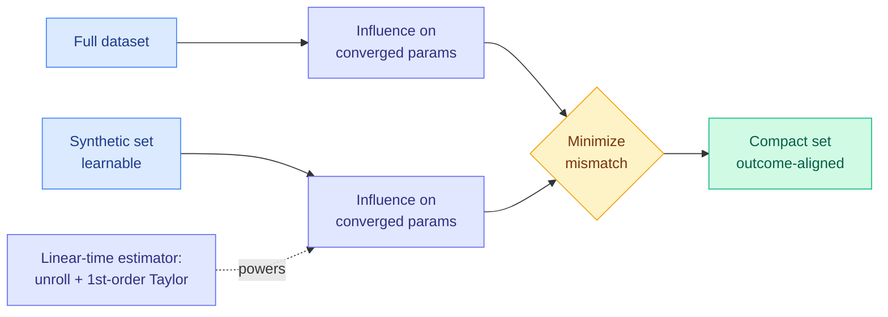

# Dataset Distillation by Influence Matching (Inf-Match)

**TL;DR.** Dataset distillation compresses a big training set into a tiny synthetic one that trains a model just as well. Prior methods match the *process* (per-step gradients or full training trajectories). Inf-Match matches the *outcome*: it learns a small synthetic set whose effect on the final converged weights matches the full dataset's effect, using a fully differentiable, linear-time influence estimator with no inverse-Hessian and no convexity assumptions. It sets state of the art across classification benchmarks and scales to vision-language distillation.

## What it is

Dataset distillation learns a compact synthetic dataset that reproduces the effect of training on a much larger real one. Most methods imitate the training *process*: they align per-step gradients or full trajectories, which is a heuristic surrogate for the thing you actually care about (the final model). Inf-Match takes an outcome-centric view: it aligns the final training outcome, learning a synthetic set whose influence on the converged parameters matches the full dataset's. The core enabler is a fully differentiable, sample-level influence estimator that quantifies how much adding or removing data shifts the converged parameters, without expensive inverse-Hessian products or convexity assumptions. It runs in linear time by unrolling the optimization dynamics and applying a first-order Taylor approximation.

## Key findings

- Best accuracy across standard classification benchmarks; on Tiny-ImageNet (IPC=10) it hits **31.5%, a +4.7% improvement over NCFM**.
- Scales beyond classification to vision-language distillation on Flickr30K: with 200-1000 synthetic samples it leads image/text retrieval, +2.5% over NCFM.
- Code released at github.com/hrtan/infmatch.

## Why it matters (relation to prior wiki)

Inf-Match is a data-side compression paper, complementary to the model-side compression the wiki tracks (quantization, pruning, distillation of weights). Its "align the outcome, not the process surrogate" framing rhymes with a recurring wiki theme: [ISO (07-22)](2026-07-22-iso-rlvr-native-optimization.md) similarly argued you should optimize the thing that actually changes (weight frames) rather than borrow a process assumption (AdamW on everything). It is also the natural partner to the Kurate-underrated *Requential Coding* (2607.11883, "pushing model compression with self-generated training data"), which the [07-22 digest](../daily-digest/2026-07/2026-07-22.md) flagged: both compress by *generating* a small high-value dataset rather than shrinking weights. See [knowledge-distillation](knowledge-distillation.md).

**Gaps.** The first-order Taylor / unrolled-dynamics estimator is an approximation whose fidelity at large scale or with strong non-convexity is untested; benchmarks top out at Tiny-ImageNet and Flickr30K, far from foundation-model scale.

- Source: [arXiv 2607.16859](https://arxiv.org/abs/2607.16859) · [HuggingFace](https://huggingface.co/papers/2607.16859)
- Raw: `raw/huggingface/2026-07-24-dataset-distillation-by-influence-matching.md`
- Related: [knowledge distillation](knowledge-distillation.md) · [ISO](2026-07-22-iso-rlvr-native-optimization.md)
