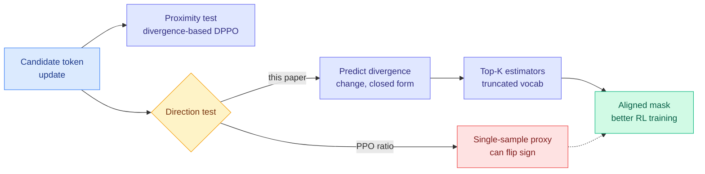

# Predictive Divergence Masks for LLM RL

**TL;DR.** Trust-region masks in RL for LLMs decide, per token, whether to keep or discard an update. They use two tests: a proximity test (has the policy drifted too far?) and a direction test (does this update push it farther away?). A recent method, DPPO, upgraded the proximity test to use a probability divergence, but left the direction test as PPO's crude single-sample ratio. This paper shows that ratio can literally disagree in sign with the divergence it is supposed to guard, and replaces it with a closed-form prediction of whether the next gradient step will increase or decrease that divergence.

## What it is

PPO-style RL uses the sampled-token importance ratio for two jobs: a proximity criterion (has the policy moved too far from the behavior policy?) and a direction criterion (does this update push it even farther?). DPPO improved the proximity criterion by using a probability divergence between behavior and training policies instead of the raw ratio. But its direction criterion still comes from PPO: a token is masked only when the sampled-token ratio moves away from one. This paper observes that the ratio-based direction test is a single-sample proxy that can *disagree in sign* with the change in the divergence that defines the proximity test, so the two criteria fight each other. The **predictive divergence mask** instead asks directly whether the next policy-gradient step will increase or decrease the same divergence the trust region uses. For discrete softmax policies this prediction is derived in closed form. Because production rollout engines expose only a truncated top-K view of the vocabulary, the authors build two lightweight top-K estimators for it.

## Key findings

- The ratio-based direction criterion can be sign-inconsistent with the realized divergence change; the divergence-based direction is far better aligned.
- Closed-form prediction for softmax policies, with two top-K estimators for truncated-vocabulary rollout engines.
- Masks improve RL training across model scales and precision (including low-precision) settings.

## Why it matters (relation to prior wiki)

This is the fourth July paper reopening the RLVR optimizer layer, alongside [ISO](2026-07-22-iso-rlvr-native-optimization.md) (freeze weight magnitudes), [SAT](2026-07-22-sat-staleness-adaptive-trust-regions.md) (clip only stale rollouts), and [RIPO](2026-07-23-ripo-riemannian-policy-optimization.md) (fix the clip's Euclidean metric). Where SAT and RIPO reshape *how much* to clip, this paper fixes *which direction* the clip should even care about, exposing that DPPO's half-upgrade left an internally contradictory mask. The practical hook, top-K estimators for truncated rollout logits, is exactly the constraint real serving stacks impose, so it is unusually deployable. Tracked on [rl-for-llms](../llms-foundation-models/rl-for-llms.md).

**Gaps.** Improvements are reported qualitatively ("improve RL training") without a headline benchmark number in the abstract; the top-K approximation error versus the true full-vocab prediction is a risk on high-entropy tokens.

- Source: [arXiv 2607.10848](https://arxiv.org/abs/2607.10848) · [HuggingFace](https://huggingface.co/papers/2607.10848)
- Raw: `raw/huggingface/2026-07-24-predictive-divergence-masks-for-llm-rl.md`
- Related: [RIPO](2026-07-23-ripo-riemannian-policy-optimization.md) · [ISO](2026-07-22-iso-rlvr-native-optimization.md) · [SAT](2026-07-22-sat-staleness-adaptive-trust-regions.md) · [rl-for-llms](../llms-foundation-models/rl-for-llms.md)
