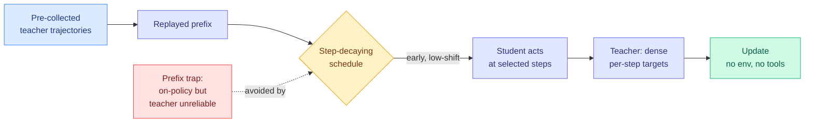

# ReOPD: Multi-Turn On-Policy Distillation with Prefix Replay

**TL;DR.** On-policy distillation (a student learns from a teacher's token-by-token probabilities on the student's own rollouts) is expensive for agents, because every update needs fresh student runs through the environment plus fresh teacher queries. ReOPD (Microsoft Research, Furu Wei's group) makes it offline: reuse pre-collected teacher trajectories as "replayed prefixes," let the student act only at selected steps, and have the teacher supply dense per-step supervision without ever touching the environment. It matches or beats full online distillation accuracy, uses zero tool calls during student training, and is at least 4x faster per rollout.

## What it is

For agentic tasks an LLM interacts with an environment over many turns, and the student imitates the teacher over those multi-turn histories. Fully online on-policy distillation (OPD) is costly because each update requires fresh student rollouts through the environment and teacher queries at every visited history. ReOPD (Replayed-Prefix OPD) is an off-environment alternative: it reuses pre-collected teacher trajectories as replayed prefixes, the student acts only at selected steps, and the teacher provides dense per-step supervision with no new environment execution.

## What problem it solves

ReOPD names a **prefix trap**: making the interaction histories more student-on-policy (more relevant to the current student) can push the teacher onto histories where its target is unreliable. This is a two-sided distribution shift, student occupancy pulling one way, teacher reliability the other. ReOPD reframes multi-turn OPD as a reliability-aware prefix distribution design problem and solves it with a simple step-decaying sampling schedule that emphasizes early, lower-shift prefixes where the teacher is still trustworthy.

## Key findings

- Across math-with-Python and search environments, over multiple teacher and student scales, ReOPD preserves or improves OPD-level accuracy.
- Uses **zero tool calls during student training** and is at least **4x faster per rollout** than online OPD.
- Turns expensive agent-environment interaction into a reusable offline resource, enabling distillation across tools, tasks, and environments.

## Why it matters (relation to prior wiki)

ReOPD is the newest entry in the wiki's long on-policy-distillation thread. It shares the core intuition of [H²SD (07-22)](2026-07-22-h2sd-hybrid-hindsight-self-distillation.md), which found that most on-policy distillation effort on already-good rollouts is wasted, and of [TIP (04-16)](knowledge-distillation.md), which found only ~10% of teacher tokens carry signal. Where those papers located the wasted signal in *tokens*, ReOPD locates it in *histories*: the teacher is only reliable on low-shift prefixes, so spend the queries there. The prefix trap is a multi-turn restatement of the same "signal is sparse and locatable" principle the wiki has tracked since spring. See [knowledge-distillation](knowledge-distillation.md).

**Gaps.** The offline replay assumes pre-collected teacher trajectories exist and cover the space; on genuinely novel tasks that library must first be built online. Tested on verifiable math/search domains, not open-ended agentic work.

- Source: [arXiv 2607.04763](https://arxiv.org/abs/2607.04763) · [HuggingFace](https://huggingface.co/papers/2607.04763)
- Raw: `raw/huggingface/2026-07-24-multi-turn-on-policy-distillation-with-prefix-replay.md`
- Related: [H²SD](2026-07-22-h2sd-hybrid-hindsight-self-distillation.md) · [knowledge distillation](knowledge-distillation.md)
