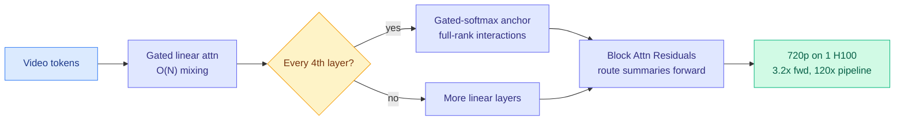

# SANA-Video 2.0: Hybrid Linear Attention with Attention Residuals

**TL;DR.** SANA-Video 2.0 (NVIDIA + MIT + HKU, Song Han's group) is a video diffusion transformer trained from scratch with mostly linear attention (cost grows O(N) with sequence length, not O(N²)) plus periodic full-softmax "anchor" layers at a 3:1 ratio to restore the exact token interactions linear attention loses. It matches full-softmax video quality while being 3.2x faster in the raw forward pass at 720p/60s, and 120x faster than Wan 2.2-A14B after full-stack kernel optimization. It generates 720p video on a single H100.

## What it is

Full-softmax attention is the bottleneck in high-resolution video generation because it scales quadratically with the number of tokens, and video has a lot of tokens. Pure linear attention scales linearly but loses expressiveness (its token interactions are low-rank). SANA-Video 2.0's answer is **Hybrid Linear-Softmax Attention**: gated linear attention does the O(N) bulk mixing, and a full-softmax layer is inserted periodically (25% of layers, a 3:1 ratio) as an "anchor" that restores full-rank interactions. Crucially it is trained from scratch as a hybrid, not linearized from a pretrained softmax model, so it learns video-specific structure directly inside the efficient framework. **Block Attention Residuals (AttnRes)** route completed block summaries into later linear layers, reusing anchor features and boosting deep-layer effective rank by ~12%.

## Key findings

- Instantiated at 5B and 14B scales under one unified architecture; reduced-resolution proxy studies fixed **25% softmax as the optimal quality-efficiency trade-off**.
- VBench score 84.30 in 13.2s at 480p on a single H100 with 40-step sampling, competitive with far larger softmax DiTs.
- Compiled DiT forward pass 3.2x faster than a matched full-softmax baseline at 720p/60s; the gap widens with video length.
- Full-stack Sol-Engine optimization (kernel fusion, caching, sparse attention) adds a further 3.58x, bringing the 5B pipeline to 13.06s at 720p/5s, 120x faster than Wan 2.2-A14B on one H100.

## Why it matters (relation to prior wiki)

The paper explicitly borrows the hybrid-attention recipe from the LLM world (Qwen3-Next, Kimi-Linear, Kimi K3) and ports it to video, which is a clean example of an efficiency idea migrating across modalities. It extends the wiki's [attention-mechanisms](../llms-foundation-models/attention-mechanisms.md) thread on hybrid/linear attention. It is the architecture-layer complement to [FVAttn](2026-07-23-fvattn-adaptive-sparse-attention.md), the systems-layer sparse-attention paper from the day before: FVAttn makes softmax cheaper to serve, SANA avoids 75% of the softmax by construction. Together they mark video attention as the efficiency battleground of late July 2026.

**Gaps.** VBench is a benchmark score, not human preference; whether the 25%-softmax ratio holds at larger scales or longer horizons is an open scaling question. From-scratch training is expensive, so this is not a drop-in retrofit for existing softmax models.

- Source: [arXiv 2607.21553](https://arxiv.org/abs/2607.21553) · [HuggingFace](https://huggingface.co/papers/2607.21553)
- Raw: `raw/huggingface/2026-07-24-sana-video-20-hybrid-linear-attention-with-attention-residua.md`
- Related: [FVAttn adaptive sparse attention](2026-07-23-fvattn-adaptive-sparse-attention.md) · [attention mechanisms](../llms-foundation-models/attention-mechanisms.md)
