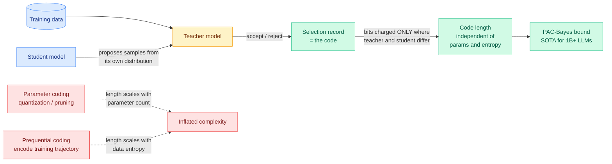

# Requential Coding — Compressing a Model by Recording Only Where Teacher and Student Disagree

**TL;DR.** Requential coding is a new way to measure how much information a neural network actually absorbed from its training data. Instead of encoding the weights (which costs bits proportional to parameter count) or encoding the training sequence (which costs bits proportional to the data's entropy), a teacher model *selects* training samples drawn from the student's own output distribution, and the code records only those selections. Selections are free wherever teacher and student already agree, so the code length is independent of both parameter count and data entropy, and is often orders of magnitude shorter than the prequential alternative. The advantage grows with scale. Plugged into a PAC-Bayes bound, it yields state-of-the-art generalization guarantees for billion-parameter LLMs, beating bounds built on aggressive post-training quantization even when quantization is granted zero error.

## What it is

The paper sits inside the compression-equals-generalization tradition: a model that can express its training data as a short code has found real regularities rather than memorized noise. The practical problem has always been constructing a code that reflects that simplicity at scale. Two families existed, and both are miscalibrated.

**Parameter-based coding** (quantization, pruning, low-rank factorization) prices the model by its weights. A billion-parameter model trained on a handful of examples is intuitively simple, but its code still costs roughly a billion parameters' worth of bits. This is why parameter-based complexity measures predict that larger models should generalize worse, when empirically they generalize better.

**Prequential coding** prices the model by its training trajectory: transmit the data one point at a time, and charge the receiver only the model's prediction loss at each step. This decouples code length from parameter count, but it must losslessly reproduce the *exact* data sequence. That means it keeps paying for the data's irreducible entropy long after the model has stopped learning anything from the unpredictable parts.

**Requential coding** changes what gets transmitted. A teacher model selects training samples that are *drawn from the student's own distribution*. The code records only the selections. Where the student would already have produced what the teacher wants, the selection is nearly free. Bits are charged only at points of teacher-student disagreement, which is exactly the information the student did not already have. The result is a code whose length tracks *transferred information* rather than model size or data noise.

## Key findings

- Code length is independent of both parameter count and data entropy, and is often **orders of magnitude shorter** than the prequential code for the same model, with the gap widening as scale increases.
- **Holding loss fixed, larger models and ensembles compress to smaller codes despite having more parameters.** This is the phenomenon parameter-based compressors get backwards, and it is the paper's cleanest evidence that the code is measuring the right thing.
- Fed into a PAC-Bayes bound (a generalization guarantee whose tightness depends on how few bits describe the learned hypothesis), requential coding gives **state-of-the-art guarantees for billion-parameter LLMs**, beating quantization-based bounds even when quantization is generously assumed lossless.
- The bound **tightens with scale in the compute-optimal regime**: models become more compressible relative to dataset size as both grow together.
- The same code predicts **gradual overfitting across multiple training epochs**, recovering a known empirical fact from a purely information-theoretic quantity.
- It separates a dataset's learnable structure from its random content, and finds that **lower-entropy text carries far more learnable structure than higher-entropy image data**.

## Why it matters (relation to prior wiki)

This is the theoretical backbone under a compression thread the wiki has been accumulating from the empirical side.

It is the closest relative of [Dataset Distillation by Influence Matching (07-24)](2026-07-24-dataset-distillation-influence-matching.md), which compresses a dataset by synthesizing a small set of examples chosen to match the influence the full dataset would have had on the trained weights. Both papers compress by *generating a small high-value dataset* rather than by shrinking weights, and both make the same underlying bet: the thing worth compressing is the information transfer, not the container. Influence Matching does it to save training compute; Requential Coding does it to measure complexity. The 07-24 summary already noted the pairing before this page existed.

It also reframes the wiki's [knowledge distillation](knowledge-distillation.md) thread. [TIP (04-16)](2026-04-16-tip-token-importance-on-policy-distillation.md) (token-level importance in on-policy distillation, which found most teacher-generated tokens carry no learning signal and under 10% suffice) is the empirical shadow of the same claim: the teacher's contribution is concentrated at disagreement points. Requential coding says that formally. If most of a distillation run is spent transmitting tokens the student already agreed with, then a selection-based code is the natural accounting of what actually moved. Requential coding gives the information-theoretic reason why aggressive token selection works, which TIP established only by measurement.

Against [VibeThinker-3B's Parametric Compression-Coverage Hypothesis (06-16)](2026-06-16-vibethinker-3b-compression-coverage.md), which held that verifiable reasoning compresses into a small parametric core while broad knowledge needs coverage, requential coding supplies a measuring instrument. The finding that lower-entropy text holds more learnable structure than image data is a direct, quantified version of "not all data compresses into capability at the same rate."

The finding that **larger models compress to smaller codes at fixed loss** is the one worth arguing with. It is a clean information-theoretic answer to why overparameterization does not hurt, and it should make anyone doing parameter-count-based capacity reasoning (including most pruning and quantization literature) nervous about their complexity proxy.

## Gaps

The compression is a *measurement* scheme, not a deployment scheme. Nothing here produces a smaller artifact you can serve; the code is a bound-tightening device, and the paper does not claim otherwise. The teacher-selection procedure requires a teacher at least as good as the student, so the code is relative to that teacher and the paper does not characterize how the measured complexity shifts as the teacher changes. The image-versus-text entropy comparison is one experiment and is doing a lot of interpretive work.

## Provenance

**Kurate cs.LG #7** (score 1656, win rate 89.1%, ai_rating 8.5/10), published 2026-07-13. Never surfaced on HuggingFace Daily Papers. This wiki flagged it as "LLM-rated underrated" in the [07-22](../daily-digest/2026-07/2026-07-22.md) and [07-24](../daily-digest/2026-07/2026-07-24.md) digests; after a third week on the Kurate leaderboard with no HuggingFace crossover, it is promoted to a full summary here rather than flagged a fourth time.

- Paper: [arXiv 2607.11883](https://arxiv.org/abs/2607.11883) — Shikai Qiu (NYU), Marc Finzi, Yujia Zheng, Kun Zhang (CMU), Andrew Gordon Wilson (NYU)
- Raw: `raw/kurate/2026-07-25-cs-lg.md`
- Related: [Dataset Distillation by Influence Matching](2026-07-24-dataset-distillation-influence-matching.md) · [knowledge-distillation](knowledge-distillation.md) · [VibeThinker-3B](2026-06-16-vibethinker-3b-compression-coverage.md)
