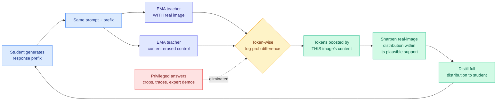

# VCSD: Making a Model Its Own Teacher by Deleting the Image

**TL;DR.** On-policy self-distillation (OPSD, where a model teaches itself instead of using a separate stronger teacher) only works if the self-teacher knows something the student does not. Every prior method manufactures that gap by feeding the teacher extra information: the answer, a reasoning trace, an expert demonstration, or a cropped region of the image. VCSD (University of Maryland, UCSD, Duke, MBZUAI) removes all of it. At each prefix the student generates, an EMA teacher (an exponentially-moving-average copy of the student's own weights) runs the *same* prompt twice, once with the real image and once with a content-erased control. The token-wise log-probability difference between the two runs isolates exactly the tokens whose likelihood was raised by the specific visual content of that image. VCSD uses that contrast to sharpen the teacher's real-image distribution inside its own plausible support and distills the sharpened full distribution into the student. On ViRL39K it beats matched OPSD across sizes: the seven-benchmark aggregate goes 62.27% → 67.04% at 2B, 71.30% → 73.16% at 4B, and 72.51% → 76.26% at 8B, with no external teacher, no privileged answers, no visual evidence signals, and no extra inference-time cost.

## The problem it solves

On-policy distillation trains a student on prefixes the student itself produced, with a teacher supplying token-level targets over those prefixes. That alignment between training and inference behavior is the whole appeal, and the wiki has tracked its selective-supervision variants all year. But it needs a teacher, and a genuinely stronger teacher is expensive to run alongside every rollout.

Self-distillation drops the external teacher and uses an EMA copy of the student. That immediately raises the obvious objection: if teacher and student see the same input at the same prefix, the teacher's distribution is barely different from the student's, and there is almost no signal to learn from. Every OPSD method therefore engineers an **information asymmetry**. For text reasoning that has meant handing the teacher the ground-truth answer, a reasoning trace, or an expert demonstration. For vision-language it has meant handing the teacher crops, bounding regions, or other localization hints. All of these need external annotation, a localization model, or a hand-designed transformation pipeline.

VCSD's question is whether the asymmetry can come purely from *input conditioning* on information the model already has.

## The mechanism

The trick is that the asymmetry does not have to be extra information. It can be *removed* information, used as a control.

Run the EMA teacher twice on the identical prompt and identical student-generated prefix. The first run sees the real image. The second sees a content-erased version of it. Subtract the log-probabilities token by token. What survives the subtraction is the set of next-token candidates whose likelihood is specifically attributable to the instance-level visual content, as opposed to the language prior, the prompt, or generic image statistics.

That difference is not used directly as the target, which matters. VCSD uses it to **sharpen the teacher's original-image distribution within that distribution's own plausible support**, then distills the full sharpened distribution. Keeping the target inside the real-image distribution's support is the guardrail against the failure mode this class of contrastive-decoding method usually hits: the raw contrast can promote tokens the model considers implausible overall just because they were relatively more likely with the image than without it.

## Key takeaways

- The self-teacher asymmetry can be built out of an *ablation* of the input rather than an *addition* to it, which removes every external dependency.
- Consistent gains over matched OPSD across three model sizes on Qwen3-VL, and also on Qwen3.5: 2B +4.77 points, 4B +1.86, 8B +3.75 on the seven-benchmark aggregate.
- **The gain does not shrink monotonically with scale.** 8B gains more than 4B. That is unusual for a self-supervision trick and is the result most worth stress-testing.
- Zero additional inference-time cost. The two teacher passes are training-time only.
- Requires no external teacher, no privileged answers, no visual evidence signals, and no reasoning traces.

## Relation to prior wiki

This is the eighth entry in the [knowledge distillation](knowledge-distillation.md) page's **neutral exchange channel** pattern, and it lands squarely on the branch [D-OPSD (05-07)](2026-05-07-d-opsd-self-distillation-step-distilled-diffusion.md) opened. D-OPSD made the same network both teacher and student under **conditioning asymmetry**: teacher sees text plus the target image, student sees only text. VCSD inverts the polarity. Instead of giving the teacher *more* conditioning than the student, it gives the teacher *two* conditionings and uses the gap between them. The asymmetry is no longer teacher-versus-student, it is teacher-versus-itself. That is a cleaner construction, because there is no privileged channel that has to be available at training time and absent at inference time.

It also confirms the wiki's dominant 2026 distillation thesis from a new direction. The selective-supervision line running from [TIP (04-16)](2026-04-16-tip-token-importance-on-policy-distillation.md), which found under 10% of teacher tokens carry real learning signal, through [Quality-Aware OPSD (06-18)](2026-06-18-quality-aware-opsd-gui-grounding.md), which gated the teacher per coordinate-token by whether the student's prefix could still reach the ground-truth box, all worked by *filtering or reweighting* the teacher's output. VCSD instead *constructs* a sharper teacher output. Both routes are chasing the same thing, concentrating supervision where it is informative, and the contrast is a cheap way to find that region without a verifier.

The theoretical framing arrived on the same day. [Requential Coding (Kurate cs.LG #7)](2026-07-25-requential-coding-self-generated-compression.md) argues the information a student actually receives from a teacher is exactly the disagreement between them, and that bits should be charged only there. VCSD's log-probability difference between the with-image and without-image teacher is a computable, per-token instance of precisely that quantity. One paper says "the transferred information lives in the disagreement"; the other builds a training signal out of a measured disagreement. Reading them together is the sharpest version of this thread the wiki has.

## Gaps

The 8B-gains-more-than-4B result is reported but not explained, and it is the finding most likely to be a dataset artifact of ViRL39K rather than a scaling property. Everything is trained on one dataset and evaluated on one seven-benchmark aggregate. "Content-erased control" is doing a lot of work with no ablation on *how* the erasure is done (noise, blur, blank, mean image), and contrastive-decoding methods are historically very sensitive to that choice. And because the sharpening is confined to the real-image distribution's support, VCSD can only reweight candidates the teacher already considered, so it cannot recover from a teacher that omitted the right answer entirely, which is the exact case an external stronger teacher would fix.

## Sources

- Paper: [arXiv 2607.21556](https://arxiv.org/abs/2607.21556) — Yijun Liang, Furong Huang, Di Fu (UMD), Yunjie Tian, Yijiang Li (UCSD), Yuqi Jia (Duke), Tianyi Zhou (MBZUAI)
- HuggingFace Daily Papers, 41 upvotes (2026-07-24)
- Raw: `raw/huggingface/2026-07-24-visual-contrastive-self-distillation.md`
- Related: [knowledge-distillation](knowledge-distillation.md) · [D-OPSD](2026-05-07-d-opsd-self-distillation-step-distilled-diffusion.md) · [TIP](2026-04-16-tip-token-importance-on-policy-distillation.md) · [Requential Coding](2026-07-25-requential-coding-self-generated-compression.md)
