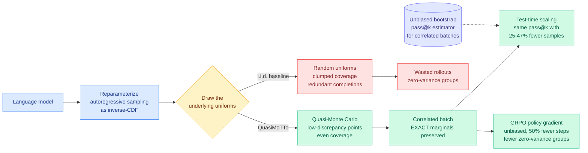

# QuasiMoTTo: Quasi-Monte Carlo Test-Time Scaling

**Source:** Kurate cs.LG #16 (score 1613, win_rate 78.0%, ai_rating 7.2/10), never surfaced on HuggingFace · [arXiv 2607.01179](https://arxiv.org/abs/2607.01179) · Michael Y. Li*, Anthony Zhan*, Kanishk Gandhi, Noah D. Goodman, Emily B. Fox (Stanford) · published 2026-07-01 · [raw Kurate leaderboard](../../raw/kurate/2026-07-26-cs-lg.md)

## TL;DR

Parallel sampling is the reliable way to buy capability with inference compute, and it is wasteful by construction: independent draws pile up on the same high-probability solutions. The usual assumption is that this waste is the price of parallelism, because independence is what makes the batch trivially parallel. QuasiMoTTo shows the tradeoff is not fundamental. It rewrites autoregressive sampling as inverse-CDF sampling and then draws the underlying uniforms with **quasi-Monte Carlo** instead of i.i.d. randomness. QMC spreads points more evenly across the unit cube than random draws do, so the resulting completions cover the output space with far less redundancy, while each sample remains **marginally distributed exactly according to the language model**. That exactness is what makes the batch legal for policy-gradient training as well as for selection. Across four reasoning benchmarks it matches i.i.d. pass@k with **25 to 47% fewer samples**, and on GRPO it matches i.i.d. performance in **50% fewer training steps**.

## The mechanism, in plain terms

Sampling a token from a language model is picking a point on the unit interval and reading off which token's probability bucket it lands in. That is inverse-CDF sampling. Chain it across positions and a whole completion is determined by a sequence of uniform numbers, one per step. Normally those uniforms come from a random number generator, independently per sample. Two samples in a batch can easily draw nearly the same uniforms and produce nearly the same completion, which is exactly the redundancy everyone observes as "best-of-16 gave me the same answer eleven times."

Quasi-Monte Carlo replaces i.i.d. uniforms with a **low-discrepancy point set**: a deterministic-but-randomized construction that fills the cube more evenly than random points do. Numerical integration has used this for decades because it converges faster than Monte Carlo. Applied here, the batch of completions is forced to spread out, so a given budget of k samples touches more distinct regions of the output space.

The property that makes this more than a diversity trick is **marginal exactness**. Each individual sample in a QuasiMoTTo batch is still distributed according to the model. Only the joint distribution over the batch changed. That is what separates this from stochastic beam search variants and temperature or nucleus tricks, which buy diversity by distorting the distribution, which in turn biases any policy gradient computed from the batch. Because QuasiMoTTo keeps marginals intact, the same batch is a valid GRPO group.

One methodological consequence the paper had to handle: standard pass@k estimators assume independent samples, so they are wrong on a correlated batch. The authors develop an **unbiased bootstrap estimator** for pass@k under correlated sampling. Anyone evaluating a correlated sampler needs this, and its absence is probably part of why the design space stayed unexplored.

## Key findings

- **25 to 47% fewer samples** to match i.i.d. pass@k accuracy across four reasoning benchmarks.
- QuasiMoTTo **often saturates an upper bound on pass@k that holds for any marginal-preserving sampler**. This is the strongest result in the paper: within the class of samplers that do not distort the model's distribution, there is not much left on the table.
- **GRPO matches i.i.d. performance with 50% fewer training steps.** The stated mechanism is coverage producing a stronger learning signal per batch, specifically by reducing zero-variance groups, the batches where every rollout gets the same reward and the group-relative advantage is identically zero so the step teaches nothing.
- The intervention is **entirely at the sampling stage**. The training objective is untouched, and the model is untouched. It is a drop-in replacement for i.i.d. sampling.
- Parallelism is fully preserved. Unlike sequential conditioning approaches, nothing has to wait for anything else.

## How this relates to prior wiki knowledge

This is the **fourth distinct answer** the wiki has recorded to one question: parallel test-time sampling wastes compute on redundant solutions, so where do you intervene? [AIMO-3 (04-17)](2026-04-17-model-capability-dominates-inference-time.md) argued from the negative side, that prompt diversity alone cannot close the pass@N gap because the bottleneck is model capability, which ruled out the cheapest intervention. [VPO (05-24)](../llms-foundation-models/2026-05-24-vector-policy-optimization-diverse-rl.md) intervened in **training**, replacing the scalar reward with a randomly-weighted vector of criteria so the policy retains diverse modes for search to exploit later. [CPT (05-27)](2026-05-27-cpt-collaborative-parallel-thinking.md) intervened **during** the search, letting parallel branches broadcast compact intermediate findings into a shared pool so no branch rediscovers what another already found, at the cost of breaking branch independence. QuasiMoTTo intervenes at the **sampler**, and it is the only one of the four that changes neither the model, nor the objective, nor the search procedure, nor the independence structure of the compute.

Four papers in four months attacking parallel-sampling redundancy at four different layers is past the wiki's threshold for calling a pattern. The field has agreed that i.i.d. best-of-N is leaving a large multiple on the table; it has not agreed on where to pay for the fix. The layering is worth noting because the four are largely **composable**, and nobody has composed them. VPO's diverse policy plus QuasiMoTTo's spread sampler are not obviously redundant with each other, since one widens the distribution's modes and the other covers whatever distribution exists more evenly.

The pass@k-upper-bound result also cleanly bounds this whole line of work. If QuasiMoTTo often saturates the best achievable by *any* marginal-preserving sampler, then further gains at the sampling layer require distorting marginals, which reopens the bias problem for RL. That pushes remaining headroom back toward the policy (VPO's territory) or toward inter-branch communication (CPT's), and it is the kind of hard ceiling that makes a research area legible.

On the RL side this sits alongside the wiki's group-relative-advantage thread. The zero-variance-group problem is the same failure mode [SAT (07-22)](2026-07-22-sat-staleness-adaptive-trust-regions.md) and the GRPO-kernel work (06-08) run into from other directions: GRPO's signal comes entirely from within-group reward spread, so any mechanism that increases genuine within-group diversity is directly a sample-efficiency multiplier. QuasiMoTTo is the cheapest such mechanism recorded so far, because it costs nothing at all at the model level.

## Gaps

The benchmarks are reasoning tasks with verifiable answers, which is where pass@k is a meaningful metric. Whether QMC coverage helps on open-ended generation, where "covering the output space" has no crisp success criterion, is untested and not obviously the same problem.

The paper reports sample counts and training steps, not wall clock or dollars. QMC point-set construction and the arithmetic-coding machinery are not free, and the honest question for a serving team is whether a 25 to 47% sample reduction survives the per-token overhead of the reparameterization at production batch sizes. Nothing in the paper answers that.

Sequence length is the other unaddressed axis. The dimension of the QMC problem is the number of sampling steps, and low-discrepancy constructions degrade toward i.i.d. behavior as dimension grows. Reasoning traces are thousands of tokens long. The paper's gains are real at the lengths tested, but there is no scaling curve showing how the advantage behaves as traces get longer, and that is precisely the regime long-horizon agentic RL cares about.

## Research angle

The immediate falsifiable question: **does the advantage decay with trace length?** QMC's edge over Monte Carlo is dimension-sensitive in theory, and a completion of length T is a T-dimensional integration problem. A plot of sample-reduction ratio against trace length would either establish this as a general lever or confine it to short-answer reasoning. That experiment is cheap and nobody has run it.

Second, the composition question. VPO trains for mode diversity, QuasiMoTTo samples the existing distribution more evenly. If they compose multiplicatively, the combined sample reduction would be the strongest test-time-compute result of the year. If they do not, that itself says something about whether policy diversity and sampler coverage are the same resource wearing different clothes.

Third, and most directly relevant to serving: QMC batches are correlated, which means the completions share more prefix structure than i.i.d. batches do at the same k. Whether that raises **prefix-cache hit rate** in a real serving stack is unexamined, and it would be a second, independent saving stacked on top of the sample reduction. Given that agentic serving economics are close to a pure prefix-retention problem (the SemiAnalysis AgentX trace replay reported a 99.2% cache hit rate on real Claude Code and Codex traces, see the [AMD CUDA-moat analysis](../hardware/2026-07-25-semianalysis-amd-cuda-moat.md)), a sampler that increases prefix sharing by construction is worth measuring on that axis and not only on pass@k.

## Links

- Paper: [arXiv 2607.01179](https://arxiv.org/abs/2607.01179)
- Related: [CPT (05-27)](2026-05-27-cpt-collaborative-parallel-thinking.md) · [VPO (05-24)](../llms-foundation-models/2026-05-24-vector-policy-optimization-diverse-rl.md) · [AIMO-3 (04-17)](2026-04-17-model-capability-dominates-inference-time.md) · [SAT (07-22)](2026-07-22-sat-staleness-adaptive-trust-regions.md)
- Concept page: [rl-for-llms](../llms-foundation-models/rl-for-llms.md)
- Digest: [2026-07-26](../daily-digest/2026-07/2026-07-26.md)
