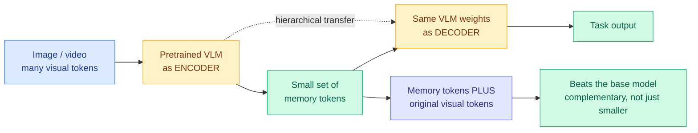

# VisCo: The Model Is Already a Good Compressor of Its Own Vision Tokens

**Source:** HuggingFace Daily Papers, 2026-07-27 | **arXiv:** [2607.12756](https://arxiv.org/abs/2607.12756) | **Raw:** [raw file](../../raw/huggingface/2026-07-27-visco-leveraging-large-language-models-as-intrinsic-encoders.md)

## TL;DR

Vision-language models spend most of their latency and memory on visual tokens, so compressing them is one of the highest-leverage efficiency levers in multimodal serving. The two existing families both have a structural flaw: training-free methods use heuristic importance metrics and fall apart at high compression ratios, while training-based methods bolt on an external compression module that the VLM backbone must then adapt to, which costs retraining and degrades the model's pretrained priors. VisCo's move is to use **the pretrained VLM itself as the compressor**. It is a parameter-sharing autoencoder: the same backbone squeezes visual information into a small set of memory tokens and then decodes from them, with hierarchical information passed from the encoding side to the decoding side. It beats prior methods at every compression ratio tested, with the margin *growing* as compression gets more aggressive, and stays stable even in the extreme single-token setting.

## Diagram

## The result that is not about compression

The abstract buries the most interesting finding at the end: when the learned memory tokens are used **alongside** the original visual tokens rather than instead of them, the base model gets *better*. That means the memory tokens are not a lossy summary of what was already there. They encode something complementary that the model's ordinary visual token stream does not surface on its own.

If that holds up, the framing "compression" undersells it. A compression method that improves the uncompressed baseline is really a representation-learning result that happens to be trainable cheaply, and the natural follow-up is to ask what those tokens contain. The paper does not appear to answer that.

## Relation to prior wiki state

- **Third distinct route to the same target in three months, and the routes disagree about where to intervene.** [DPVR (06-10)](../ai-routing/2026-06-10-dpvr-vision-token-routing.md) treats surplus visual tokens as a *routing* problem, deciding per token which path it takes. [AVR (04-20)](2026-04-20-avr-adaptive-visual-reasoning.md) makes visual reasoning depth adaptive per instance. VisCo intervenes at the *encoding* layer and reuses the backbone. Three papers, three layers, same waste.
- **It is the multimodal instance of a pattern the wiki has now seen repeatedly: reuse the frozen model instead of bolting on a module.** [δ-mem (05-13)](2026-05-13-delta-mem-online-memory.md) adds an 8x8 associative memory over a frozen backbone with no fine-tuning. [Multi-Head Latent Control (07-27)](../ai-routing/2026-07-27-multi-head-latent-control.md), today, reads control signals off a frozen LLM's hidden states rather than training a router. VisCo makes the frozen model its own autoencoder. The shared claim is that pretrained models already contain the capability and the field keeps paying to rebuild it externally.
- **It is a KV-cache story wearing a vision costume.** Visual tokens occupy KV cache, so cutting them by a large factor cuts cache footprint by the same factor. The [kv-cache concept page](kv-cache.md) has tracked eviction and quantization as the two main levers; encoding fewer tokens in the first place is a third that mostly gets discussed only in multimodal papers.

## Gaps

No latency or throughput numbers in the abstract, only quality-at-compression-ratio, and the encode-then-decode structure means the compression itself costs forward passes through the backbone. Whether the token reduction nets out to a wall-clock win at production batch sizes is exactly the question, and it is unanswered. "Training-efficient" is also a relative claim against methods that need full retraining, not an absolute one, and there is no cost figure. The single-token stability result is striking enough that it invites a contamination-style worry: a benchmark suite where one token suffices may be one where the visual content was never load-bearing.

## Related pages

- [KV Cache](kv-cache.md) — concept page
- [DPVR: vision token routing](../ai-routing/2026-06-10-dpvr-vision-token-routing.md)
- [Multi-Head Latent Control](../ai-routing/2026-07-27-multi-head-latent-control.md) — same frozen-backbone-reuse move, different target
- [MXSens: mixed-precision quantization](2026-07-27-mxsens-mixed-precision-quantization.md)
