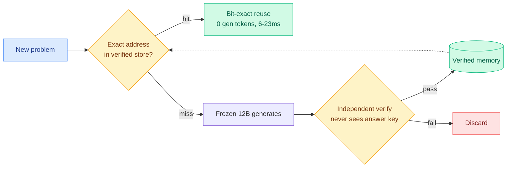

# A Frozen 12B Beats Frontier Models on Verified Work

**Source:** HuggingFace Daily Papers (2026-07-28) · Corbenic AI | **arXiv:** [2607.23806](https://arxiv.org/abs/2607.23806) | **Testbench:** [corbenic-galahad-bench.hf.space](https://corbenic-galahad-bench.hf.space)

## TL;DR

A frozen 12B model paired with a persistent memory of verified solutions answers any repeat problem at zero generation tokens, bit-exact, deterministically. Across 180 fresh instances over nine problem families, four architectures from four vendors (dense and MoE) each score 180/180. A negative control attributes the capability entirely to the memory: emptied, it solves nothing. This is the same "solve once, replay forever" thesis as the July 17 Byte-Exact KV-Cache Grafting paper (same Corbenic lineage), generalized from cache states to a full verified-solution store with a public benchmark.

## Diagram

## Key findings

- **180/180 verified-work accuracy at 0 generation tokens** per answer, across four vendors' architectures (dense + MoE). Selection 1.4 microseconds; full reuse 6-23 ms at 36 mWh.
- **Capability is fully in the memory** (clean negative control): emptied, it solves nothing.
- **Exact addressing beats approximate retrieval decisively**: 0 errors via exact addressing vs 94.3% wrong-item rate for approximate similarity on a 4,500-item store. Approximate retrieval is the wrong tool when the store demands exactness.
- **Open-ended reasoning holds too**: 88/88 consistency-gated acceptances, machine-checked formal proof, 77/80 reasoning-method transfer.
- **The store doubles as a 6M-token movable context** on a single 46 GB GPU at flat memory, where vLLM stops at ~30K tokens and SGLang silently truncates past 32K.

## Gaps

The win only holds on already-solved-and-verified problems; on raw from-scratch benchmarks, frontier models remain far ahead of any 12B (the paper says so plainly). The engine is proprietary (as with the July 17 paper). Depends entirely on workloads having recurring, verifiable problem families.

## Relation to prior wiki knowledge

- **Direct successor to [Byte-Exact KV-Cache Grafting (2026-07-17)](2026-07-17-byte-exact-kv-cache-grafting.md)** — same Corbenic group, generalizing from grafted KV states to a full verified-solution store.
- **The cache-as-capability thread**: with KVpop (07-08, learned eviction) and today's [KV-eviction error certificates](2026-07-28-kv-eviction-error-certificates.md), the four-part 2026 account of the cache as a measurable, reusable, certifiable asset.
- **Routing implication**: introduces a routing tier *above* model selection — route to memory before routing to any model. Ties to the July 20 DeepMind/IBM routing-foundation papers.

## Research angle

The open build is a router that checks a verified store before invoking any model, reporting a "memory-hit rate" as a first-class serving metric. Falsifiable: a serving system that beats a frontier API on cost-per-verified-answer for a recurring-query workload while matching accuracy.

## Raw source

[arXiv 2607.23806](https://arxiv.org/abs/2607.23806) · `raw/huggingface/2026-07-28-a-frozen-12b-beats-frontier-models-on-verified-work-100-accu.md`
