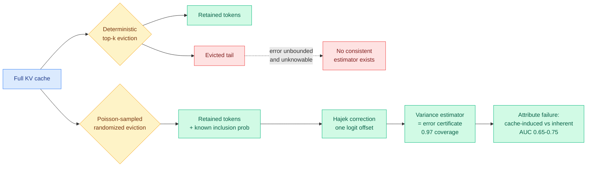

# Error Certificates for KV-Cache Eviction via Randomized Design

**Source:** Kurate cs.LG leaderboard #20 (score 1492, ai_rating 7.0/10) · [arXiv 2607.21475](https://arxiv.org/abs/2607.21475)
**Raw:** [`raw/kurate/2026-07-28-cs-lg.md`](../../raw/kurate/2026-07-28-cs-lg.md)
**Author:** Peng Xie

## TL;DR

Every KV-cache eviction method in this wiki picks the top-k tokens by some importance score and deletes the rest. This paper proves that design has a structural blind spot: **a deterministic evictor cannot know what it destroyed.** You can alter the evicted values so that everything the serving system still holds looks identical while the true attention-output error grows without bound, which means no serving-time estimator of that error can be consistent. The fix is to make eviction *random*. With a Poisson-sampled tail at known inclusion probabilities, a single logit offset applies the Hájek correction inside the softmax, and a standard survey-sampling variance estimator over the retained set becomes a per-step **error certificate** with 0.97 empirical coverage at no accuracy cost. The paper's own one-line summary is the honest one: **randomization buys attribution, not prediction.**

## Key findings

- **Impossibility result for deterministic eviction.** Evicted values can be adversarially altered while the retained set is bit-identical, so true attention-output error is unidentifiable from what the server can see. This is not a "current estimators are weak" claim; it is a "no consistent estimator exists" claim.
- **Randomization restores identifiability.** Poisson sampling of the tail with known inclusion probabilities turns eviction into a survey-sampling problem, where the Horvitz-Thompson / Hájek machinery applies. The correction costs one logit offset inside the softmax.
- **0.97 empirical coverage at no accuracy cost.** The certificate is calibrated, and randomizing does not degrade output quality relative to deterministic eviction at the same budget.
- **Seven pre-registered claims**, which is unusual rigor for a systems-efficiency paper and worth noting on its own.
- **The negative results are the sharpest part.** Question-aware eviction at 25 to 50% budgets is "nearly free." Output log-probability predicts failure better than *any* cache-side signal. And certificate-gated budget escalation **adds nothing** over simpler policies. The certificate does not help you decide how much cache to keep.
- **What it does buy: attribution.** The certificate separates cache-induced failures from failures the model would have had anyway, at AUC 0.65 to 0.75, against 0.47 to 0.54 (essentially chance) for output confidence. It also schedules recomputation better than random or confidence gating.

## Relation to prior wiki pages

**This is the theoretical grounding for a result [VaSE (06-03)](2026-06-03-vase-value-aware-stochastic-kv-eviction.md) found empirically and could not explain.** VaSE, which introduced value-magnitude-guarded stochastic KV eviction, reported two training-free findings: protect the abnormally-large-magnitude value states, and make the eviction decision *stochastic rather than deterministic* because stochasticity keeps the surviving cache diverse and raises accuracy at the same budget. VaSE framed stochasticity as an accuracy trick and offered a diversity intuition. Xie's paper says stochasticity is doing something structurally different and more important: it is what makes the resulting error *estimable at all*. Two papers, seven weeks apart, arriving at randomized eviction from opposite directions is the strongest signal on the [kv-cache](kv-cache.md) page's eviction axis this quarter.

**It refutes a hope this wiki has carried since [Conf-KV (05-30)](2026-05-30-conf-kv-confidence-aware-eviction.md).** Conf-KV converts the next-token distribution into a confidence score and uses it to set the cache budget step by step: low confidence keeps more context, high confidence prunes hard. That is exactly "certificate-gated budget escalation," and Xie tests it and finds it adds nothing. Conf-KV's strong Needle-in-a-Haystack numbers (91.4% at 32K against 53.8% for sliding-window) are not in dispute, but the *mechanism story* is: the gain may come from the ranking and the protected recent window rather than from the confidence-driven budget itself. This is a genuine tension and the wiki should not resolve it in either direction yet.

**It reframes what the eviction control axes are for.** The [kv-cache](kv-cache.md) page tracks four eviction control axes: learned per-token retention ([Make-Each-Token-Count, 05-12](2026-05-12-make-each-token-count-kv-eviction.md)), per-step confidence budget (Conf-KV, 05-30), per-head role pruning ([Forcing-KV, 05-15](2026-05-15-forcing-kv-video-diffusion-kv-cache-compression.md)), and value-magnitude guard plus stochasticity (VaSE, 06-03). All four are *allocation* policies. This paper adds a fifth thing that is not an allocation policy at all: an observability layer that tells you, per step, how much of your error the cache caused.

**It lands directly on the workload the [SemiAnalysis AgentX measurement (07-25)](../hardware/2026-07-25-semianalysis-amd-cuda-moat.md) established.** That measurement, which replayed three months of real Claude Code and Codex traces and found median 140k input, 396 output, 99.2% cache hit rate, reframed agentic serving as a prefill-and-retention problem. Retention decisions are exactly where you need to know whether dropping a block will cost you. The certificate's real product is not a better evictor but a *recomputation scheduler*, and that is the missing piece in the tiered HBM → DRAM → NVMe KV design AMD put on its MoRI H2-2026 roadmap and that [memory-hierarchy](../hardware/memory-hierarchy.md) has listed as an open problem.

## Gaps

The attribution AUC of 0.65 to 0.75 is useful but far from decisive; at the low end it is a weak signal to build a scheduler on. The paper does not report the throughput cost of Poisson-sampling the tail versus a deterministic top-k, and top-k has highly optimized kernel support that random sampling does not. There is also no test of whether the certificate composes with the head-non-uniform budgets that [Tangram (06-16)](2026-06-16-tangram-non-uniform-kv-compression-serving.md) showed are needed for real throughput gains, and per-head inclusion probabilities would complicate the variance estimator.

## Links

- [KV cache concept page](kv-cache.md)
- [VaSE: value-aware stochastic KV eviction](2026-06-03-vase-value-aware-stochastic-kv-eviction.md)
- [Conf-KV: confidence-aware eviction](2026-05-30-conf-kv-confidence-aware-eviction.md)
- [Memory hierarchy](../hardware/memory-hierarchy.md)
- [Daily digest 2026-07-28](../daily-digest/2026-07/2026-07-28.md)
