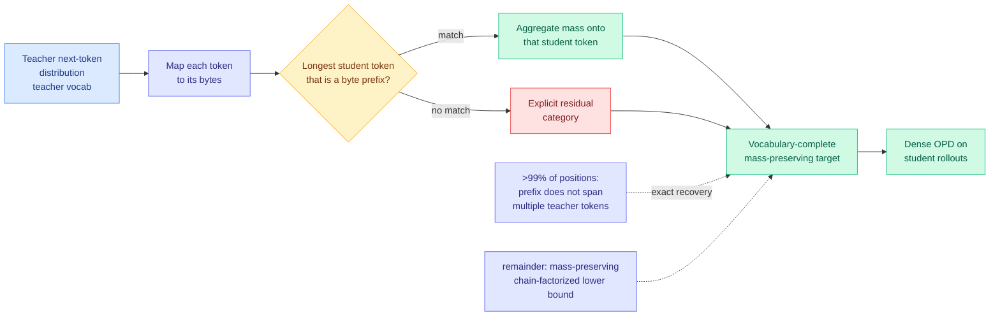

# Cross-Tokenizer On-Policy Distillation via Byte-Prefix Marginalization (BPM)

**arxiv:** [2607.22334](https://arxiv.org/abs/2607.22334) · **Source:** [Kurate cs.LG weekly leaderboard #16, 2026-07-29](../../raw/kurate/2026-07-29-cs-lg.md) (score 1493, ai_rating 7.0/10) · **Authors:** Hao Wang, Kun Yuan, Wenlin Zhong, Minglei Zhang, Han Xiao, Ming Sun, Honggang Qi

## TL;DR

On-policy distillation (OPD, training a small student on its own generations under dense token-level supervision from a bigger teacher) normally assumes teacher and student share a tokenizer, because the supervision is a probability distribution over one shared vocabulary. That assumption is what stops you from distilling Qwen, GLM, and MiniMax into one student even though their strengths are complementary. Existing cross-tokenizer fixes either throw away teacher probability mass they cannot map, or map it onto student tokens whose text has nothing to do with the teacher token. **Byte-Prefix Marginalization (BPM)** re-expresses the teacher's distribution in a shared byte space: each teacher token's probability goes to the longest student token whose bytes are a prefix of the teacher token's bytes, mass landing on the same student token is summed, and anything unmatched goes into an explicit residual bucket instead of vanishing. The result is vocabulary-complete and mass-preserving, so dense OPD works across families. Six-benchmark avg@8 improves 3.7 to 6.6 points over the strongest prior cross-tokenizer methods.

## Why the byte space is the right choice

The failure mode of prior cross-tokenizer distillation is subtle and worth stating precisely. If you align two vocabularies by string matching or embedding similarity, you end up assigning teacher probability to student tokens that mean something else, which injects supervision noise directly into the target distribution. If you instead restrict to the tokens that align exactly, you discard mass, and a target that does not sum to one is a biased gradient. BPM refuses both. Bytes are the universal substrate every tokenizer is built on top of, so mapping into byte space is lossless by construction; the only question is how to *aggregate*, and the longest-byte-prefix rule gives a deterministic, content-respecting answer.

The theoretical claim is tighter than "it works": the target **exactly recovers** the teacher-induced byte-prefix marginal whenever the relevant prefix does not span multiple teacher tokens, a condition the authors measure as holding at more than 99% of training positions. For the residual sub-1%, they fall back to a mass-preserving chain-factorized lower bound rather than an approximation that could break normalization. So the method is exact almost everywhere and conservative in the remainder.

## Key results

- Teachers: Qwen3-32B, GLM-Z1-9B-0414, MiniMax-M2.7. Three different families, three different tokenizers.
- Six-benchmark avg@8 on mathematics and programming: **+3.7 to +6.6 points** over the strongest existing cross-tokenizer baselines.
- The >99% exactness figure is measured, not assumed, which is what separates this from the usual "our approximation is fine" claim.

## How this relates to prior wiki pages

**This is the enabling primitive for the multi-teacher direction the wiki has tracked since 06-16 but which has been quietly stuck inside single vocabulary families.** [Nemotron 3 Ultra (06-16)](../llms-foundation-models/2026-06-16-nemotron-3-ultra-moe-hybrid-mamba.md) put Multi-teacher On-Policy Distillation into a 550B frontier post-training recipe, and the Interconnects 06-16 podcast named MOPD the 2026 default (DeepSeek V4, MiMo-V2-Flash, Nemotron 3 Ultra with more than ten teachers). Every one of those runs used teachers the lab controlled, which in practice means one tokenizer. BPM is what turns "distill from your own model zoo" into "distill from the open-weight ecosystem," and it arrives the same week [Gradient Flow argues](../ai-industry/2026-07-29-labs-competing-with-your-data.md) that specialized models built on open weights are the consequential shift for enterprises. The technique and the market thesis are the same claim from two directions.

**It is also the second paper this week to relocate the distillation target away from the shared output vocabulary.** [Relay-OPD (07-29)](2026-07-29-relay-opd-trajectory-relayed-distillation.md), landing the same day on HuggingFace, keeps the shared vocabulary but changes *who generates* at critical positions. [OPRD (06-05)](2026-06-05-oprd-on-policy-representation-distillation.md) went further and abandoned output space entirely, aligning hidden states across layers and bypassing the LM head. Read together, the three form a clean axis: OPRD says the vocabulary is the wrong venue, BPM says the vocabulary is fine if you translate it correctly, and Relay-OPD says the vocabulary is fine and the problem is *where in the trajectory* you apply it. BPM's is the most immediately deployable of the three because it needs no architectural access to the teacher, only its output distribution.

## Gaps

Math and programming benchmarks only, which is the same verifiable-domain ceiling nearly every paper on the [knowledge-distillation](knowledge-distillation.md) page hits. No student scale study; the paper reports one student configuration. The residual category is a real design choice with no ablation on what happens to the probability mass parked there, and since it is explicitly excluded from the student vocabulary it is effectively a "none of the above" class whose gradient contribution is unexamined. Finally, nothing here composes with the multi-teacher case directly: BPM aligns *one* teacher to *one* student, and whether three byte-marginalized targets from three families can be mixed without their residual buckets interfering is the obvious next experiment and is not run.

## Related

- [knowledge-distillation](knowledge-distillation.md) (concept page)
- [Relay-OPD (07-29)](2026-07-29-relay-opd-trajectory-relayed-distillation.md)
- [OPRD (06-05)](2026-06-05-oprd-on-policy-representation-distillation.md)
- [Daily digest 2026-07-29](../daily-digest/2026-07/2026-07-29.md)
