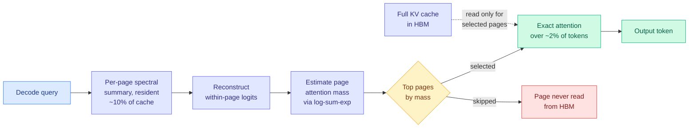

# LOCKS: Page-Local Compact Key Summaries for Efficient Long-Context Decoding

**arxiv:** [2607.24555](https://arxiv.org/abs/2607.24555) · **Source:** [Kurate cs.LG weekly leaderboard #2, 2026-07-29](../../raw/kurate/2026-07-29-cs-lg.md) (score 1564, win rate 83.3%, ai_rating 6.3/10) · **Author:** Junsung Hwang

## TL;DR

Serving a long context is bottlenecked by the KV cache (the stored key and value tensors for every token already processed, so attention does not recompute them), because every decode step reads the whole thing. The standard escape is to select a subset of the cache to attend to, but selection itself usually requires reading candidate keys, which reintroduces the bandwidth you were trying to avoid. LOCKS starts from a measured structural fact: **attention keys are locally low-rank but globally high-rank.** A single shared low-rank basis across the whole cache throws away the directions that are specific to one page; a per-page basis keeps them. So LOCKS gives every KV page its own small spectral summary, resident in memory at roughly a tenth of the cache size, reconstructs the within-page attention logits from that summary, estimates each page's total attention mass by log-sum-exp, and attends only to the top pages. **Selection reads no candidate keys or values at all.** At its shipped 2048-token budget it matches full-cache aggregate quality at 100K+ context while touching about 2% of tokens, and halves per-token decode latency (2.0x at 1M tokens) against dense attention. It ships as a drop-in plugin for unmodified vLLM with batched decode inside full CUDA graphs.

## The mechanism, and why the locality claim is load-bearing

Every block-selection method needs a cheap proxy for "how much attention will this block receive." The usual proxies are a mean-pooled key per block, a learned index head, or a shared low-rank projection of all keys. LOCKS argues the shared-basis version is the one that quietly fails, and gives the reason: keys are low-rank *within a page* and high-rank *across the cache*. A global basis is fit to the union, so it retains the directions common to all pages and discards the page-specific directions, which are exactly the ones that distinguish one page from its neighbours. Per-page bases cost more storage (a tenth of the cache rather than a fixed small projection) but preserve the discriminative signal.

The second design decision matters as much: **selection never touches candidate keys or values.** Methods that score blocks by reading a representative key still pay HBM traffic proportional to the number of candidate blocks, which is what caps their speedup at long context. LOCKS scores entirely from the resident summaries, so selection cost is independent of how much cache is on the wrong side of the bandwidth wall.

## Key results

- Long-document QA (LongBench-v1): within about **one point** of full cache.
- Retrieval-dense RULER: tracks the read-every-key oracle **down to the smallest budgets**, which is the harder test because retrieval tasks punish a selector that misses the one relevant block.
- Long-form reasoning (AIME26, MATH-500): **largest margins here, where baseline selectors collapse.** This is the most interesting result in the paper and the least explained.
- At 2048-token budget: matches FullKV aggregate quality at 100K+ context attending ~2% of tokens; **2.0x lower per-token decode latency at 1M tokens**.
- Ships as a drop-in vLLM plugin, batched decode in full CUDA graphs.

## How this relates to prior wiki pages

**The reasoning-collapse result is the sharpest datapoint yet for a tension [kv-cache](kv-cache.md) has carried since the spring.** The page's whole selection line ([MISA](2026-05-11-misa-mixture-of-indexer-sparse-attention.md) head-axis, [MSA](2026-06-12-minimax-sparse-attention-msa.md) blockwise select-then-attend-exactly, [RTPurbo](2026-05-24-rtpurbo-full-to-sparse-attention.md) query-dependent budgets) validated on retrieval and long-document QA, where the relevant evidence is a contiguous span the selector can find. Long-form reasoning is different: the needed context is diffuse, and a selector tuned on retrieval has no reason to work. LOCKS reporting its *largest* margins exactly where baselines collapse suggests the per-page basis is capturing something the pooled and shared-basis proxies structurally cannot, and that the field has been benchmarking selectors on the easy half of the distribution.

**It is the algorithmic complement to [Tangram (06-16)](2026-06-16-tangram-non-uniform-kv-compression-serving.md), and it inherits Tangram's problem.** Tangram's finding was that serving stacks assume uniform KV length per head, so heterogeneous per-head budgets trap freed memory as page fragmentation, burn up to 25% of prefill on page reclamation, and inflate decode latency up to 1.7x. LOCKS is page-granular rather than head-granular, so it sidesteps the ragged-paging problem by construction, which is probably why it ships as an unmodified-vLLM plugin while most of this literature does not ship at all. But the resident summaries are themselves a per-page allocation at a tenth of cache size, and the paper does not report what that does to the memory the serving stack could otherwise spend on batch size.

**It also sits directly against the [Error Certificates for KV-Cache Eviction (07-28)](2026-07-28-kv-eviction-error-certificates.md) impossibility result.** That paper proved deterministic top-k eviction cannot estimate the error it introduced, and restored a per-step error estimate via randomized (Poisson) eviction at 0.97 coverage. LOCKS is deterministic top-k selection with a log-sum-exp mass estimate, so by that argument it cannot certify its own error either. The interesting difference is that LOCKS *selects* rather than *evicts*: the skipped pages are still resident and could be read next step, so a mistake is recoverable in a way an eviction is not. Whether the certificate result applies to reversible selection or only to irreversible eviction is an open question the two papers do not address, and it is the most useful thing to resolve about either.

## Gaps

Single author, no scale study across model families, and the reported numbers are on unnamed backbones in the abstract. The 2.0x decode figure is against dense attention rather than against the strong selectors it beats on quality, so the accuracy-per-unit-latency comparison against MSA or Tangram is not available. The tenth-of-cache summary overhead is stated but its effect on achievable batch size, which is what actually determines serving cost, is not measured. And the striking long-form-reasoning result gets no mechanistic explanation, which makes it the finding most likely to be a benchmark artifact and most worth an independent replication.

## Provenance note

Kurate cs.LG #2 for the week of 2026-07-29 (a leaderboard built from three-LLM pairwise tournaments, so a quality signal rather than a popularity one). It has **not** appeared on HuggingFace Daily Papers, which makes it LLM-rated-underrated in the wiki's cross-source scheme: high tournament score, no community upvote signal.

## Related

- [kv-cache](kv-cache.md) (concept page)
- [Sparse Event-KV memory contract (07-29)](2026-07-29-sparse-event-kv-memory-contract.md)
- [Error Certificates for KV-Cache Eviction (07-28)](2026-07-28-kv-eviction-error-certificates.md)
- [Tangram (06-16)](2026-06-16-tangram-non-uniform-kv-compression-serving.md)
- [Daily digest 2026-07-29](../daily-digest/2026-07/2026-07-29.md)
