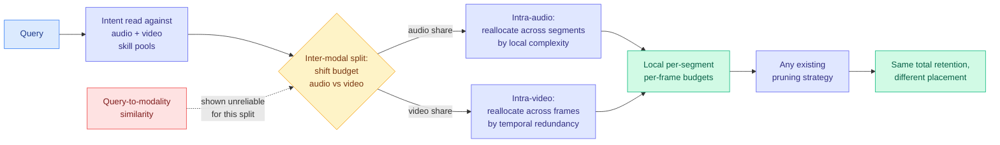

# OmniDelta: Skill-Driven Budget Allocation for Token Compression in OmniLLMs

**arxiv:** [2607.25669](https://arxiv.org/abs/2607.25669) · **Source:** [HuggingFace Daily Papers 2026-07-29](../../raw/huggingface/2026-07-29-omnidelta-skill-driven-budget-allocation-for-token-compressi.md)

## TL;DR

Omni-modal models (OmniLLMs, which take text, audio, and video in one context) are expensive because audio and video expand into very long token sequences. The entire compression literature for them answers the question "given a fixed budget of tokens to keep, which ones?" OmniDelta points out that everyone skipped the question before it: **how much budget should audio get versus video, and how should that budget be spread within each modality?** Two negative findings motivate the method. Direct query-to-audio or query-to-video similarity is an unreliable signal for splitting budget between modalities. And a uniform budget within a modality both misses key evidence and keeps redundant content, at the same time. OmniDelta is training-free: it builds audio and video **skill pools**, uses the query's intent to shift the fixed retained-token budget between modalities, then reallocates within each modality across audio segments and video frames using local complexity and temporal redundancy. It composes with existing pruning strategies because it changes *where* the budget is spent without changing the total retained-token ratio. On Qwen2.5-Omni-7B at 25% token retention: **22.0% less GPU memory and a 1.64x end-to-end speedup** over full-token inference, on a new accuracy-efficiency Pareto frontier across four audio-video benchmarks.

## The negative result is the contribution

The useful part of this paper is not the skill pools, it is the demonstration that **query-to-modality similarity does not tell you how to split budget across modalities.** That is the obvious method, it is what a practitioner would reach for first, and it fails. The reason it fails is worth stating: similarity measures whether a modality *is about* the query, not whether the answer *requires* it. A question about what someone said in a video is highly similar to both the audio and the visual track, but the evidence lives in one of them. Intent, read against a pool of what each modality is good for, separates those two things where raw similarity cannot.

The second-order move, reallocating *within* a modality by local complexity and temporal redundancy, is the more familiar idea (a still frame deserves fewer tokens than a busy one), but the paper's framing that uniform intra-modal budgets fail in *both* directions simultaneously (starving evidence while feeding redundancy) is a cleaner statement than the usual "uniform is suboptimal."

## Key results

- Qwen2.5-Omni at two sizes, four audio-video benchmarks, new accuracy-efficiency Pareto frontier across pruning ratios.
- At 25% retention on Qwen2.5-Omni-7B: **22.0% GPU memory reduction, 1.64x end-to-end speedup** over full-token inference.
- Training-free, and composes with existing pruning methods rather than replacing them.

## How this relates to prior wiki pages

**This is the same move [Tangram (06-16)](2026-06-16-tangram-non-uniform-kv-compression-serving.md) made on the head axis, now on the modality axis.** Tangram's result was that per-head KV budgets follow a two-level structural regularity, an input-invariant head ranking with narrowly bounded per-head ratios, calibratable offline from about fifty samples. OmniDelta's skill pools are the modality-axis version of that offline calibration: a fixed characterization of what each stream is good for, consulted at runtime by query intent. The difference matters. Tangram's ranking is input-invariant, which is what let it resolve statically what prior systems handled dynamically. OmniDelta's allocation is explicitly **query-dependent**, so it cannot be baked in ahead of time. That puts it closer to [KVServe (05-24)](2026-05-24-kvserve-service-aware-kv-compression.md), which treated the compression profile as an online control surface.

**It also extends the non-uniform-budget principle that [kv-cache](kv-cache.md) has accumulated on four axes and adds a fifth.** The page already tracks head-axis ([MISA](2026-05-11-misa-mixture-of-indexer-sparse-attention.md)), head-role ([Forcing-KV](2026-05-15-forcing-kv-video-diffusion-kv-cache-compression.md)), value-magnitude ([VaSE](2026-06-03-vase-value-aware-stochastic-kv-eviction.md)), and layer-function ([Rethinking Efficient Attention in Hybrid Architectures](2026-06-17-rethinking-efficient-attention-hybrid.md), which found long-range retrieval localized to the full-attention layers). Modality is the fifth, and it is the first that is *semantic* rather than architectural: the other four are properties of the network, this one is a property of the question being asked.

**Same-day sibling on the visual token axis: [Mage-VL (07-29)](../vision-audio-video/2026-07-29-mage-vl-codec-native-streaming.md)**, which cuts visual token consumption by over 75% by encoding only entropy-rich regions using motion vectors and residual energy from the video codec. The two are complementary and slightly rivalrous. Mage-VL reduces tokens at the *tokenizer*, before the budget question exists; OmniDelta allocates a budget over tokens that already exist. If codec-native tokenization becomes standard, OmniDelta's intra-video reallocation by temporal redundancy is partly doing work the tokenizer already did. The interesting experiment nobody ran is whether OmniDelta still buys 1.64x on top of a Mage-VIT-style front end.

**And it belongs to the visual-compression run [VisCo (07-27)](2026-07-27-visco-visual-token-compression.md) opened two days ago**, which reused the pretrained VLM as its own parameter-sharing autoencoder so no external module had to be adapted to. Three visual/multimodal compression papers in three days is a cluster: VisCo changes the compressor, Mage-VL changes the tokenizer, OmniDelta changes the allocator. All three keep the backbone frozen, which is the shared bet worth naming.

## Gaps

One model family (Qwen2.5-Omni, two sizes) and four benchmarks, so the skill pools may be tuned to what those benchmarks ask. The skill pools themselves are the least specified part of the method in the abstract: how they are constructed, how many skills, and whether they transfer across model families are all unaddressed, and a training-free method whose quality depends on a hand-built pool is only training-free in a narrow sense. No results on text-heavy or three-modality-simultaneous queries, which is where an intent-based split should be hardest.

## Related

- [kv-cache](kv-cache.md) (concept page)
- [Mage-VL (07-29)](../vision-audio-video/2026-07-29-mage-vl-codec-native-streaming.md)
- [VisCo (07-27)](2026-07-27-visco-visual-token-compression.md)
- [Tangram (06-16)](2026-06-16-tangram-non-uniform-kv-compression-serving.md)
- [Daily digest 2026-07-29](../daily-digest/2026-07/2026-07-29.md)
