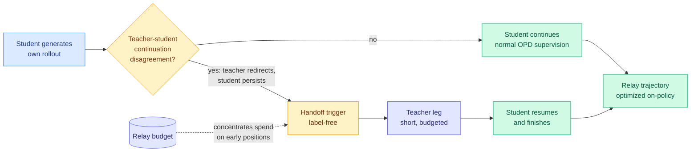

# Pass the Baton: Trajectory-Relayed On-Policy Distillation (Relay-OPD)

**arxiv:** [2607.26057](https://arxiv.org/abs/2607.26057) · **Source:** [HuggingFace Daily Papers 2026-07-29](../../raw/huggingface/2026-07-29-pass-the-baton-trajectory-relayed-on-policy-distillation.md)

## TL;DR

On-policy distillation (OPD, where a small student generates its own reasoning attempts and a bigger teacher scores every token of them) breaks in a specific way that has a name on this wiki: **prefix failure**. Once the student commits to a wrong early step, everything after it is built on that mistake, so the teacher's per-token supervision on the rest of the trajectory is scoring a doomed path. Relay-OPD's move is to notice that the teacher and the student *disagree about what to do next* on exactly those bad prefixes. The teacher tends to redirect; the student ploughs on. That asymmetry needs no labels to detect, so it becomes a free trigger: at the trigger point the teacher takes the baton for a short leg, then hands it back and the student finishes. Train on the resulting relay trajectory. Against a Qwen3-4B-Instruct teacher, Qwen3-1.7B students beat standard OPD by +5.73% and the strongest prior baseline (FastOPD) by +1.49% across eight math benchmarks, while training trajectories get **over 50% shorter**.

## What the paper actually does

Three components, and the interesting one is the trigger.

**The diagnosis.** OPD grounds supervision in the student's own trajectory, which is the whole point (it avoids the exposure bias of training on teacher text the student would never produce). But the same property means a wrong first step poisons every later token: the student keeps generating from a state the teacher considers hopeless, and the teacher's next-token distribution over that state is unreliable supervision. Compute is spent producing tokens nobody should learn from.

**The trigger.** Rather than needing a verifier or the ground-truth answer to detect a bad prefix, the paper measures a **teacher-student continuation asymmetry**. On a failed prefix the teacher's continuation distribution shifts toward correcting course, while the student's stays committed to the original direction. That divergence is computable from the two models alone. No label, no reward model, no answer key. This is the paper's real contribution and the reason it can run in domains where a verifier would be expensive.

**The relay.** At the trigger the teacher generates a short leg, then the student resumes and is optimized on the composite trajectory. A **limited relay budget** forces intervention into early positions, which is both where prefix failure originates and where the student's policy has not yet drifted far from the teacher's. Spending the budget late would produce a trajectory too far off the student's own distribution to be a valid on-policy target.

## Key results

- +5.73% average over standard OPD and +1.49% over FastOPD on eight math benchmarks at Qwen3-1.7B, best or second-best on **every** benchmark.
- Consistent gains at 0.6B, so the mechanism is not scale-fragile at the small end.
- Training trajectory length cut by **over 50%**, which is a compute saving on top of the accuracy gain. Both come from the same source: not generating tokens that build on a dead prefix.

## How this relates to prior wiki pages

**This is the fourth distinct answer to prefix failure and the first that needs no supervision to fire.** [TRD (06-09)](2026-06-09-trd-trajectory-refined-distillation.md) named prefix failure and *repaired* the bad prefix under teacher guidance before distilling. [FiRe-OPD (06-04)](2026-06-04-fire-opd-filter-then-reweight-distillation.md) *discarded* bad trajectories outright, then soft-reweighted what survived. [Quality-Aware OPSD (06-18)](2026-06-18-quality-aware-opsd-gui-grounding.md) gated per token by asking whether the current prefix could still reach the ground-truth box, which works only where a box exists. [ReOPD (07-24)](2026-07-24-reopd-multiturn-onpolicy-distillation.md) generalized the diagnosis to whole multi-turn histories and called it a prefix trap, fixing it with a step-decaying schedule that emphasizes early low-shift prefixes. Relay-OPD sits between repair and gating: it does not fix the prefix and does not discard it, it **hands control over temporarily**. Its relay budget concentrating on early positions is the same insight ReOPD's decay schedule encodes, reached by a different route.

**The trigger is the closest thing yet to the unified reliability estimator [knowledge-distillation](knowledge-distillation.md) has flagged as missing since 06-18.** TA-OPD's "teachability," TrOPD's "trust region," SG-OPD's "sign-consistency," and Quality-Aware OPSD's "can this prefix still reach the answer" are four task-specific estimators of per-token teacher reliability, and every one of them needs either a verifier or an answer key. Relay-OPD's continuation asymmetry needs neither. It is not the full estimator (it is binary and trajectory-positional rather than graded and per-token) but it is the first member of the family that could run outside verifiable domains.

**It also lands on the exact quantity [Requential Coding (07-25)](2026-07-25-requential-coding-self-generated-compression.md) says the transferred information *is*.** Requential Coding proved that the bits a teacher actually transmits are charged only where teacher and student disagree, so agreement points are free and carry nothing. Relay-OPD triggers on disagreement about the *continuation direction* and spends its expensive intervention there. That is a disagreement-based selection criterion in the wild, which is the loop the concept page said nobody had closed. It closes it at the trajectory level, not the token level, so the token-level version is still open.

## Gaps

Math reasoning only, teacher and student both from the Qwen3 family, and the largest teacher is 4B. Whether the continuation asymmetry survives a genuine capability gap (a 4B student under a 200B+ teacher, where the teacher's redirections may be unreachable rather than merely different) is untested, and that is precisely the regime TA-OPD's reachability work says is dangerous. The relay budget is a hyperparameter with no principled setting. And because the teacher leg is inserted into the training trajectory, the student is partly imitating text it did not produce, which reintroduces a slice of the off-distribution problem OPD exists to avoid; the paper argues the budget bounds this but does not measure the resulting distribution shift directly.

## Related

- [knowledge-distillation](knowledge-distillation.md) (concept page)
- [ReOPD (07-24)](2026-07-24-reopd-multiturn-onpolicy-distillation.md)
- [Cross-Tokenizer OPD via Byte-Prefix Marginalization (07-29)](2026-07-29-bpm-cross-tokenizer-opd.md)
- [Requential Coding (07-25)](2026-07-25-requential-coding-self-generated-compression.md)
- [Daily digest 2026-07-29](../daily-digest/2026-07/2026-07-29.md)
