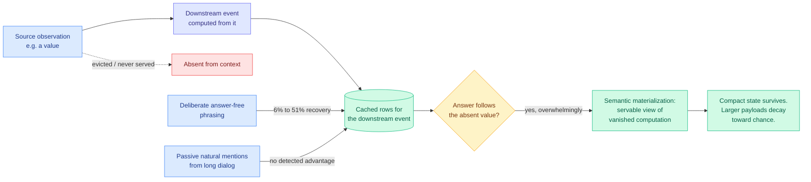

# Compute Globally, Materialize Locally: The Memory Contract of Sparse Event-KV

**arxiv:** [2607.23693](https://arxiv.org/abs/2607.23693) · **Source:** [Kurate cs.AI weekly leaderboard #19, 2026-07-29](../../raw/kurate/2026-07-29-cs-ai.md) (score 1499, ai_rating 6.0/10) · **Authors:** Zefeng Cai, Zerui Cai

## TL;DR

Long-horizon agents increasingly treat the KV cache (the stored attention state for tokens already processed) as *memory*: the serving system keeps some cached entries across turns and drops the rest. Every eviction policy and every episodic-memory scheme rests on an assumption nobody tests directly, which is that a retained event still carries its information once the observations that produced it are gone. This paper tests it by deleting one earlier observation from what is served, holding the agent history otherwise identical. The result: on items sensitive to that observation, **the model's answer overwhelmingly still follows the deleted value**, even though no served span states it. The authors call this **semantic materialization**. A downstream event's cached rows behave as an independently servable view of a computation whose inputs no longer exist. And it can be written deliberately: a carefully phrased, answer-free event raises donor-aligned recovery from **6% to 51%** on Qwen3-8B without ever naming the value. Passively harvesting natural mentions from long dialog yields no detectable advantage.

The consequence for anyone building eviction is stated bluntly in the paper and is the reason this matters: **dropping a source event and observing no accuracy loss does not show the source was unnecessary.** It may show the information already materialized downstream.

## What the memory contract actually says

The paper's framing is systems-flavoured and precise: it specifies **what to write, where it lands, and what survives once the source is gone.** Three bounds:

1. **Compact state survives; larger payloads decay toward chance.** Materialization has a capacity, and it is small. This is a hard limit on how much you can hope to carry forward implicitly.
2. **Whether a construction writes at all turns on phrasing, not meaning.** Two phrasings the model comprehends equally well can diverge sharply in whether they materialize. That is an uncomfortable result: the property is not semantic, so you cannot design for it by reasoning about content.
3. **Deliberate beats passive by a wide margin** (6% to 51% versus no detectable effect). Materialization is something you engineer, not something you harvest.

## How this relates to prior wiki pages

**This is the strongest challenge yet to the eviction-evaluation methodology on [kv-cache](kv-cache.md).** Every eviction paper the page tracks validates the same way: drop entries, measure accuracy, conclude the dropped entries were expendable. This paper shows that inference is invalid in the agentic regime, because a downstream cached event may be silently standing in for the source. The measured accuracy is real; the causal claim about *why* is not. Read alongside the [Error Certificates for KV-Cache Eviction (07-28)](2026-07-28-kv-eviction-error-certificates.md) result, which proved deterministic top-k evictors cannot estimate the error they introduce, the two papers attack eviction from opposite ends within four days of each other: one says you cannot measure the damage, the other says your measurement of *no* damage does not mean what you think. That is a genuine methodological crisis for the eviction literature, and neither paper is on HuggingFace.

**It also gives a mechanism to the [Frozen 12B verified-memory (07-28)](2026-07-28-frozen-12b-verified-memory-reuse.md) result from the other direction.** That paper showed a frozen model plus a persistent store of verified solutions answers repeat problems at zero generation tokens, bit-exact, and that emptying the memory solves nothing. Its store is explicit and addressed. Semantic materialization says a *second*, implicit store exists inside the cache rows themselves, unaddressed and unaudited, holding compact state whose source has been discarded. A serving system now has two memories with different reliability properties, and only one of them is inspectable.

**And it sharpens the agentic-serving picture SemiAnalysis measured on 07-25.** [AgentX](../hardware/2026-07-25-semianalysis-amd-cuda-moat.md) put real numbers on agentic workloads: median input 140k, median output 396, median cache hit rate 99.2%. At that in/out ratio the cache is not a decode accelerator, it is the agent's working memory, and what survives eviction is a correctness question rather than a throughput question. Sparse Event-KV is what that correctness question looks like when you actually run the ablation.

**The tension with [InMind (07-29)](../agentic-systems/2026-07-29-inmind-implicit-association-blind-spot.md) is worth naming.** InMind, landing the same day, found that external memory systems fail to *surface* facts they demonstrably hold, recalling on demand at up to 100% but answering indirect queries at most 14.4%. Sparse Event-KV finds the opposite failure of intuition inside the cache: information reaches the answer through a path nobody served. One says explicit memory under-delivers what it stores; the other says implicit memory delivers what it was never asked to store. Both undermine the same assumption, that the served context is the information the model is using.

## Gaps

Qwen3-8B is the only model with a headline number, so whether materialization capacity scales with model size (which would determine whether this gets better or worse on frontier models) is unmeasured. The phrasing-not-meaning finding is reported as an observation without a predictive rule, so a practitioner cannot yet tell which phrasings write. And "answer-free" is doing a lot of work: the boundary between an event that materializes a value and one that leaks it is exactly where a safety or privacy argument would live, and the paper does not draw it.

## Provenance note

Kurate cs.AI #19 for the week of 2026-07-29, absent from HuggingFace Daily Papers. LLM-rated-underrated in the wiki's cross-source scheme.

## Related

- [kv-cache](kv-cache.md) (concept page)
- [LOCKS (07-29)](2026-07-29-locks-page-local-key-summaries.md)
- [Error Certificates for KV-Cache Eviction (07-28)](2026-07-28-kv-eviction-error-certificates.md)
- [InMind (07-29)](../agentic-systems/2026-07-29-inmind-implicit-association-blind-spot.md)
- [Daily digest 2026-07-29](../daily-digest/2026-07/2026-07-29.md)
