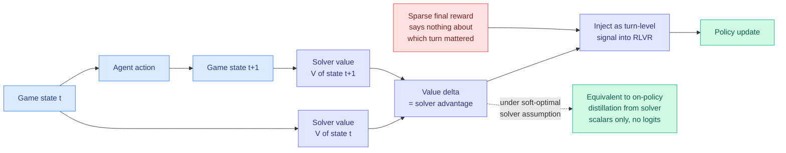

# CAST: Game Solvers as Turn-Level Teachers for LLM Agents

**arxiv:** [2607.25308](https://arxiv.org/abs/2607.25308) · **Source:** [HuggingFace Daily Papers 2026-07-30](../../raw/huggingface/2026-07-30-cast-game-solvers-as-turn-level-teachers-for-llm-agents.md) · **Code:** [github.com/Wloner0809/CAST](https://github.com/Wloner0809/CAST)

## TL;DR

RLVR (reinforcement learning with verifiable rewards, where the training signal is a checkable final answer rather than a human preference) has one structural weakness in long-horizon settings: the reward arrives only at the end and says nothing about *which* of the fifty decisions along the way was the good one. The usual fixes for that credit-assignment problem are a learned process reward model (cheap but inaccurate) or a teacher LLM scoring every step (accurate but expensive). CAST observes that in any domain with a classical solver, the solver's **state value** is already a perfect process signal. The change in solver value from one state to the next tells you directly whether the action advanced the position. CAST converts those value deltas into solver advantages and injects them into RLVR as turn-level signal. The theoretical result is the part worth keeping: under a soft-optimal solver assumption, **maximizing the solver advantage is equivalent to on-policy distillation from the solver, and it needs only scalar values rather than teacher logits.**

## The equivalence is the contribution

Standard on-policy distillation requires the teacher's full output distribution at every position, because the loss is a divergence between two distributions over the vocabulary. That is why the whole distillation line assumes a teacher LLM: you need logits. CAST's derivation says that if your teacher is a soft-optimal solver, a **scalar value per state** carries the same training signal. That collapses the teacher's bandwidth requirement from a vocabulary-sized vector per token to one number per turn.

Practically this means the teacher no longer has to be a language model at all. A Sokoban solver, a Minesweeper constraint propagator, and a Rush Hour search do not speak the student's token space, do not share its tokenizer, and cannot produce logits over it. Under this framing none of that matters.

## Relation to prior wiki state

This is the fourth distinct attack on the same question in two weeks, and it is the one that moves the constraint. The wiki's on-policy distillation thread has been circling a single dependency: every reliability signal proposed for OPD needs something the student does not have.

- [Relay-OPD (2026-07-29)](2026-07-29-relay-opd-trajectory-relayed-distillation.md) found a teacher-student continuation asymmetry, on a failed prefix the teacher changes course while the student ploughs on, and used it as a **label-free** handoff trigger, gaining 5.73% over standard OPD while halving trajectory length. Its significance was needing no verifier. Its limitation is that it still needs a teacher LLM to diverge from.
- [BPM / cross-tokenizer OPD (2026-07-29)](2026-07-29-bpm-cross-tokenizer-opd.md) removed the shared-tokenizer requirement via byte-prefix marginalization, letting teacher and student come from different families.
- [ReOPD (2026-07-24)](2026-07-24-reopd-multiturn-onpolicy-distillation.md) extended OPD to multi-turn settings.

CAST removes a different dependency than any of them: **the teacher does not have to be a neural network.** Line up the three constraints that have fallen this month and the pattern is explicit. BPM dropped the shared tokenizer, Relay-OPD dropped the verifier, CAST drops the requirement that the teacher emit a distribution at all. What is left of on-policy distillation is a very general statement about transferring any scalar-valued source of state quality into a policy.

That also connects it back to the token-weighting line. [TIP](knowledge-distillation.md), which showed most teacher-generated tokens carry no learning signal and roughly 10% suffice, and today's [CoRT (2026-07-30)](2026-07-30-cort-counterfactual-replay-token-credit.md), which redistributes a response-level GRPO advantage across tokens using counterfactual likelihood contrasts, are both asking where within a trajectory the signal lives. CAST answers it from outside the model, using a solver that already knows.

## Key results

- Beats **all** trained baselines on Sokoban, Minesweeper, and Rush Hour, under both in-domain and unseen-difficulty evaluation.
- Highest average **zero-shot** transfer to ALFWorld and WebShop, which are not games and have no solver. This is the load-bearing generalization result: turn-level credit learned against a solver produces a policy that is better at long-horizon decision-making in general.

## Gaps

The soft-optimal solver assumption is doing real work in the derivation and no game solver is exactly soft-optimal, so the equivalence is approximate by an unquantified amount. All three training domains are perfect-information puzzles with cheap exact solvers, which is the narrowest possible slice of "domains with solvers." The interesting untested cases are domains with *imperfect* or expensive solvers (theorem provers, compilers, simulators, SQL planners) where the value function is noisy or slow, and the paper gives no sensitivity analysis for solver quality. The zero-shot ALFWorld and WebShop gains are reported as averages without per-task breakdown, so it is unclear whether the transfer is broad or driven by a subset.

## Industrial implication

Anywhere a verifier already exists as a program rather than a model, this says you have been throwing away the most valuable part of it. Code agents have compilers, test suites, and static analyzers that all emit graded state quality; SQL agents have query planners; formal-methods agents have proof checkers. Today those are used as terminal pass/fail rewards. CAST's equivalence says they can be used as dense per-step teachers at no extra inference cost, which is the cheapest available upgrade to any agentic RL pipeline in a tooled domain.

## Related

- [Knowledge Distillation](knowledge-distillation.md)
- [Relay-OPD](2026-07-29-relay-opd-trajectory-relayed-distillation.md)
- [BPM: cross-tokenizer on-policy distillation](2026-07-29-bpm-cross-tokenizer-opd.md)
- [CoRT: token-level rubric credit](2026-07-30-cort-counterfactual-replay-token-credit.md)
- [Daily digest 2026-07-30](../daily-digest/2026-07/2026-07-30.md)
