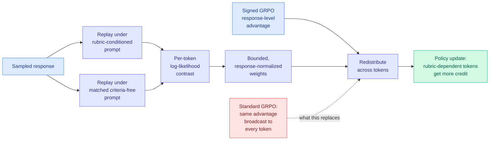

# CoRT: Counterfactual Replay for Token-Level Rubric-Guided Policy Optimization

**arxiv:** [2607.25659](https://arxiv.org/abs/2607.25659) · **Source:** [HuggingFace Daily Papers 2026-07-30](../../raw/huggingface/2026-07-30-cort-counterfactual-replay-for-token-level-rubric-guided-pol.md) · **Institutions:** Nanjing University, ByteDance, UCAS · **Enrichment:** [alphaxiv overview](https://www.alphaxiv.org/abs/2607.25659)

## TL;DR

Rubric-based RL evaluates a model's response against explicit written criteria (correctness, formatting, safety, tone) instead of one opaque preference score. That is much richer supervision, and then GRPO (group-relative policy optimization, the standard RL algorithm for LLM post-training) throws almost all of it away: the per-criterion judgments are collapsed into one scalar, converted into one response-level advantage, and broadcast **uniformly to every token in the response**. A formatting criterion and a factual-correctness criterion are grounded in completely different spans, and the gradient cannot tell them apart. CoRT recovers the within-response structure without training anything extra. It replays the same sampled response twice, once under the original rubric-conditioned prompt and once under a matched criteria-free prompt, and takes the **per-token log-likelihood difference** as a proxy for how much that token depended on the rubric. Those contrasts become bounded, response-normalized weights that redistribute the signed GRPO advantage across tokens. The response-level reward is untouched. Average gain **4.4 percentage points** over matched response-level GRPO, improving in the vast majority of comparisons.

## Why "no auxiliary scorer" is the whole point

The prior approach to this problem, Rubrics-to-Tokens (RTT), trains a separate model to score token relevance. That works and it costs a second model, a second training stage, and a second thing that can be miscalibrated or go stale as the policy moves. CoRT's claim is that the policy **already contains** the signal: if a token was generated because the rubric was in the prompt, then removing the rubric from the prompt lowers that token's likelihood. The contrast is a free measurement of rubric-dependence, computable with one extra forward pass over a response you already sampled.

The design discipline matters as much as the idea. CoRT changes only the *within-response* credit allocation and leaves the response-level reward exactly as GRPO computed it, so the weights are bounded and response-normalized and the total advantage mass is preserved. That is why it inherits GRPO's stability rather than introducing a new failure mode, and it is why the paper can report gains "in the vast majority of comparisons" rather than a best-case number. The reported result is that it stays competitive with learned token-level credit baselines while skipping the relevance-learning stage entirely, which is a fair trade rather than a dominance claim.

## Relation to prior wiki state

This is the fourth paper this month arguing that **uniform credit across a trajectory is the waste**, and the third to fix it without adding a supervisor. Name them together and the convergence is hard to miss:

- **TIP** (see [knowledge-distillation](knowledge-distillation.md)) showed most teacher-generated tokens carry no learning signal and roughly 10% suffice, reframing distillation as a token-weighting problem.
- [LongAct (2026-04-18)](2026-04-18-longact-saliency-sparse-rl.md) restricted RL gradient updates to the positions with high-magnitude Q/K activations, the same saliency peaks that trouble quantization, for about 8% on LongBench v2.
- [Relay-OPD (2026-07-29)](2026-07-29-relay-opd-trajectory-relayed-distillation.md) used teacher-student continuation asymmetry as a label-free trigger for where in a trajectory to intervene.
- **CoRT** uses the policy's own counterfactual likelihood contrast to decide where within a response the credit belongs.

Four papers, four different signals (teacher agreement, activation magnitude, continuation divergence, counterfactual likelihood), one shared claim: the trajectory is not uniform and treating it as uniform is leaving several points on the table. That threshold, three or more papers making the same core architectural choice, is the wiki's bar for declaring a pattern established. **It is established.** The open question the four of them jointly raise and none answers is whether these signals agree with each other; they are cheap enough that somebody should correlate them on the same rollouts.

Its same-day companion [CAST (2026-07-30)](2026-07-30-cast-solver-advantage-distillation.md) attacks the identical credit-assignment problem from outside the model, converting a classical game solver's state-value deltas into turn-level signal. CoRT works at token granularity from policy internals; CAST works at turn granularity from an external oracle. They are compatible and nobody has stacked them.

## Gaps

Instruction-tuned models and rubric-conditioned tasks only, so nothing here says the counterfactual contrast is a good credit signal outside rubric settings, where there is no natural "matched criteria-free prompt" to contrast against. The 4.4-point average is over an unstated spread, and "vast majority of comparisons" concedes some regressions that are not characterized. The most important untested question is whether the contrast measures *rubric dependence* or merely *prompt sensitivity*: a token whose likelihood drops when any long prefix is removed would be upweighted for the wrong reason, and the paper's own framing (borrowed from context-attribution methods) is where that confound lives. A placebo prompt ablation would settle it cheaply.

## Industrial implication

This is a drop-in change to a rubric-RL pipeline costing one extra forward pass per sampled response and no new model to maintain. For anyone running rubric-based post-training, which is now the standard recipe for instruction-following and safety behaviour at every major lab, 4.4 points for that price is worth testing this quarter. The deeper implication is for RLAIF and constitutional-style pipelines generally: they all condition a judge on written criteria and then flatten the result to a scalar, and CoRT says the flattening is where the signal dies.

## Related

- [Knowledge Distillation](knowledge-distillation.md)
- [CAST: solver advantages as turn-level teachers](2026-07-30-cast-solver-advantage-distillation.md)
- [LongAct: saliency-sparse RL](2026-04-18-longact-saliency-sparse-rl.md)
- [Daily digest 2026-07-30](../daily-digest/2026-07/2026-07-30.md)
