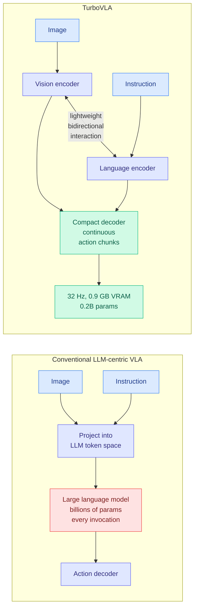

# TurboVLA: Real-Time Vision-Language-Action Model at 32 Hz on an RTX 4090 with <1 GB VRAM

**arxiv:** [2607.27205](https://arxiv.org/abs/2607.27205) · **Source:** [HuggingFace Daily Papers 2026-07-30](../../raw/huggingface/2026-07-30-turbovla-real-time-vision-language-action-model-at-32-hz-on.md) · **Institutions:** Huazhong University of Science and Technology, Huawei · **Code:** [github.com/H-EmbodVis/TurboVLA](https://github.com/H-EmbodVis/TurboVLA)

## TL;DR

Vision-language-action models (policies that take a camera image plus a natural-language instruction and emit robot joint commands) almost all route through a large language model: project the image into the LLM's token space, run the LLM, decode actions out the other side. That V → L → A pathway pays for a multi-billion-parameter forward pass on **every single policy invocation**, which at control frequencies means paying it dozens of times per second. TurboVLA deletes the LLM from the loop. Vision and language are encoded independently, exchange information through a lightweight bidirectional interaction module, and a compact decoder predicts continuous action chunks directly. The mapping becomes V + L → A. At **0.2B parameters** it reaches **97.7% average success on LIBERO** with **31.2 ms latency** and **0.9 GB inference VRAM** on a consumer RTX 4090, matching or beating substantially larger VLA policies.

## Why the LLM was there, and what removing it costs

The LLM-centric design is not arbitrary. Putting the instruction through a language model is what buys open-vocabulary understanding, semantic generalization to phrasings never seen in the demonstration set, and any high-level reasoning about the task. Those are real properties and they come from large-scale language pretraining, not from the action data.

TurboVLA's bet is that on a benchmark like LIBERO the policy is not actually using most of that. What it needs is a task-conditioned visual representation, and you can build one by letting a vision encoder and a language encoder attend to each other directly rather than by serializing the image into language space and running a general-purpose reasoner over it. The 97.7% number says the bet pays on LIBERO. Whether it pays on instructions phrased in ways the training set never contained is precisely what LIBERO does not test, and the paper does not claim otherwise.

The efficiency arithmetic is what makes this interesting beyond robotics. A 0.2B model at 0.9 GB is not just cheaper, it is a **different deployment class**: it fits alongside other workloads on one consumer card, it runs on a robot without a server in the loop, and at 31.2 ms it closes a control loop that a 7B VLA cannot.

## Relation to prior wiki state

The structural move here (stop routing everything through the big general model, build a task-specific path instead) is the same one the wiki's routing and efficiency pages have been tracking from four other directions. [DSPy task-model separation (2026-07-25)](../ai-routing/2026-07-25-dspy-task-model-separation-550x.md) reported a 550x cost gap from separating the task specification from the model that executes it. [MHLC / multi-head latent control (2026-07-27)](../ai-routing/2026-07-27-multi-head-latent-control.md) decides from a partial generation whether the small model suffices. TurboVLA is the most aggressive version: it does not route around the large model, it removes the large model from the architecture.

Read against [VISCO (2026-07-27)](2026-07-27-visco-visual-token-compression.md), which compresses visual tokens before they reach the language model, the two are alternative answers to the same cost. VISCO keeps the LLM and shrinks its input; TurboVLA keeps the input and deletes the LLM. VISCO preserves the semantic generalization TurboVLA gambles on not needing, which makes them complements rather than competitors, and suggests the untested middle: a small language model with compressed visual tokens.

The consumer-hardware framing lands the same week practitioners are measuring exactly this. The [local coding model KV-cache economics report (2026-07-30)](2026-07-30-local-model-kv-cache-economics.md) found the binding constraint on a single-GPU deployment is cache footprint rather than parameter count. TurboVLA's 0.9 GB is the robotics-side version of that finding: what determines whether a model is deployable on one card is total memory at inference, and architecture choices move it by more than an order of magnitude.

## Gaps

LIBERO only, and LIBERO is a simulation benchmark with a bounded instruction distribution, which is the friendliest possible ground for a design whose central risk is losing language generalization. The paper's own framing (removing the LLM removes the source of open-vocabulary understanding) makes the missing experiment obvious: performance under paraphrased, compositional, or unseen instructions. There is also no real-robot result reported in the abstract, so the 32 Hz figure is a compute claim rather than a demonstrated control result. Scaling behaviour is unaddressed in both directions: whether the bidirectional interaction module keeps working as task diversity grows, and whether a 1B version would recover the generalization at still-reasonable cost.

## Industrial implication

If this survives contact with real robots and open-vocabulary instructions, the deployment economics of manipulation change from server-attached to on-board. A 0.9 GB policy runs on embedded hardware, which removes the network round trip that currently caps control frequency and makes fleet deployment a per-unit hardware cost rather than a per-unit inference bill. The Huawei co-authorship is worth noting for where that gets productized first.

## Related

- [KV Cache](kv-cache.md)
- [LLM Routing](../ai-routing/llm-routing.md)
- [VISCO: visual token compression](2026-07-27-visco-visual-token-compression.md)
- [Daily digest 2026-07-30](../daily-digest/2026-07/2026-07-30.md)
