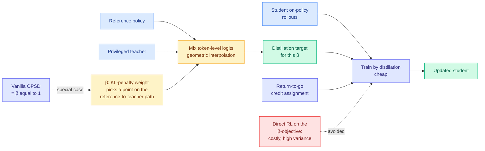

# β-OPSD: Deriving with Policy Optimization, Training with Self-Distillation

**Source:** HuggingFace Daily Papers, 2026-07-31 · [arXiv 2607.28582](https://arxiv.org/abs/2607.28582) · [raw](../../raw/huggingface/2026-07-31-opsd-deriving-with-policy-optimization-training-with-self-di.md)

## TL;DR

On-policy self-distillation (OPSD), where a reasoning model is trained on its own rollouts under supervision from a privileged teacher, works but is notoriously fiddly. This paper explains why with one observation: **vanilla OPSD is exactly the β = 1 member of a broader policy-optimization family**, where β weights the KL penalty anchoring the student to a reference policy. Nobody chose β = 1. It was baked in. Exposing it turns a fixed constant into a tunable regularizer, and the optimal policy for any β has a closed form: a **geometric interpolation between the reference policy and the privileged teacher**. Rather than optimize that objective with reinforcement learning, which would be expensive and high-variance, β-OPSD turns the closed-form solution into a **distillation target** implemented by mixing reference and teacher **token-level logits**.

## The move

The paper's structure is worth stating plainly because it is the whole contribution: **derive with policy optimization, train with self-distillation.** The RL formulation gives you the right target. The distillation formulation gives you a cheap way to hit it. You never run the expensive optimizer.

Two supporting pieces:

- **β selects a point along the reference-to-teacher path.** Small β leans on the teacher's privileged guidance; large β keeps the student anchored to its reference. The trade-off is explicit rather than implicit, which is what turns a brittle recipe into a dial.
- **Return-to-go credit assignment** aligns token-level updates with the sequence-level objective while keeping OPSD's simplicity.

Experiments on mathematical-reasoning benchmarks report that β-OPSD consistently outperforms vanilla OPSD, improving both optimization stability and downstream reasoning.

## Gaps

No numbers in the abstract, which for a paper whose thesis is "tune this parameter" is a real omission: the reader cannot see how much of the gain is β and how much is return-to-go credit assignment, and there is no reported sensitivity curve over β. Whether the optimal β is stable across model scales, teacher strengths and task families is the question that decides if this is a principled fix or a new hyperparameter to sweep, and it is not answered. Evaluation is mathematical reasoning only, which is the same confinement the whole on-policy-distillation line suffers from.

## Relation to prior wiki state

**Fifth structural constraint removed from on-policy distillation in three days.** [knowledge-distillation.md](knowledge-distillation.md) recorded a sharp run in late July: [BPM (07-29)](2026-07-29-bpm-cross-tokenizer-opd.md) removed the shared-tokenizer requirement by mapping teacher probability into byte space; [Relay-OPD (07-29)](2026-07-29-relay-opd-trajectory-relayed-distillation.md) removed the verifier requirement using teacher-student continuation asymmetry as a label-free handoff trigger; [CAST (07-30)](2026-07-30-cast-solver-advantage-distillation.md) removed the requirement that the teacher be a neural network at all, proving that under a soft-optimal solver assumption, maximizing solver advantage *is* on-policy distillation using scalars rather than logits. β-OPSD removes a different kind of constraint: not a requirement on the teacher, but a **hidden constant in the objective**. The four together say the field had been working inside a much smaller box than the math required.

**Direct successor to the OPSD-stability line.** [D-OPSD (05-07)](2026-05-07-d-opsd-self-distillation-step-distilled-diffusion.md) and [ATESD (05-16)](2026-05-16-atesd-adaptive-teacher-exposure-self-distillation.md) both attacked OPSD brittleness by adapting *how much teacher the student sees*, ATESD by scheduling teacher exposure. β-OPSD gives that intuition a closed form: adaptive teacher exposure is a schedule over β, and the geometric-interpolation result says exactly what target each schedule point corresponds to.

**Partial answer to the [Extrapolation Cliff (05-14)](2026-05-14-extrapolation-cliff-on-policy-distillation.md).** That paper found a closed-form threshold above which on-policy distillation collapses when the teacher-student gap is too large. β-OPSD's interpolation gives a mechanism for staying below such a threshold by construction: raise β to keep the target nearer the reference. Whether the two closed forms are the same object under different parameterizations is worth checking and neither paper does it.

## Links

- [knowledge-distillation.md](knowledge-distillation.md)
- [Flux-OPD: On-Policy Distillation with Evolving Contexts](2026-07-31-flux-opd-evolving-contexts.md)
- [Daily digest 2026-07-31](../daily-digest/2026-07/2026-07-31.md)
