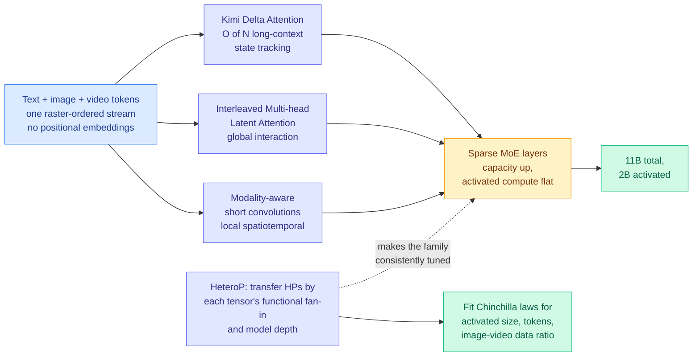

# Chimera: Designing and Chinchilla-Scaling Hybrid Visual Diffusion Transformers

**Source:** HuggingFace Daily Papers, 2026-07-31 · [arXiv 2607.28611](https://arxiv.org/abs/2607.28611) · [raw](../../raw/huggingface/2026-07-31-chimera-designing-and-chinchilla-scaling-hybrid-visual-diffu.md)

## TL;DR

Two things happen in this paper and only one of them is about video. The visible result is a hybrid visual diffusion backbone that is **7.3x more compute-efficient** than a matched full-attention Wan-2.1 2B baseline on pretraining diffusion loss, and extrapolates zero-shot from **5-second training clips to 30-second videos** with only **6.5% FID degradation** in the last five seconds. The durable result is **HeteroP**, a module-wise hyperparameter-transfer scheme that makes a heterogeneous architecture, one mixing several different layer types, tunable at all. Without something like HeteroP you cannot fit compute-optimal scaling laws for a model whose parts scale differently, and that is the reason nobody had published Chinchilla-style laws for hybrid architectures before.

## What is in the architecture

Chimera processes text, image and video tokens in one raster-ordered stream **without positional embeddings**, and combines three mixing mechanisms plus sparsity:

- **Kimi Delta Attention (KDA)** for long-context state tracking at O(N) cost. This is the linear-attention component.
- **Interleaved Multi-head Latent Attention (MLA)** for direct global interaction. This is the low-rank-latent-KV component.
- **Modality-aware short convolutions** for local spatiotemporal context.
- **Sparse Mixture-of-Experts layers** to expand capacity while holding activated compute down.

The trained model is **11B total parameters with 2B activated**.

## Key results

- **1.7x** compute efficiency from the dense backbone alone versus a matched full-attention Wan-2.1 2B baseline, measured by pretraining diffusion loss; **7.3x** for the complete system with sparsity.
- **Zero-shot length extrapolation**: trained on 5-second clips, generates 30-second video with 6.5% FID degradation in the final five seconds, with no length-specific fine-tuning.
- The fitted scaling laws say **compute-optimal image pretraining divides compute nearly evenly between activated model size and training-token count**, whereas **video pretraining modestly favours model size at higher budgets**. That is a concrete, checkable allocation recommendation that did not previously exist for this model class.

## Gaps

Compute efficiency is measured in **pretraining diffusion loss**, not in generation quality, and loss-versus-quality decoupling is a chronic problem in diffusion. The 7.3x number combines architectural and sparsity gains, so a dense-versus-dense comparison at matched activated parameters is the ablation that would separate "hybrid attention works" from "MoE works." The scaling laws are fitted on a family tuned by HeteroP, which means the laws are conditional on HeteroP being correct, and HeteroP is validated by the same fits. There is no reported inference throughput, only training-side efficiency.

## Relation to prior wiki state

**The hybrid recipe reaches its third domain, and this time with scaling laws attached.** [attention-mechanisms.md](../llms-foundation-models/attention-mechanisms.md) tracked the convergence: on 06-16 two labs shipped hybrid backbones the same day, [Nemotron 3 Ultra](../llms-foundation-models/2026-06-16-nemotron-3-ultra-moe-hybrid-mamba.md) (550B/55B-active Mamba-plus-attention MoE) and [Ling/Ring-2.6](../llms-foundation-models/2026-06-16-ling-ring-2.6-hybrid-linear-attention.md) (a 1T model migrated in place to a 7:1 linear-to-MLA ratio). On 07-24 the recipe crossed into video with [SANA-Video 2.0](2026-07-24-sana-video-hybrid-linear-attention.md), which fixed 25% full-softmax anchors as the quality-efficiency optimum in a from-scratch video diffusion transformer. Chimera is the same family and adds what all of them lacked: **fitted compute-optimal laws**, plus the parametrization machinery that makes fitting possible.

**HeteroP is the fourth leg of the scale-stable-architecture program.** [MoE μP (05-17)](../ai-routing/2026-05-17-moe-mup-maximally-scale-stable-parameterization.md) gave hyperparameter transfer to mixture-of-experts, [Gated DeltaNet μP (06-04)](2026-06-04-gated-delta-network-mup-scaling.md) gave it to gated linear attention, and [Parallax (05-29)](2026-05-29-parallax-local-linear-attention.md) showed the optimizer choice unlocks local-linear-attention capacity. Each of those handled **one** layer family. HeteroP's contribution is transferring across a model containing several at once, keyed on each tensor's functional fan-in and the model depth, which is the case every real hybrid actually is.

**Open question this raises for the page.** The 06-17 mechanism study found **Large-Window Laziness**, where a bigger sliding-window attention window delays retrieval-head formation in the full-attention layers because the cheap layers cover for them. Chimera has three cheap-ish paths (KDA, convolutions, MoE) covering for interleaved MLA, and reports no analysis of whether the MLA layers go lazy. Its clean length extrapolation is weak evidence they do not.

## Links

- [attention-mechanisms.md](../llms-foundation-models/attention-mechanisms.md)
- [SANA-Video 2.0](2026-07-24-sana-video-hybrid-linear-attention.md)
- [Daily digest 2026-07-31](../daily-digest/2026-07/2026-07-31.md)
