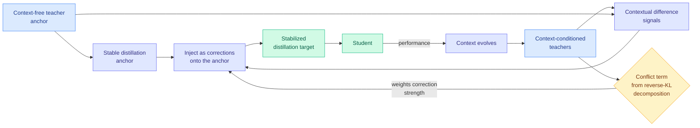

# Flux-OPD: On-Policy Distillation with Evolving Contexts

**Source:** HuggingFace Daily Papers, 2026-07-31 · [arXiv 2607.28022](https://arxiv.org/abs/2607.28022) · [raw](../../raw/huggingface/2026-07-31-flux-opd-on-policy-distillation-with-evolving-contexts.md)

## TL;DR

On-policy distillation works well where a reward can be checked. In open-ended domains, writing quality, dialogue, advice, there is no verifier, so task preferences are hard to turn into supervision. A prompt-side **context** can express those preferences ("be concise, cite sources, avoid hedging"), but a fixed context stops teaching once the student has absorbed it. Flux-OPD lets the context **evolve with student performance** and solves the instability that creates. Its analytical result is the useful part: decomposing the reverse-KL objective shows the student is distilled toward the **geometric mean of context-conditioned teachers**, and the objective contains an explicit **conflict term** measuring disagreement among those teachers. That conflict term becomes the control signal.

## The mechanism

Using an evolving context directly as in-training supervision fails for two reasons the paper names: the distillation **target becomes unstable** as the context moves, and different contexts induce **conflicting distributions** over the same output. Flux-OPD's fix follows from the decomposition:

- Treat the difference between a **context-conditioned** teacher and the **context-free** teacher as a **contextual difference signal**, rather than treating the context-conditioned teacher as the target outright.
- Inject those differences as **corrections onto the context-free anchor**. The anchor is stable, so the target stays stable.
- **Weight the correction strength by the conflict term.** Where the context-conditioned teachers disagree with each other, trust the correction less.

Reported to outperform existing on-policy-distillation paradigms on open-ended tasks.

## Gaps

Nothing quantitative is stated. There is no description of how the context actually evolves, which is the load-bearing free choice in the whole design, and no ablation separating the anchor-plus-correction structure from the conflict-based weighting. "Open-ended tasks" is unnamed, and open-ended evaluation is where LLM-judge artifacts live, so the evaluation protocol matters more here than in a math-benchmark paper and is unspecified.

## Relation to prior wiki state

**Extends the on-policy-distillation line into the domain it has never reached.** [knowledge-distillation.md](knowledge-distillation.md) has flagged repeatedly that every estimator in this family, [TA-OPD](knowledge-distillation.md)'s teachability, TrOPD's trust region, [Relay-OPD (07-29)](2026-07-29-relay-opd-trajectory-relayed-distillation.md)'s continuation asymmetry, needs some form of supervision to fire, which is why the whole line is confined to math and code. Flux-OPD attacks the confinement head-on by replacing the missing verifier with a **context that encodes preferences**, and its conflict term is a reliability estimator that needs no labels at all, computed purely from disagreement among context-conditioned teachers.

**Pairs with [β-OPSD (same day)](2026-07-31-beta-opsd-policy-optimization-self-distillation.md), and the pairing is instructive.** β-OPSD interpolates between a **reference policy and a teacher** and exposes the interpolation weight. Flux-OPD interpolates between a **context-free teacher and context-conditioned teachers** and derives the weight from measured conflict. Same shape, different axis: one blends along the trust-the-teacher dimension, the other along the trust-this-instruction dimension. Both arrived on the same HuggingFace page.

**Third distinct use of teacher disagreement as a training signal in three days**, after Relay-OPD (teacher-student continuation asymmetry as a handoff trigger) and [CoRT (07-30)](2026-07-30-cort-counterfactual-replay-token-credit.md) (per-token log-likelihood contrast between rubric-conditioned and criteria-free prompts as a credit weight). CoRT and Flux-OPD are structurally near-identical operations, contrast a conditioned run against an unconditioned run, applied to different ends: CoRT uses the contrast to weight **credit**, Flux-OPD uses it to weight **corrections to the target**. The wiki's open question about whether these disagreement signals agree with each other on the same rollouts now has a fourth member and is more overdue.

## Links

- [knowledge-distillation.md](knowledge-distillation.md)
- [β-OPSD](2026-07-31-beta-opsd-policy-optimization-self-distillation.md)
- [Daily digest 2026-07-31](../daily-digest/2026-07/2026-07-31.md)
