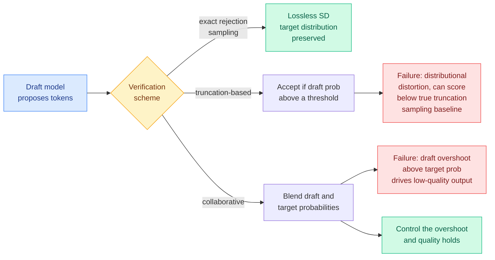

# Revisiting Lossy Verification in Speculative Decoding: Mechanisms, Trade-offs, and Failure Modes

**Source:** HuggingFace Daily Papers, 2026-07-31 · [arXiv 2607.26627](https://arxiv.org/abs/2607.26627) · [code](https://github.com/ZhouYuxuanYX/Fast-HSD) · [raw](../../raw/huggingface/2026-07-31-revisiting-lossy-verification-in-speculative-decoding-mechan.md)

## TL;DR

Speculative decoding is defined by being lossless: a cheap draft model proposes tokens, the expensive target model verifies them by exact rejection sampling, and the target's output distribution is preserved exactly. A growing set of methods buy extra speed by relaxing that guarantee. This paper shows that the relaxation is not a small quality tax you can reason about locally. It silently rewrites the decoding distribution, and the resulting quality can be unstable and sometimes far worse than the baseline the method claims to approximate. The paper's contribution is a taxonomy plus a diagnostic: every lossy verification scheme published so far collapses into two families, **truncation-based** and **collaborative**, and each family has one specific failure mode.

## What it actually does

Three moves. First, a distributional analysis of what each published lossy verifier actually samples from, which is the step that shows most of them are superficially distinct and mechanically the same. Second, the two-family classification. Third, a diagnostic evaluation framework over curated benchmarks designed to expose the failure modes rather than average them away, which is why the paper finds problems that the original method papers did not report.

The two findings, stated plainly:

**Truncation-based verification has a baseline problem.** These methods accept a draft token when its probability clears some threshold, which is meant to approximate top-p or top-k sampling from the target. The paper shows performance can degrade *significantly against the true truncation-sampling baseline*. That is the damning comparison. The method is not trading a little quality for speed relative to greedy or full sampling. It is producing worse output than the exact version of the very distribution it claims to be approximating, because the distortion is not a clean truncation.

**Collaborative verification has a controllable knob nobody was controlling.** These methods blend draft and target probabilities. The paper identifies **overshoot**, the amount by which the draft's probability for a token exceeds the target's, as the quantity that determines whether output quality survives. Control the overshoot and collaborative verification behaves. Leave it uncontrolled and you get the low-quality generations reported in the wild.

## Key findings

- Published lossy verifiers reduce to **two families**, not the many distinct mechanisms their papers present.
- Truncation-based schemes can score **below the true truncation-sampling baseline**, not just below lossless decoding.
- For collaborative schemes, **bounding draft-over-target probability overshoot is the necessary condition** for acceptable output.
- Quality degradation is described as **unstable**, meaning it does not show up uniformly and is easy to miss with a benchmark average.

## How this relates to prior wiki pages

**This is the first paper on the [speculative-decoding](speculative-decoding.md) page to argue that the field's recent direction is partly unsound, and it lands directly on a question that page left open.** The page's 06-12 entry on VIA-SD (which carves a slim verifier out of the full verifier and routes tokens to accept, slim-regenerate, or full recompute, cutting rejection rates 0.10 to 0.22) closed with exactly this worry: "Open question for review: whether the slim-verifier regeneration path is exactly lossless or an approximation." Today's paper is the general answer. VIA-SD's middle tier is a collaborative-family mechanism, so the overshoot condition applies to it, and the honest reading is that VIA-SD's numbers need re-reporting under this diagnostic before they can be trusted at face value.

**It also reframes the page's own summary line.** The page opens by defining speculative decoding as lossless, "quality is unchanged," and then tracks four axes of generalization: better drafts (GRAFT, 05-20, retrieve draft tokens instead of generating them), better draft training (Draft-OPD, 06-02, on-policy distillation for the drafter), better scheduling (SPD, 06-02, pipeline-parallel zero-bubble speculation), and graded verification cost (VIA-SD). Every one of those keeps the guarantee except the last. This paper says the moment you cross that line the accounting changes qualitatively, because you are no longer measuring speed at fixed quality, you are measuring two moving quantities and reporting one.

**Against [Bebop](2026-06-11-bebop-mtp-rejection-sampling-rl.md) (06-11, which found multi-token-prediction acceptance is near-linearly bounded by model entropy, so acceptance collapses during RL exactly when rollouts are most expensive), there is a shared shape.** Both papers find that a speculative-decoding quantity everyone reports as a scalar is actually a function of the output distribution's shape, and both find the dependence is where the surprises live. Bebop's fix was to optimise total variation directly rather than cross-entropy. This paper's fix is to bound overshoot. Both are distributional corrections to methods that were being tuned on aggregates.

## Gaps

The abstract gives no numbers, so the size of the truncation-family degradation is unknown from the paper's front matter and the "significantly" is doing unquantified work. The overshoot condition is stated as a principle rather than a bound with a constant, so it is not yet something a serving stack can implement without tuning. And the diagnostic framework is described as curated benchmarks, which raises the standard question in the other direction: a framework designed to expose failure modes will find them, and whether the failures matter at production sampling temperatures and prompt distributions is a different question the paper does not appear to answer.

## Industrial read

Anyone running a lossy speculative-decoding variant in production is currently reporting a speedup against a quality number measured on an average. The paper's instability finding says that average is hiding the cases that matter. The cheap action is the overshoot instrumentation: log draft-minus-target probability per accepted token and look at the tail, which costs nothing and is the one number this paper says predicts collapse.

## Related

- [speculative-decoding.md](speculative-decoding.md)
- [VIA-SD: intra-model routing for graded verification](../ai-routing/2026-06-12-via-sd-intra-model-routing-speculative-decoding.md)
- [Bebop: MTP acceptance and entropy](2026-06-11-bebop-mtp-rejection-sampling-rl.md)
- [Draft-OPD: on-policy distillation for drafters](2026-06-02-draft-opd-speculative-draft-distillation.md)
