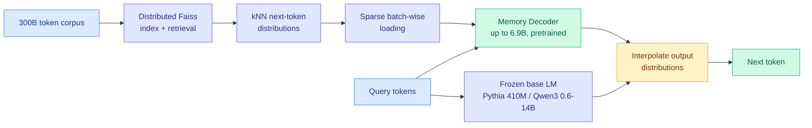

# Memory Decoder at Scale: A Pretrained, Parametric Long-Term Memory

**Source:** HuggingFace Daily Papers, 2026-07-31 · [arXiv 2607.27919](https://arxiv.org/abs/2607.27919) · [raw](../../raw/huggingface/2026-07-31-memory-decoder-at-scale-a-pretrained-parametric-long-term-me.md)

## TL;DR

A decoder-only language model keeps its long-term memory and its reasoning in the same parameter set, so you cannot buy more memory without buying more reasoning. Memory Decoder at Scale separates them: train a dedicated memory model, up to 6.9B parameters on 300B tokens, that predicts the next-token distribution a k-nearest-neighbour retriever would produce, then run it alongside a frozen base model. The headline result is a parameter-allocation claim, not a retrieval claim. A 6.9B general memory paired with Pythia-410M lifts the average across 17 benchmarks from 29.86 to 37.34, beating Pythia-12B at 37.24 while using 39% fewer parameters in total. Spending parameters on memory beats spending them on the base model.

## What it actually does

The original Memory Decoder proposed a parametric memory module and validated it small. This work is the scaling study, and most of the contribution is infrastructure. At 300B tokens, building a Faiss index (the standard approximate nearest-neighbour library) over every training position and then searching it for every training step is not affordable. The paper builds a distributed indexing and retrieval pipeline and adds sparse, batch-wise loading of the kNN distributions so the training loop never materialises the full retrieval tensor. Without that plumbing the experiment does not run at all, which is the honest reason nobody had scaled this before.

The result is a memory model that emits, in one forward pass, an approximation of what a retriever over 300B tokens would have said. At inference the base model is frozen. You interpolate the two output distributions. There is no index at query time and no retrieved documents in the prompt.

## Key findings

- **6.9B memory + Pythia-410M averages 37.34 across 17 benchmarks, versus 37.24 for Pythia-12B**, at 39% fewer total parameters. This is the whole argument in one line.
- Base model average without memory: **29.86**. The memory contributes roughly 7.5 points.
- **Domain memories are cheap and scale-invariant.** A 1.7B domain memory raises the three-domain average by more than 9 points on every Qwen3 Base size from 0.6B to 14B. The gain does not shrink as the base model grows, which is the surprising part. If memory and reasoning were substitutes you would expect a 14B model to need less external memory than a 0.6B one.
- The parameter-performance tradeoff is better for memory than for the base model across every scale tested.

## How this relates to prior wiki pages

**This extends [parametric-context-internalization](parametric-context-internalization.md) along the axis that page's open questions asked about, and it lands on the other side of one of them.** That page tracks the move from "put context in the prompt" to "put context in weights," through Code2LoRA and Video2LoRA (06-06, both predict a LoRA adapter from a context item in one hypernetwork pass) and Experience Distillation (07-25, train a student to reproduce a context-conditioned teacher's behaviour, retaining 64.8% of the in-context gain versus 3.8% for supervised fine-tuning on the same transcripts). All three internalize *one item at a time*. Memory Decoder internalizes *a corpus*, and it does so as a separate model rather than an adapter on the base one. The page's "frontier-scale transfer" open question asked whether predicted-adapter results on small backbones hold up when the base is large. This paper answers a neighbouring version of it: the memory's contribution holds from 0.6B to 14B, so the axis does not collapse as the base model absorbs more knowledge in weights.

**It also inverts the framing of today's [Metis](../agentic-systems/2026-07-31-metis-memory-foundation-model.md).** Metis puts memory *inside* the backbone as a persistent state updated by a forward pass. Memory Decoder keeps it *outside* as a second model with its own parameter budget. Both reject the external retrieval database. They disagree on where the memory should live, and both report gains, which means the field has two live architectures for the same complaint and no head-to-head comparison. Worth tracking as a genuine fork rather than a convergence.

**Against [agent-memory](../agentic-systems/agent-memory.md)'s InMind finding (07-29), this is a partial answer to a problem InMind said retrieval cannot solve.** InMind showed six vector, graph and agentic memory systems answer at most 14.4% of indirect queries whose answers they demonstrably store, while the same backbone answers 84.0% when the memory is placed in context. The diagnosis was that retrieval fails to *trigger* on queries that do not resemble the stored fact. A parametric memory has no trigger step: the memory model contributes to every token's distribution whether or not the query looks like the stored text. Whether that actually recovers the implicit-association gap is untested here, and it is the obvious experiment: run Memory Decoder on InMind.

## Gaps

Every reported base model is Pythia or Qwen3 Base, so this is pretending-to-be-2023 territory. No instruct-tuned or reasoning model appears, and interpolating a memory distribution into a model whose post-training carefully shaped its output distribution is a different proposition. The 17-benchmark average also hides which benchmarks moved: a memory model trained to imitate kNN retrieval should help knowledge-heavy tasks far more than reasoning, and if the 7.5-point average is mostly knowledge recall, the "beats Pythia-12B" comparison is measuring the wrong equivalence. Serving cost is not discussed either. Two forward passes per token against one is a real inference tax that the parameter count does not capture.

## Related

- [parametric-context-internalization.md](parametric-context-internalization.md)
- [Metis: Memory Foundation Model](../agentic-systems/2026-07-31-metis-memory-foundation-model.md)
- [agent-memory.md](../agentic-systems/agent-memory.md)
- [kv-cache.md](kv-cache.md)
