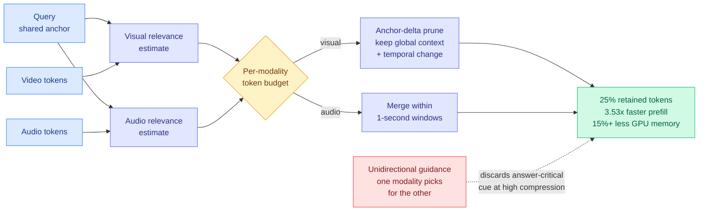

# OmniScope: Modality-Decoupled Token Compression for Omnimodal Large Language Models

**arxiv:** [2607.23193](https://arxiv.org/abs/2607.23193) · **Source:** [HuggingFace Daily Papers 2026-07-31](../../raw/huggingface/2026-07-31-omniscope-modality-decoupled-token-compression-for-omnimo.md) (2 upvotes) · **Code:** [github.com/MAC-AutoML/OmniScope](https://github.com/MAC-AutoML/OmniScope)

## TL;DR

Token compression is how you make a multimodal model affordable: a minute of video plus its audio track becomes tens of thousands of tokens, most of which carry nothing the query needs, so you prune. Existing methods for audio-video models do this with **unidirectional guidance**, using one modality to decide what to keep in the other, usually letting the visual stream pick and dragging audio along. OmniScope shows the assumption underneath that is wrong with a single observation: **for the same query, audio relevance and video relevance peak at different moments.** A speaker names the object three seconds before the camera shows it. Guidance from one modality therefore throws away the answer-critical cue in the other, and the harder you compress, the more often it happens.

The fix is stated as a design principle in one line: **share the query across modalities, but not the salience estimates.** OmniScope keeps the query as a shared semantic anchor, then estimates relevance **separately** per modality, allocates a **modality-specific token budget**, prunes visual tokens with an **anchor-delta** strategy that keeps both global context and temporal change, and **merges audio tokens within each one-second window** to cut redundancy without breaking temporal continuity. It is **training-free**. At **25% token retention it delivers up to 3.53x prefill speedup and over 15% GPU memory reduction for a 0.35-point average accuracy drop**, best average accuracy at every compression setting tested, across four audio-video benchmarks and two Qwen2.5-Omni scales.

## Why the cross-modal salience mismatch is the real contribution

The speedup number is nice but replaceable. The diagnosis is not. "Cross-modal salience mismatch" names a failure that is invisible in aggregate benchmark scores at moderate compression and only shows up when you push retention down, which is exactly the regime anyone deploying an omnimodal model actually cares about. It also explains why the prior literature looked fine: at 50% retention there is enough slack that dropping the audio peak still leaves a usable signal, so unidirectional guidance appears adequate. The failure is a **tail** failure, and it is the tail that determines whether a compression method is deployable.

Two mechanism details are worth separating, because they solve different halves.

**Anchor-delta pruning for video.** Keeping the top-scoring frames alone collapses temporal structure, because the highest-relevance frames cluster. Anchor-delta keeps a global anchor set plus the frames where the representation *changes*, which preserves the "what happened between these two moments" information that per-frame scoring destroys. This is the same insight as [EvoMem (06-14)](../agentic-systems/2026-06-14-evoarena-evomem-memory-evolution.md), which stored memory as patch histories so an agent could reason about change rather than about snapshots, applied one layer down at the token level.

**Per-second merging for audio.** Audio does not have the frame-level redundancy structure video does; it has a continuity requirement. Merging inside a fixed one-second window respects that: you compress within a window and never across, so the timeline stays intact. Handling the two modalities with structurally different operators, not just different budgets, is the part that follows from the mismatch diagnosis.

## Key results

- **3.53x prefill speedup** at **25% overall token retention**, with **more than 15% GPU memory reduction** and only a **0.35-point** average accuracy drop.
- **Best average accuracy across all compression settings** tested, on four audio-video benchmarks and two Qwen2.5-Omni model scales.
- **Training-free.** No fine-tuning, no learned selector, so it drops onto an existing served model.
- Establishes the cross-modal salience mismatch empirically: audio and video relevance for one query peak at different timestamps.

## How this relates to prior wiki pages

**It is the multimodal instance of a pattern the [kv-cache](kv-cache.md) page has now seen from three angles: the aggregate accuracy number hides what selection destroyed.** [Sparse Event-KV (07-29)](2026-07-29-sparse-event-kv-memory-contract.md) showed that dropping a cached fact and seeing no accuracy loss does not prove it was unnecessary, because the answer may reach you through a later cache row that materialised the dropped computation. [The KV-eviction error certificate result (07-28)](2026-07-28-kv-eviction-error-certificates.md) proved deterministic top-k eviction cannot know what it destroyed, and restored a per-step error estimate with 0.97 coverage by making eviction randomised (Poisson) instead. OmniScope adds a third: unidirectional cross-modal guidance cannot know what it destroyed, because the modality doing the choosing has no access to the other's salience curve. Three independent results, three layers of the stack, one claim: **selection methods validated on accuracy-after-drop are validating the wrong thing.**

**It sits alongside [LOCKS (07-29)](2026-07-29-locks-page-local-key-summaries.md) as the prefill-side complement to a decode-side result.** LOCKS gives every KV page a per-page spectral summary so selection reads no candidate keys, matching full-cache quality at 100K+ context while touching about 2% of tokens and halving per-token decode latency. LOCKS optimises **decode**; OmniScope optimises **prefill**, which is where a long audio-video input actually hurts. They are composable and target different bottlenecks, and both make the same architectural bet that the cheap resident summary beats reading candidates.

**Its "share the query, not the salience estimates" line generalises into a routing claim, which is why it belongs on [llm-routing](../ai-routing/llm-routing.md) too.** That page tracks routing over models, experts, heads, phases, and, since [InMind (07-29)](../agentic-systems/2026-07-29-inmind-implicit-association-blind-spot.md), over context occupancy. OmniScope routes a **token budget across modalities**, decided per query. That is admission control with a per-stream quota, structurally the same shape as [CLEAR (06-05)](2026-06-05-clear-shadow-price-reasoning-budget.md)'s rationing of reasoning tokens across a batch by one global shadow price, except the scarce resource is split across modalities rather than across queries. Nobody has written the version that does both.

**On the reader's attention hierarchy this is squarely an efficiency result despite the multimodal framing.** The mechanism is token compression and prefill cost; the fact that the tokens happen to be audio and video is incidental to why it matters.

## Gaps

- **One model family.** Two scales of Qwen2.5-Omni is a scale check, not a generality check. Whether the salience mismatch has the same magnitude in a model with a different audio-visual fusion architecture is untested, and the whole method is calibrated to the mismatch's size.
- **Training-free is a strength and a ceiling.** A learned per-modality budget allocator would almost certainly beat a heuristic one. The paper does not report what the learned upper bound looks like, so we do not know how much is left on the table.
- **No compression below 25% reported in the abstract.** The mismatch argument predicts the gap over unidirectional baselines should *widen* as retention drops, which is the paper's strongest available claim and the number that is missing.
- **Latency, not throughput.** 3.53x prefill speedup is a single-request figure. Under batched serving the memory saving matters more than the speedup, and the 15% figure is reported without a batch-size sweep.

## Industrial implication

Any product doing real-time video understanding with audio, meeting assistants, video search, screen-recording agents, live captioning with visual grounding, is currently paying prefill on the full token count or accepting a quality hit from naive compression. A training-free 3.53x prefill win at 25% retention is deployable this quarter with no retraining and no model swap, which is a very short adoption path. Expect it to land in an omnimodal serving stack fast, and expect the per-modality budget to become a tunable knob exposed to callers, the same way [Claude Opus 5's effort dial (07-25)](../llms-foundation-models/2026-07-25-claude-opus-5.md) exposed reasoning budget per request.

## Related pages

- [KV Cache](kv-cache.md) — the selection-validity thread this joins
- [LOCKS (07-29)](2026-07-29-locks-page-local-key-summaries.md) — decode-side complement
- [Sparse Event-KV (07-29)](2026-07-29-sparse-event-kv-memory-contract.md) — the same what-did-selection-destroy problem
- [LLM Routing](../ai-routing/llm-routing.md) — budget allocation across modalities as a routing axis
- [Daily digest 2026-07-31](../daily-digest/2026-07/2026-07-31.md)
