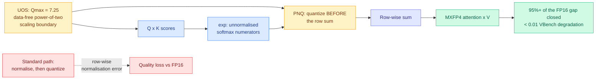

# MXAttention: Data-Free Optimal Scaling and Pre-Normalization Quantization for MXFP4 Attention

**Date ingested:** 2026-08-01
**Source:** Kurate weekly cs.LG leaderboard #16 (score 1433, win rate 60.0%, ai_rating 7.0/10, the only tier-1-flagged entry on either board this week)
**Paper:** [arXiv 2607.24377](https://arxiv.org/abs/2607.24377)
**Raw:** [Kurate cs.LG board](../../raw/kurate/2026-08-01-cs-lg.md)

---

## TL;DR

MXFP4 is the four-bit format (32 values share one power-of-two scale factor) that AMD built its low-precision path around and that OCP standardised. Running attention in MXFP4 should be the obvious way to attack the quadratic cost of attention in diffusion video models, and it does not work out of the box: quality degrades. MXAttention identifies exactly two numerical causes and fixes both without any calibration data. First, the power-of-two scale forces a choice between clipping large values and underflowing small ones, and the periodic structure of that scale turns out to admit a single distribution-independent optimum at **Qmax = 7.25**, no search and no calibration set required. Second, the standard practice of quantizing softmax outputs after row-wise normalisation injects normalisation error, so MXAttention quantizes the **unnormalised exponentials before** the row sum, which preserves normalisation by construction. On Wan2.2 and HunyuanVideo it closes **at least 95% of the VBench Imaging Quality gap** between stock OCP MXFP4 and FP16, and lands under **0.01 absolute degradation on every reported VBench metric**.

---

## Architecture

---

## What it actually does

**Universal Optimal Scaling (UOS).** MXFP4 assigns one shared E8M0 exponent (a power of two, no mantissa) to each block of 32 values. Because the scale can only move in factors of two, the effective quantisation grid repeats with period two in log space. MXAttention exploits that periodicity to solve for the scaling boundary that minimises expected error *independently of the input distribution*, arriving at a constant, Qmax = 7.25. This is the part that matters operationally: every competing four-bit attention recipe needs a calibration pass over representative activations, which means a data pipeline, a re-run whenever the workload shifts, and a licensing question about what data you calibrated on. UOS needs none of it.

**Pre-Normalization Quantization (PNQ).** Softmax computes exponentials, sums them per row, then divides. The conventional quantisation point is after the division, which means the quantiser sees values already scaled by a row-dependent denominator and the error it introduces breaks the property that the row sums to one. PNQ quantises the raw exponentials first and lets the sum happen in the quantised domain, so normalisation holds by construction rather than approximately.

---

## Key results

- Closes **≥95% of the VBench Imaging Quality gap** between OCP MXFP4 and FP16 on Wan2.2 and HunyuanVideo.
- **< 0.01 absolute degradation on all reported VBench metrics**, which is the claim that makes it a drop-in rather than a tradeoff.
- Substantially improved frame-level similarity, the metric that catches temporal flicker that per-frame scores miss.
- **Competitive with strong NVFP4 baselines** with negligible fused overhead, which is the strategically interesting number.
- Shipped in **MindIE-SD**, so this is vendor inference-stack code, not a research artifact.

---

## How this relates to prior wiki pages

**It lands directly on the format-war thread from [SemiAnalysis's AMD analysis (07-25)](../hardware/2026-07-25-semianalysis-amd-cuda-moat.md).** That piece documented the split cleanly: NVFP4 (16-element blocks, an FP8 E4M3 per-block scale plus an FP32 global scale) is NVIDIA's Blackwell format and is becoming the default for four-bit checkpoints, while MXFP4 (32-element blocks, E8M0 power-of-two scale) is the OCP standard AMD's four-bit path was built around, with MI355X supporting MXFP4 only and gfx1250/MI455X gaining native NVFP4 with a runtime discriminator. The practical read at the time was that NVFP4's richer scale format buys accuracy that MXFP4 cannot match, and that AMD's hardware answer was to also speak NVFP4. MXAttention argues the accuracy gap was never intrinsic to the format. It was two fixable numerical mistakes in how people were using it, and once fixed, MXFP4 is competitive with NVFP4 on quality. If that holds beyond video diffusion, the strategic case for NVFP4 as the universal default weakens, and MI355X-class hardware that only speaks MXFP4 stops being second-tier for four-bit attention.

**It is the third result in eight days saying the same thing about calibration and selection.** [The KV-eviction certificate result (07-28)](2026-07-28-kv-eviction-error-certificates.md) proved deterministic top-k eviction cannot know what it destroyed, [Sparse Event-KV (07-29)](2026-07-29-sparse-event-kv-memory-contract.md) showed that dropping a cached fact and seeing no accuracy drop does not prove the fact was unnecessary, and [OmniScope (07-31)](2026-07-31-omniscope-modality-decoupled-token-compression.md) found that letting one modality pick what to keep in another silently discards the answer-critical cue. Each of those is a *selection* method validated on accuracy-after-drop. MXAttention is the constructive counterpart: rather than validating a heuristic empirically, it derives the optimum in closed form and gets a guarantee (normalisation preserved by construction) instead of a benchmark. The contrast is worth naming because it suggests where the field's low-precision work should go next, which is toward invariants you can prove rather than thresholds you tune.

**It gives the [gpu-kernels](../hardware/gpu-kernels.md) page a data-free entry.** Every kernel-level quantisation entry on that page so far assumes a calibration stage. UOS removes it for this one operator.

---

## Gaps

The evaluation is **entirely diffusion video generation**, two models, one benchmark family. Attention in an autoregressive language model has a very different score distribution (long tails from attention sinks, heavy skew after RoPE at long context), and whether Qmax = 7.25 survives that is completely untested and is the single question that decides whether this matters beyond video. The abstract reports quality faithfully but gives **no end-to-end speedup or memory number**, so "negligible overhead when fused" is an assertion, and a four-bit attention path whose quality is FP16-equivalent is only interesting if it is also meaningfully faster than the FP8 path people currently run. The distribution-independence claim rests on the periodic structure of power-of-two microscaling and the abstract does not state the assumptions under which the derivation holds, which is exactly where a data-free claim usually leaks.

---

## Research angle

The open problem this creates is a clean one: **does UOS's distribution-independence survive a different tensor?** The derivation is about the geometry of power-of-two scaling, not about attention scores, so on its face Qmax = 7.25 should apply to any MXFP4-quantised tensor, weights included. Nobody has tested that. If it holds, data-free MXFP4 weight quantisation follows immediately and the calibration step disappears from a much larger class of pipelines. If it fails, the constant is secretly distribution-dependent and the paper's headline property is narrower than advertised. Second question: PNQ's argument (quantise before the normalising operation, not after) is a general principle about where in a normalisation chain the quantiser belongs, and RMSNorm and LayerNorm have exactly the same structure. Nobody has applied it there either.

---

## Related pages

- [KV Cache](kv-cache.md)
- [GPU Kernels](../hardware/gpu-kernels.md)
- [Memory Hierarchy](../hardware/memory-hierarchy.md)
- [Sparse Event-KV (07-29)](2026-07-29-sparse-event-kv-memory-contract.md)
- [OmniScope (07-31)](2026-07-31-omniscope-modality-decoupled-token-compression.md)
