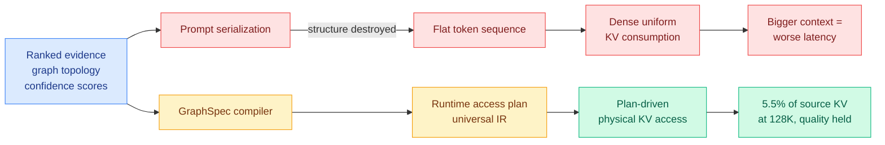

# KAP: Knowledge Access Planning, or how the prompt format throws away everything the retriever knew

**arxiv:** [2607.24260](https://arxiv.org/abs/2607.24260)
**Authors:** Shuo Wang, Fang Xi, Wenyuan Huang, Qing Wang, Junming Su
**Source:** Kurate weekly cs.LG leaderboard #2 (score 1510, win rate 76.5%, ai_rating 5.0/10, published 2026-07-27)
**Concept page:** [kv-cache.md](kv-cache.md)

## TL;DR

Modern LLM systems put a lot of work into deciding what goes into the prompt. A retriever ranks evidence, a graph gives you topology, a multimodal aligner says which region matches which sentence, a confidence model attaches a score. Then all of it is flattened into a string of tokens, and the serving backend, which is the thing that actually pays for the context, sees none of it. KAP names this the **Knowledge Selection-Runtime Consumption (KSRC) gap** and argues it is an architectural mismatch rather than an inefficiency: richer context makes the full-prompt KV footprint bigger and decode-time memory traffic heavier, so improving your retriever makes your serving worse, even when the reasoning only depends on a small slice. The fix is to compile the structured priors into a **runtime access plan**, a universal intermediate representation that governs physical KV access while leaving the logical prompt semantics, the weights, and the training procedure untouched. The instantiation is GraphSpec, a compiler-executor pair. Across 4K to 128K long-context QA it holds answer quality comparable to full-context decoding while cutting proposal-time KV access to **5.5% of the source KV state at 128K**.

## Diagram

## Key findings

- **The KSRC gap is stated as a scaling problem, not a constant-factor one.** Once knowledge selection is serialized, the backend must consume the KV state densely and uniformly. So enlarging the retrieved context enlarges the KV footprint and the decode-time memory traffic together, degrading latency and throughput even when only a small fraction of that context is load-bearing. Better retrieval and cheaper serving are currently in tension.
- **The runtime access plan is an intermediate representation, not a heuristic.** KAP's claim is that structured knowledge priors should be first-class physical execution artifacts rather than passive prompt-construction hints. The IR compiles those signals into a plan that governs which KV gets touched, and it does this **without altering logical prompt semantics, model weights, or training procedures**. That is what makes it composable with an existing stack rather than a replacement for one.
- **5.5% of source KV state at 128K, with quality comparable to full-context decoding**, across 4K to 128K long-context QA workloads. The framing the authors use is the more interesting number: the method **decouples physical KV consumption from prompt length**, which changes the scaling trajectory of long-context generation rather than moving a point on it.
- **A phase-boundary model for when plan-guided execution actually wins.** The paper derives the regime in which the speedup is positive rather than asserting it holds everywhere. That is unusually honest for a serving paper and it is the part most likely to survive.

## Relation to prior wiki

**Every selection method on the [KV cache page](kv-cache.md) re-derives importance from inside the model. KAP is the first to argue the importance signal was destroyed upstream.** [MISA (05-11)](2026-05-11-misa-mixture-of-indexer-sparse-attention.md) routes on the indexer-head axis, treating 64 indexer heads as an expert pool and activating 8. [RTPurbo (05-24)](2026-05-24-rtpurbo-full-to-sparse-attention.md) found that long-range retrieval geometry lives in a 16-dimensional subspace, so a tiny indexer suffices. [MSA (06-12)](2026-06-12-minimax-sparse-attention-msa.md) scores KV blocks per GQA group and attends the top-k exactly. [FlashMemory-LSA (06-09)](2026-06-09-flashmemory-ds-v4-lookahead-sparse-attention.md) trains a Neural Memory Indexer to predict which chunks future queries will need. [LOCKS (07-29)](2026-07-29-locks-page-local-key-summaries.md) gives every page its own spectral summary and estimates page attention mass by log-sum-exp, reading no candidate keys during selection at all. All five reconstruct a relevance signal from the cache after the fact. In a retrieval-augmented or graph-grounded system, a relevance signal **already existed** and was discarded at the prompt boundary. KAP is the first paper on this page to treat that discard as the bug.

That makes KAP and LOCKS complementary rather than competing, which is the useful reading. LOCKS works when nothing upstream knows anything (a raw 1M-token document, an agent trace). KAP works when something upstream knows a lot (a ranked RAG result, a knowledge graph, a tool-output tree). A serving stack that wants both needs the plan to degrade gracefully into a spectral estimate where no prior exists, and neither paper addresses the composition.

**It also inherits an unresolved warning.** [Error Certificates for KV-Cache Eviction (07-28)](2026-07-28-kv-eviction-error-certificates.md) proved that deterministic top-k selection cannot estimate the error it created. A compiled access plan is deterministic by construction, so it cannot certify its own damage either, and unlike LOCKS its selection is not derived from the cache and therefore cannot even notice when the upstream prior was wrong. A retriever that ranked the right document third and a plan that reads the top two produce a confident wrong answer with a clean profile. [Sparse Event-KV (07-29)](2026-07-29-sparse-event-kv-memory-contract.md) sharpens this further: it showed that dropping a source event and observing no accuracy loss does not prove the event was unnecessary, because a downstream event's cached rows can act as an independently servable view of the dropped computation. Under that result, "quality comparable to full-context decoding" on a QA benchmark is weaker evidence than it looks.

**On the economics.** [TokenPilot (06-16)](2026-06-16-tokenpilot-cache-efficient-agent-context.md) established that prompt-cache hit rate, not token count, is what clears the bill, because any context edit that mutates the prompt prefix triggers a prefill recompute that cancels the saving. KAP is explicitly designed to leave prompt semantics unchanged, so the prefix survives and the saving is on the decode side. That is the right side of the ledger for the workload [SemiAnalysis measured with AgentX (07-25)](../hardware/2026-07-25-semianalysis-amd-cuda-moat.md), where the median request is 140k in and 396 out at a 99.2% cache hit rate: prefill is already cached, and what remains to optimise is exactly the dense KV read at every decode step.

## Gaps in the study

- **"Proposal-time" is doing unexamined work in the headline number.** The 5.5% figure is proposal-time KV access, and GraphSpec is described as a compiler-executor with a proposal phase, which implies a draft-and-verify structure. If verification reads substantially more of the cache, the end-to-end saving is smaller than 5.5% suggests and the paper does not separate the two in its abstract.
- **The quality claim rests on long-context QA.** QA has a locatable evidence span, which is the friendliest possible setting for any access plan, and it is precisely the regime where [LOCKS found baseline selectors look fine and then collapse on long-form reasoning](2026-07-29-locks-page-local-key-summaries.md) (AIME26, MATH-500). A plan compiled from retrieval structure has no obvious reason to survive diffuse reasoning, and no reasoning benchmark is reported.
- **The plan is only as good as the upstream ranker, and no failure analysis is given.** There is no reported behaviour when the retriever is wrong, no fallback to dense consumption on low-confidence plans, and no sensitivity curve against retrieval quality. In production the retriever is the least reliable component in the pipeline.
- **The LLM judges were lukewarm.** Kurate rates it 5.0/10 against a 76.5% tournament win rate, a wider gap than most entries on the board. The systems contribution is real; the evidence that it generalises is thin.

## Research angle

The interesting generalisation is that KAP's IR is not really about knowledge at all, it is about **any upstream signal that the prompt format cannot carry**. Tool-call structure, agent-trajectory phase boundaries, speaker turns, document provenance, and the semantic argument roles that [role-stratified conformal risk control (08-02)](../agentic-systems/2026-08-02-agent-authority-field-granularity.md) certifies over are all destroyed by the same serialization step. If a runtime access plan can be compiled from a retrieval graph, it can be compiled from a trajectory schema, and the agent-serving case is the larger workload. The concrete open question worth a week: does a plan compiled from structure compose with a summary computed from the cache, and can the plan carry a confidence that hands control back to LOCKS-style estimation when the upstream prior is weak? Nobody has built the fallback, and without it a compiled plan is a single point of failure sitting on the critical path of every decode step.

## Links

- Paper: [arxiv 2607.24260](https://arxiv.org/abs/2607.24260)
- Raw: [kurate/2026-08-02-cs-lg](../../raw/kurate/2026-08-02-cs-lg.md)
- Related: [kv-cache](kv-cache.md) · [LOCKS](2026-07-29-locks-page-local-key-summaries.md) · [Sparse Event-KV](2026-07-29-sparse-event-kv-memory-contract.md) · [Error Certificates for KV-Cache Eviction](2026-07-28-kv-eviction-error-certificates.md) · [TokenPilot](2026-06-16-tokenpilot-cache-efficient-agent-context.md) · [MSA](2026-06-12-minimax-sparse-attention-msa.md)
