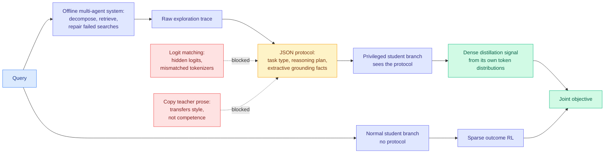

# MAPD: distilling a closed teacher through a JSON protocol instead of its words

**arxiv:** [2607.24280](https://arxiv.org/abs/2607.24280)
**Authors:** Junlin Liu, Jiangwang Chen, Zixin Song, Shuaiyu Zhou, Chunji Lv et al.
**Source:** Kurate weekly cs.AI leaderboard #12 (score 1437, win rate 61.5%, ai_rating 5.5/10, published 2026-07-27)
**Concept page:** [knowledge-distillation.md](knowledge-distillation.md)

## TL;DR

Agentic search means a model interleaves reasoning with retrieval over several steps to answer a knowledge-heavy question. Training that with outcome-based reinforcement learning gives one reward at the end for many decisions, which is very thin supervision. Distilling from a strong proprietary teacher would give a denser signal, except you cannot: closed models hide their logits and use a different tokenizer, so the standard technique of matching output distributions is unavailable, and the fallback of copying the teacher's natural-language trajectories transfers its writing style rather than its reasoning. **Multi-Agent Protocol Distillation (MAPD)** routes around both by inserting a structured intermediate. An offline multi-agent system decomposes each query, retrieves evidence, repairs failed searches, and compiles the whole exploration trace into a **JSON protocol** holding the task type, the reasoning plan, and extractive grounding facts. During training the protocol goes only to a **privileged branch** of the student policy, whose token distributions then supply a dense distillation target alongside the sparse RL objective. Average success reaches 39.4% on Qwen3-1.7B and 44.4% on Qwen3-4B across seven QA benchmarks, and the framework holds up across different proprietary teachers while suppressing style drift and verbosity degeneration.

## Diagram

## Key findings

- **The protocol is style-normalized on purpose.** Its whole job is to strip the teacher's surface form. Task type, plan, and extractive facts are the parts of a trajectory that survive translation between models; phrasing is the part that does not. This is why the paper reports **generalising robustly across diverse proprietary teachers**, which no logit-matching method can do at all.
- **The privileged-branch trick is what makes the protocol into a dense target.** The protocol is never given to the deployed policy. It is shown to a privileged copy whose token distributions then act as the teacher signal, so the student learns to reach the protocol's reasoning without being able to read it at inference. That converts a discrete artifact into a per-token supervision signal without needing the original teacher's logits.
- **39.4% average success on Qwen3-1.7B and 44.4% on Qwen3-4B** across seven QA benchmarks, beating competitive distillation and RL baselines.
- **Style drift and verbosity degeneration are explicitly reported as mitigated**, which matters because both are the standard failure of trajectory imitation and both are usually left unmeasured.

## Relation to prior wiki

**This is the fourth paper on the [knowledge distillation page](knowledge-distillation.md) to solve teacher-student incompatibility by inserting a neutral representation layer, and four crosses the threshold where this stops being a coincidence.** [TESSY (04-18)](2026-04-18-tessy-teacher-student-sft.md) used hybrid token sequences. [Switch-KD (04-18)](2026-04-18-switch-kd-vision-language-distillation.md) used a shared text probability space. [BPM (07-29)](2026-07-29-bpm-cross-tokenizer-opd.md) used **bytes**, mapping each teacher token's probability mass onto the longest student token whose bytes prefix it, summing collisions and routing unmatched mass into an explicit residual so the target stays vocabulary-complete and mass-preserving, and exactly recovering the byte-prefix marginal at over 99% of training positions. MAPD uses a **JSON protocol**. Line them up and the trend is clear: the neutral layer has been moving steadily **up the abstraction stack**, from token sequences to probability spaces to bytes to a semantic schema. Bytes are the lowest common substrate two tokenizers share. A task-type-plus-plan-plus-facts schema is the lowest common substrate two *reasoning systems* share, and it is the first one in the series that is not a lossless re-encoding of the teacher's output. That is both the interesting move and the reason to be careful with the result.

**It is also the first entry on this page whose teacher is a system rather than a model.** [CAST (07-30)](2026-07-30-cast-solver-advantage-distillation.md) already removed the requirement that the teacher be a neural network, showing that under a soft-optimal solver assumption maximizing a classical solver's state-value advantage is equivalent to on-policy distillation from that solver, needing only scalar values rather than logits. The page's summary of CAST was that what remains of on-policy distillation is a very general statement about transferring any scalar-valued source of state quality into a policy. MAPD widens it again: the teacher here is an **offline multi-agent pipeline** with a repair loop, which produces better traces than any single call to the underlying proprietary model would. **The teacher is now allowed to be more capable than the model it is built from**, which is a different kind of asymmetry than the page has tracked, and it is the same construction as generating high-quality training data with search and then training on it.

**One tension worth naming.** [OPRD (06-05)](2026-06-05-oprd-on-policy-representation-distillation.md) argued the output vocabulary is the wrong venue for the signal entirely and aligned hidden states instead. BPM argued the vocabulary is fine if you translate it correctly. MAPD implicitly agrees with BPM (it ends up supervising token distributions) but only after routing through a representation that is not the teacher's at all. The three answers are not compatible and no paper has run them against each other on a shared benchmark.

**And it inherits an unresolved credit-assignment question.** The page established four papers deep that **uniform credit across a trajectory is the waste**: [TIP (04-16)](2026-04-16-tip-token-importance-on-policy-distillation.md) found under 10% of teacher tokens carry usable signal, [LongAct (04-18)](2026-04-18-longact-saliency-sparse-rl.md) restricted gradients to high-magnitude activation positions, [Relay-OPD (07-29)](2026-07-29-relay-opd-trajectory-relayed-distillation.md) used teacher-student continuation divergence, and [CoRT (07-30)](2026-07-30-cort-counterfactual-replay-token-credit.md) used per-token counterfactual likelihood contrast for +4.4 points. MAPD's privileged branch supplies a dense signal over the **whole** sequence, which is precisely the uniform-credit pattern those four papers spent three months arguing against. Composing MAPD's protocol with CoRT's per-token weighting is an obvious and unrun experiment.

## Gaps in the study

- **The protocol is a lossy summary and nothing measures what it drops.** Task type, plan, and extractive facts are a design choice. There is no ablation reported on which of the three carries the signal, and no measurement of how much of the teacher's competence fails to fit into the schema. A neutral layer that is a lossless re-encoding (bytes) and one that is an interpretation (JSON schema) deserve different levels of trust, and the paper treats them the same.
- **The offline multi-agent system is a large unpriced component.** Decompose, retrieve, repair, compile, per query, before training starts. No cost is reported against the baselines, so the comparison against plain RL may be a comparison against a much smaller compute budget.
- **Small students only.** Qwen3-1.7B and Qwen3-4B. A structured plan is most valuable when the student cannot plan for itself, so the gain should shrink with scale, and nothing here says how fast.
- **Success rates in the high 30s and low 40s are not strong absolute numbers**, and seven QA benchmarks is the friendliest possible setting for a method whose protocol carries extractive grounding facts. Whether the protocol format survives a task whose answer is not extractive is untested.
- **The LLM judges were unenthusiastic** at 5.5/10 against a 61.5% win rate, the softest combination among the papers this wiki pulled from the board this week.

## Research angle

The structural observation worth carrying forward is that MAPD and [KAP (08-02)](2026-08-02-kap-knowledge-access-planning.md) are the same move in two unrelated subsystems on the same weekly board. KAP compiles ranked evidence, graph topology and confidence scores into a runtime access plan so the serving backend stops seeing a flat token sequence. MAPD compiles an exploration trace into a JSON protocol so the student stops seeing the teacher's prose. In both cases something upstream computed real structure, a flat text interface destroyed it, and the fix is an explicit intermediate representation that survives the boundary. The open question specific to MAPD is whether the protocol should be **learned rather than designed**. Every neutral layer in this series so far was hand-specified, and bytes worked because they are the unique lowest common substrate. There is no unique lowest common substrate for reasoning, so a fixed schema is a bet, and the natural next paper trains the protocol vocabulary jointly with the student instead of fixing it in advance.

## Links

- Paper: [arxiv 2607.24280](https://arxiv.org/abs/2607.24280)
- Raw: [kurate/2026-08-02-cs-ai](../../raw/kurate/2026-08-02-cs-ai.md)
- Related: [knowledge-distillation](knowledge-distillation.md) · [BPM cross-tokenizer OPD](2026-07-29-bpm-cross-tokenizer-opd.md) · [TESSY](2026-04-18-tessy-teacher-student-sft.md) · [Switch-KD](2026-04-18-switch-kd-vision-language-distillation.md) · [CAST](2026-07-30-cast-solver-advantage-distillation.md) · [CoRT](2026-07-30-cort-counterfactual-replay-token-credit.md) · [KAP](2026-08-02-kap-knowledge-access-planning.md)
